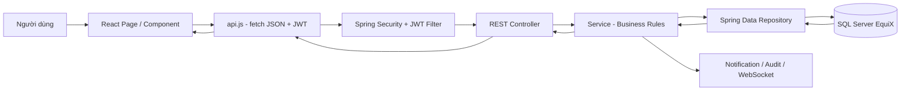
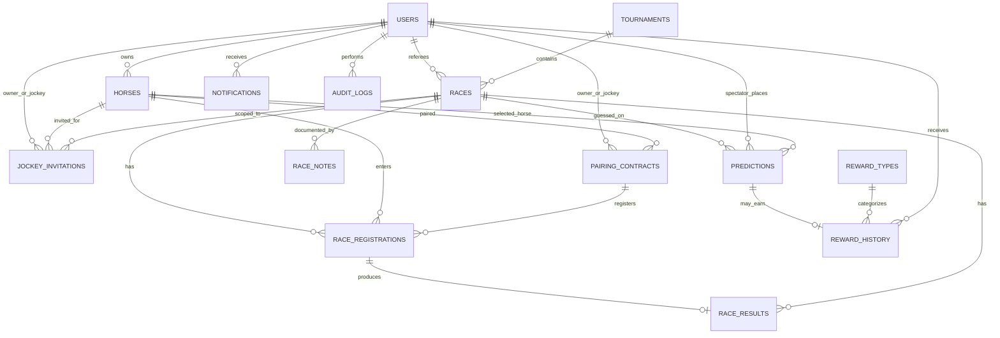
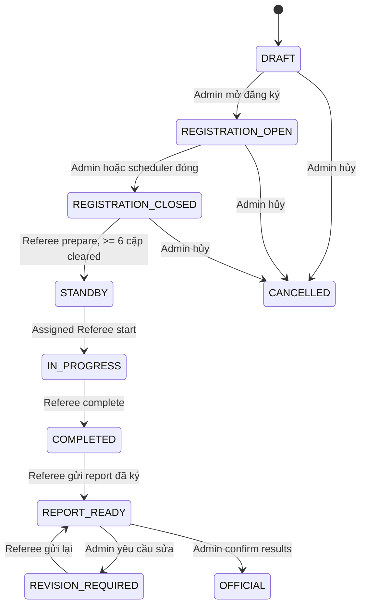
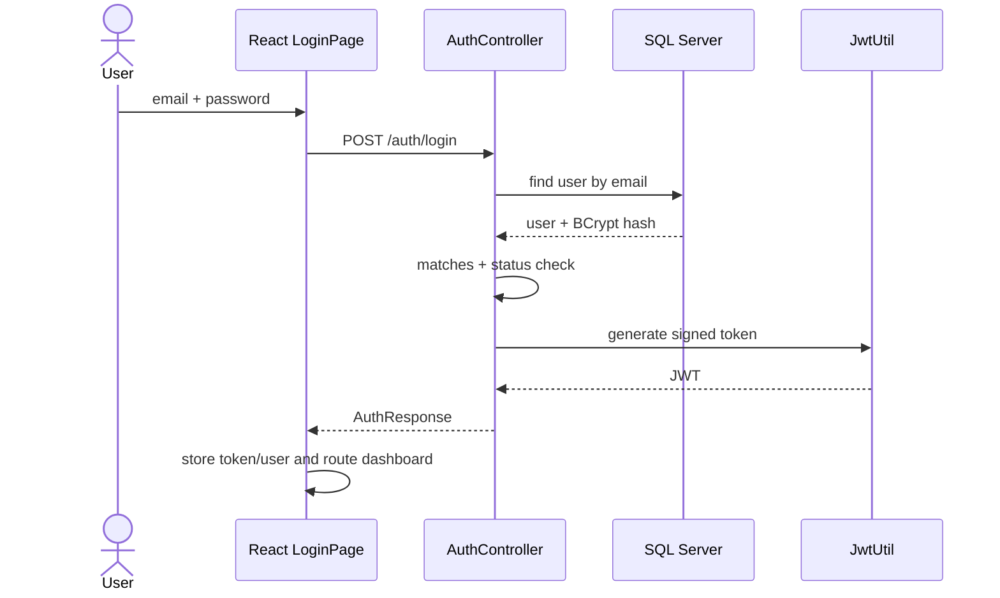
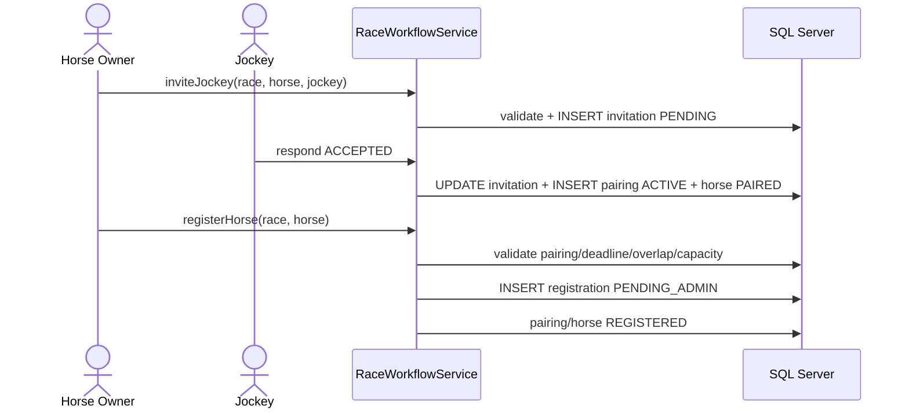
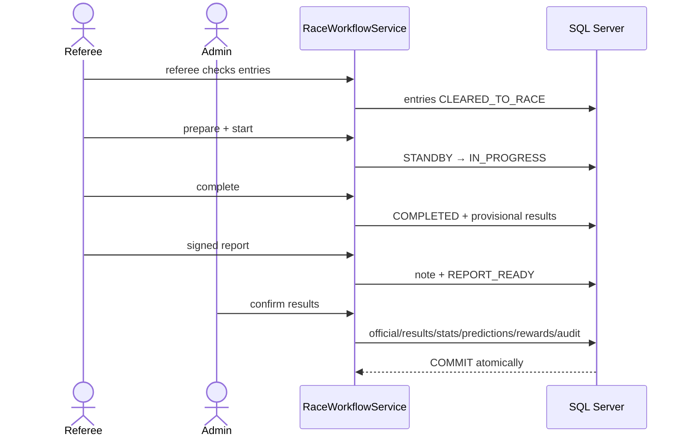
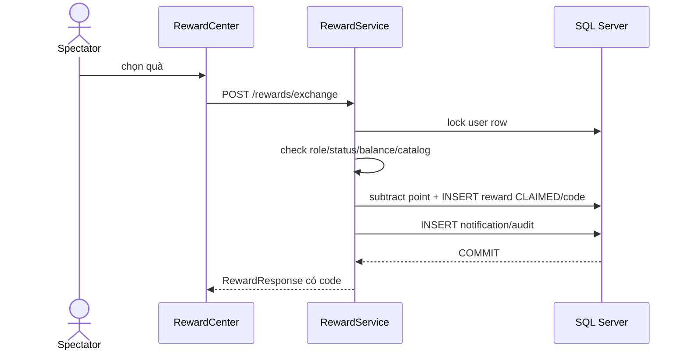

# EQUIX — GIÁO TRÌNH MASTERCLASS TOÀN BỘ PROJECT VÀ VẤN ĐÁP

> Giáo trình đầy đủ từ nền tảng đến source code hiện tại cho SWP391 — FPT  
> Bám theo source code hiện tại, nghiệp vụ `EquiX_Business_Logic_Definitive_v4.md` và database SQL Server `EquiX`  
> Frontend: React 19 + Vite 8 · Backend: Java 17 + Spring Boot 3.5 · Database: Microsoft SQL Server 2019+  
> Cập nhật: 23/07/2026

Tài liệu này không phải bản tóm tắt thay thế source. Nó là bản đồ học đầy đủ giúp bạn:

- Hiểu lý thuyết nền trước khi đọc code.
- Biết trách nhiệm của từng file và từng tầng.
- Lần được mọi thao tác từ UI đến database.
- Đọc được database diagram, constraint và query.
- Giải thích được business rule, security, transaction, realtime và test.
- Nhận ra giới hạn hoặc điểm cần cải tiến thay vì khẳng định mù quáng.

Phần “30 phút” phía dưới chỉ là **đường vào ưu tiên khi gấp**; toàn bộ các chương còn lại mới là giáo trình đầy đủ để học lâu dài và chuẩn bị hội đồng.

### Bản đồ toàn bộ giáo trình

| Phần | Chương | Bạn sẽ học được gì? |
|---|---|---|
| Nền tảng dự án | 0–25 | Câu trả lời race table, ERD, workflow, rule, source map, SQL và 40 câu hỏi |
| Nền tảng lập trình | 26–29 | Java, Spring Boot, React và SQL Server từ số 0 |
| Tham chiếu source | 30–36 | Folder, boot flow, toàn API, service, DTO, repository, frontend từng role |
| Database chuyên sâu | 37–43 | Data dictionary, PK/FK/index, normalization, transaction, migration, SQL lab |
| Vận hành chất lượng | 44–48 | Chạy/build/test/debug/security/deploy/design trade-off |
| V4 và hội đồng | 49–56 | Traceability, giới hạn, 100 Q&A, status, lifecycle, sequence diagram, bài tập, baseline |

Bạn không cần đọc tuyến tính một lần. Khi học một chức năng, dùng bảng trên để đi qua ba góc nhìn: **nghiệp vụ → code → database/test**.

---

## 0. Đọc phần nào trước nếu sắp bị gọi lên?

Nếu chỉ còn **30 phút**, học theo đúng thứ tự này:

1. Đọc mục **1 — Câu trả lời cứu nguy về bảng `races`**.
2. Học thuộc mục **2 — Bài nói 90 giây**.
3. Nhìn mục **5 — Database diagram** và nhớ 8 bảng lõi.
4. Học vòng đời cuộc đua ở mục **8**.
5. Đọc 15 câu đầu ở mục **18 — Vấn đáp với thầy**.

Nếu còn **1–2 giờ**:

1. Học các mục 1, 2, 5, 6, 7, 8.
2. Tự kể lại hai luồng ở mục 12 mà không nhìn tài liệu.
3. Chạy các câu SQL ở mục 17 và giải thích từng dòng.

Nếu còn **3 giờ trở lên**:

1. Học thêm bản đồ code backend ở mục 13.
2. Học bản đồ frontend ở mục 14.
3. Tập trả lời toàn bộ mục 18 và làm bài tự kiểm tra ở mục 20.

Điều quan trọng: **không cần thuộc 13.000 dòng code**. Bạn cần hiểu cấu trúc, trách nhiệm của từng lớp, dữ liệu đi qua đâu, trạng thái thay đổi thế nào và vì sao database được thiết kế như vậy.

---

## 1. Câu trả lời cứu nguy: “Sau khi nhập dữ liệu thì bảng `race` cho ra những gì?”

### 1.1 Câu trả lời ngắn, đúng thuật ngữ

Bạn có thể trả lời nguyên văn:

> “Dạ, về thuật ngữ thì một bảng database không tự tạo ra output. Khi Admin nhập form tạo cuộc đua, frontend gửi JSON đến API, backend validate rồi INSERT một record vào bảng `races`. SQL Server sinh khóa chính `id`, backend trả record đã lưu về dạng JSON để frontend hiển thị. Record `races` giữ cấu hình và trạng thái của cuộc đua. Sau đó `race_id` của record này trở thành khóa ngoại cho các bảng phát sinh như `race_registrations`, `predictions`, `race_notes`, `race_results` và `reward_history`. Khi muốn xem output đầy đủ, hệ thống SELECT/JOIN các bảng này chứ không lấy mọi thứ từ riêng bảng `races`.”

### 1.2 Nếu thầy hỏi “Cụ thể bảng `races` lưu gì?”

`races` lưu 5 nhóm dữ liệu:

1. **Định danh và quan hệ**: `id`, `tournament_id`, `referee_id`.
2. **Cấu hình**: `race_name`, `race_type`, `race_distance`, `track_condition`, `total_lanes`, `prize_points`.
3. **Lịch**: `race_date`, `race_time`, `registration_deadline`, `location`, `weather`.
4. **Trạng thái nghiệp vụ**: `status`, `admin_review_required`, `review_reason`.
5. **Theo dõi thay đổi**: `created_at`, `updated_at`, `deleted_at`, lý do hủy/đổi lịch.

### 1.3 Bảng `races` không lưu trực tiếp những gì?

| Dữ liệu muốn hiển thị | Lấy từ đâu? | Vì sao không lưu trong `races`? |
|---|---|---|
| Tên giải đấu | JOIN `tournaments` qua `tournament_id` | Tránh lặp tên giải ở nhiều race |
| Tên trọng tài | JOIN `users` qua `referee_id` | User có thể đổi tên, không nên copy tên |
| Số ngựa tham gia | COUNT `race_registrations` theo `race_id` | Đây là dữ liệu thay đổi theo đăng ký/rút |
| Danh sách ngựa–nài | JOIN `race_registrations`, `horses`, `users` | Quan hệ một cuộc đua có nhiều cặp |
| Dự đoán của khán giả | `predictions` | Một race có nhiều prediction |
| Sự cố và báo cáo | `race_notes` | Một race có nhiều ghi chú theo thời gian |
| Thứ hạng và thời gian về đích | `race_results` | Chỉ phát sinh sau khi đua |
| Quà của khán giả | `reward_history` | Chỉ phát sinh sau kết quả chính thức |

Đây chính là **chuẩn hóa dữ liệu**: chỉ lưu một sự thật ở một nơi, liên kết bằng Primary Key và Foreign Key.

### 1.4 “Output” thực tế sau từng giai đoạn

| Giai đoạn | Thay đổi ở `races` | Dữ liệu phát sinh ở bảng khác |
|---|---|---|
| Admin tạo race | INSERT một row, sinh `id` | `audit_logs` ghi thao tác |
| Chủ ngựa đăng ký | Race thường vẫn `REGISTRATION_OPEN` | INSERT `race_registrations` |
| Khán giả dự đoán | Race chưa đổi | INSERT/UPDATE `predictions`, trừ point user |
| Hết hạn đăng ký | `status = REGISTRATION_CLOSED` | Có thể tạo notification cần Admin review |
| Trọng tài chuẩn bị | `status = STANDBY` | Prediction chuyển `LOCKED` |
| Trọng tài bắt đầu | `status = IN_PROGRESS` | WebSocket phát tiến độ đường đua |
| Trọng tài kết thúc | `status = COMPLETED` | INSERT kết quả tạm vào `race_results`, `official = 0` |
| Trọng tài gửi báo cáo | `status = REPORT_READY` | INSERT `race_notes` loại `RACE_REPORT` |
| Admin yêu cầu sửa | `status = REVISION_REQUIRED` | INSERT note `REVISION_REQUEST` |
| Admin chốt kết quả | `status = OFFICIAL` | Kết quả official, cộng BXH, chốt prediction, tạo reward/notification, giải phóng pairing |

### 1.5 Ví dụ cụ thể

Admin nhập:

```text
Tên: Saigon Sprint Cup
Giải: Tournament #3
Loại: SPRINT
Cự ly: 1200m
Ngày giờ: 10/08/2026 14:00
Số làn: 12
Giải thưởng: 10000 point
Trọng tài: User #25
```

Backend lưu gần tương đương:

```text
races.id                    = 10          -- SQL Server tự sinh
races.tournament_id         = 3
races.race_name             = Saigon Sprint Cup
races.race_type             = SPRINT
races.race_distance         = 1200
races.track_condition       = Turf
races.race_date             = 2026-08-10
races.race_time             = 14:00
races.registration_deadline = 2026-08-03 14:00
races.total_lanes           = 12
races.prize_points          = 10000
races.referee_id            = 25
races.status                = REGISTRATION_OPEN hoặc DRAFT
```

Sau đó các bảng khác liên kết bằng `race_id = 10`. `races.id` giống như “mã hồ sơ trung tâm” của toàn bộ quy trình.

---

## 2. Bài nói 90 giây về toàn project

> “EquiX là hệ thống quản lý giải đua ngựa với năm role: Admin, Horse Owner, Jockey, Referee và Spectator. Hệ thống dùng kiến trúc ba tầng. React là presentation layer, gọi REST API bằng JSON. Spring Boot là business layer, gồm Controller nhận request, Service xử lý luật nghiệp vụ và Repository truy cập dữ liệu bằng JPA. SQL Server là data layer, dùng Primary Key, Foreign Key, Unique Constraint và Transaction để bảo đảm toàn vẹn dữ liệu.
>
> Trung tâm nghiệp vụ là vòng đời cuộc đua. Admin tạo tournament và race, chủ ngựa mời jockey, jockey chấp nhận để sinh pairing contract, rồi chủ ngựa đăng ký cặp vào race. Admin duyệt đăng ký, trọng tài kiểm tra sức khỏe, chuyển race sang Standby và bắt đầu. Khi kết thúc, hệ thống tạo kết quả tạm. Trọng tài phải gửi báo cáo, sau đó Admin mới được xác nhận kết quả chính thức. Khi official, hệ thống cập nhật bảng xếp hạng, chốt dự đoán, phát thưởng, gửi notification và ghi audit log.
>
> JWT bảo vệ API theo role. Database không nhồi tất cả vào bảng race; `races` chỉ giữ cấu hình và trạng thái, còn đăng ký, dự đoán, báo cáo, kết quả và phần thưởng nằm ở các bảng con liên kết bằng `race_id`. Thiết kế này giảm lặp dữ liệu và giúp kiểm soát toàn bộ lịch sử nghiệp vụ.”

---

## 3. Project này giải quyết bài toán gì?

EquiX quản lý toàn bộ chuỗi hoạt động của một giải đua ngựa:

1. Quản lý tài khoản và phân quyền.
2. Quản lý ngựa của chủ ngựa.
3. Mời và ghép nài ngựa với ngựa.
4. Tạo giải đấu và cuộc đua.
5. Đăng ký cặp ngựa–nài vào cuộc đua.
6. Admin duyệt và trọng tài kiểm tra trước đua.
7. Mô phỏng cuộc đua thời gian thực.
8. Ghi sự cố, DNF, báo cáo có chữ ký.
9. Admin xác nhận kết quả chính thức.
10. Tính điểm bảng xếp hạng và phân bổ prize pool.
11. Cho khán giả dự đoán bằng point.
12. Phát thưởng và mã quà tặng.
13. Gửi thông báo và lưu audit log.

### Năm role và trách nhiệm

| Role | Trách nhiệm chính | Không được làm |
|---|---|---|
| `ADMIN` | Tài khoản, tournament, race, duyệt đăng ký, gán trọng tài, chốt kết quả, reward | Không trực tiếp bắt đầu race |
| `HORSE_OWNER` | CRUD ngựa, mời jockey, đăng ký/rút cặp | Không tự duyệt hoặc tự start race |
| `JOCKEY` | Nhận/từ chối invitation, theo dõi cặp và race | Không tự tạo pairing contract trực tiếp |
| `REFEREE` | Kiểm tra trước đua, standby/start/complete, incident, DNF, report | Không tự biến kết quả thành official |
| `SPECTATOR` | Xem race, dự đoán, dùng point, nhận/đổi reward | Không can thiệp vận hành race |

Separation of duties quan trọng nhất:

- Admin **tạo và chốt**, nhưng Referee mới **start**.
- Referee **báo cáo**, nhưng Admin mới **official**.
- Điều này ngăn một người tự điều khiển toàn bộ kết quả.

---

## 4. Kiến trúc và đường đi của một request



### Ví dụ: chủ ngựa đăng ký ngựa vào race

```text
DashboardPage.jsx
  → api.registerHorse(raceId, { horseId })
  → POST /api/races/{id}/registrations + Bearer JWT
  → SecurityConfig kiểm tra role HORSE_OWNER
  → RaceController.registerHorse(...)
  → RaceWorkflowService.registerHorse(...)
  → validate race open, deadline, owner, pairing, overlap, capacity
  → RaceRegistrationRepository.save(...)
  → INSERT race_registrations
  → UPDATE horses.status = REGISTERED
  → INSERT notifications + audit_logs
  → trả JSON RaceRegistration về React
  → React reload data và hiển thị toast
```

### Vai trò từng lớp

| Lớp | Câu hỏi lớp này trả lời |
|---|---|
| React Component | Người dùng nhìn và bấm gì? |
| `api.js` | Gọi URL nào, method gì, gửi JSON nào? |
| Security/JWT | Người gọi là ai, đã login chưa, có đúng role không? |
| Controller | Map HTTP request thành Java method và DTO nào? |
| Service | Luật nghiệp vụ, thứ tự xử lý và transaction là gì? |
| Repository | Cần SELECT/INSERT/UPDATE entity nào? |
| Entity | Class Java map vào table/column nào? |
| SQL Server | Lưu bền vững, kiểm tra PK/FK/UNIQUE/CHECK |

---

## 5. Database diagram — cách đọc từ số 0

### 5.1 Từ vựng bắt buộc

| Thuật ngữ | Nghĩa | Ví dụ EquiX |
|---|---|---|
| Table | Tập hợp record cùng loại | `races` |
| Row/Record | Một đối tượng cụ thể | Race có `id = 10` |
| Column | Một thuộc tính | `race_name`, `status` |
| Primary Key (PK) | Định danh duy nhất một row | `races.id` |
| Foreign Key (FK) | Trỏ đến PK bảng khác | `races.tournament_id → tournaments.id` |
| One-to-many (1:N) | Một cha có nhiều con | Một race có nhiều registration |
| Unique | Không cho trùng | Một email, một horse trong một race |
| Check Constraint | Chỉ cho giá trị hợp lệ | role chỉ thuộc 5 role |
| Index | Tăng tốc tìm kiếm | index `races(status, date, time)` |
| Transaction | Nhiều thay đổi cùng thành công hoặc cùng rollback | Chốt result + reward + point |
| Soft delete | Không DELETE vật lý, chỉ ghi thời điểm xóa | `deleted_at` |

### 5.2 ERD lõi



### 5.3 Quan hệ quan trọng cần thuộc

1. `tournaments 1 — N races`: một giải có nhiều cuộc đua.
2. `users 1 — N horses`: một chủ có nhiều ngựa.
3. `horses 1 — N pairing_contracts` theo lịch sử, nhưng chỉ tối đa một contract `ACTIVE`.
4. `users(JOCKEY) 1 — N pairing_contracts` theo lịch sử, nhưng chỉ tối đa một `ACTIVE`.
5. `races 1 — N race_registrations`.
6. `race_registrations 1 — 0..1 race_results`.
7. `races 1 — N predictions`; mỗi spectator chỉ một prediction/race.
8. `predictions 1 — 0..1 reward_history` cho reward chính thức.
9. `users 1 — N notifications` và `users 1 — N audit_logs`.

### 5.4 Các UNIQUE constraint bảo vệ nghiệp vụ

| Constraint | Bảo vệ điều gì? |
|---|---|
| `users.email` unique | Không hai account trùng email |
| `users.username` unique | Không trùng username |
| `horses.registration_number` unique | Mã đăng ký ngựa duy nhất |
| `(race_id, horse_id)` trong registration | Một ngựa không đăng ký hai lần cùng race |
| `(race_id, jockey_id)` | Một jockey không cưỡi hai ngựa cùng race |
| `(race_id, lane_number)` | Không trùng làn |
| `(spectator_id, race_id)` trong prediction | Một spectator chỉ một guess/race |
| `registration_id` trong result | Một entry chỉ có một result |
| `prediction_id` trong reward history | Một prediction không nhận reward hai lần |
| `redemption_code` | Mã quà tặng duy nhất |
| Filtered unique active horse/jockey | Mỗi horse/jockey chỉ một pairing `ACTIVE` |

### 5.5 Vì sao Java entity không dùng `@ManyToOne`?

Code hiện tại dùng dạng:

```java
@Column(name = "tournament_id")
private Long tournamentId;
```

thay vì:

```java
@ManyToOne
private Tournament tournament;
```

Ý nghĩa:

- SQL Server vẫn có Foreign Key thật để bảo vệ quan hệ.
- Java giữ ID đơn giản, Service chủ động truy vấn repository khi cần.
- Ưu điểm: JSON đơn giản, tránh vòng lặp serialize và lazy-loading ngoài ý muốn.
- Nhược điểm: phải JOIN/lookup thủ công nhiều hơn và entity không tự điều hướng sang object cha.

Nếu thầy hỏi, không nói “database không có relation”. Hãy nói: **relation nằm ở Foreign Key của SQL Server; Java đang map theo foreign-key ID thay vì object association**.

---

## 6. Từ điển tất cả bảng trong database hiện tại

### 6.1 Nhóm tài khoản

#### `users`

- Trung tâm danh tính của năm role.
- Cột chính: username, password hash BCrypt, họ tên, email, phone, role, status, reward points, avatar.
- Account mới nhận 500 point.
- `deleted_at` hỗ trợ soft delete.
- Là parent của horses, invitations, pairings, referee assignment, predictions, rewards, notifications và audit.

#### `password_reset_tokens`

- Token reset password đã hash, thời hạn 30 phút, đánh dấu `is_used`.
- Không lưu raw token để giảm rủi ro nếu database bị lộ.

#### `email_change_tokens`

- Giữ email mới, token hash, hạn dùng và trạng thái used.
- Email cũ vẫn hoạt động cho đến khi token được xác nhận.

#### `jockey_profiles`, `achievements`, `jockey_achievements`

- Schema dành cho profile/thành tích jockey.
- `jockey_achievements` là bảng nối many-to-many giữa jockey và achievement.
- Trong backend hiện tại, leaderboard jockey chủ yếu được tính từ `race_results`; ba bảng này là phần schema mở rộng/legacy, chưa có đầy đủ entity/service CRUD tương ứng.

### 6.2 Nhóm ngựa và ghép cặp

#### `horses`

- Thuộc về owner qua `owner_id`.
- Lưu thông tin nhận dạng, giống, giới tính, tuổi, cân nặng, hình ảnh.
- Lưu chỉ số training: speed, stamina, acceleration, agility, pace style.
- Lưu sức khỏe và status.
- Lưu thống kê tổng: total races/wins/top3/points.
- Chỉ số training hiện là display-only, không quyết định kết quả race.

#### `jockey_invitations`

- Lời mời owner gửi jockey cho một horse và race.
- Status: `PENDING → ACCEPTED` hoặc `DECLINED`.
- Khi ACCEPTED, service sinh một `pairing_contracts`.

#### `pairing_contracts`

- Hợp đồng ghép horse–jockey–owner.
- Status chính: `ACTIVE`, `REGISTERED`, `DISSOLVED`.
- Filtered unique index bảo đảm một horse và một jockey chỉ có một contract ACTIVE.

### 6.3 Nhóm tournament và race

#### `tournaments`

- Container của nhiều race.
- Lưu tên, mô tả, địa điểm, ngày bắt đầu/kết thúc.
- `grace_period_hours` chỉ nhận 72, 120 hoặc 168 giờ.
- Status: DRAFT, OPEN, CLOSED, ONGOING, COMPLETED, CANCELLED.

#### `races`

- Bảng trung tâm giữ cấu hình, lịch, trọng tài và trạng thái race.
- Không phải bảng kết quả.
- Xem giải thích chi tiết ở mục 7.

#### `race_registrations`

- Mỗi row là một cặp horse–jockey đăng ký vào một race.
- Chụp các ID: race, horse, jockey, owner, pairing contract và lane.
- Theo dõi Admin approval, referee health check, DQ, DNF và withdrawal.

#### `race_notes`

- Nhật ký sự cố, DNF, báo cáo có chữ ký và yêu cầu sửa báo cáo.
- Có timestamp, category, severity, affected registration, action taken, race time.

#### `race_results`

- Kết quả của từng registration.
- Lưu finish position/time, leaderboard points, DNF, DQ, notes và cờ `official`.
- Provisional: `official = 0`; Admin chốt: `official = 1`.

### 6.4 Nhóm spectator và reward

#### `predictions`

- Liên kết spectator + race + horse được chọn.
- Lưu wager point, point nhận, trạng thái ACTIVE/LOCKED/VOIDED.
- Unique `(spectator_id, race_id)` bảo đảm một guess/race; chỉnh guess là UPDATE row cũ.

#### `reward_types`

- Catalog ba loại: HORSE_GOODS, VOUCHER, DRINK_COUPON.
- Lưu mô tả, hình/link/partner/terms, hạn dùng, shipping và point cost.

#### `reward_history`

- Mỗi reward đã phát cho một spectator.
- Có thể sinh từ prediction chính thức hoặc đổi point/admin tạo code.
- Lưu snapshot nội dung để catalog thay đổi sau này không làm sai reward cũ.
- Status: ISSUED → CLAIMED → PROCESSING → SHIPPED → FULFILLED; reward digital có thể → REDEEMED.
- Có version để chống hai request cập nhật cùng lúc.

### 6.5 Nhóm hỗ trợ

#### `notifications`

- Thông báo theo user: category, title, message, deep link, read/read_at.
- Hiện dùng channel `IN_APP`.

#### `audit_logs`

- Ghi ai, role gì, làm action nào, trên entity nào, trước/sau ra sao, lúc nào.
- Dùng cho accountability và truy vết lỗi/tranh chấp.

#### `system_settings`

- Key-value cấu hình hệ thống trong database; hiện chưa phải luồng chính của backend.

#### `sysdiagrams`

- Bảng hệ thống do SQL Server Management Studio dùng để lưu Database Diagram.
- Không phải bảng nghiệp vụ EquiX.

---

## 7. Mổ xẻ bảng `races`

| Column | Kiểu | Ý nghĩa |
|---|---|---|
| `id` | bigint identity PK | ID SQL Server tự tăng |
| `tournament_id` | bigint FK, not null | Race thuộc tournament nào |
| `race_name` | nvarchar | Tên cuộc đua |
| `race_type` | nvarchar | SPRINT/MILE/MEDIUM/LONG |
| `race_distance` | int | Cự ly mét, phải khớp type |
| `track_condition` | nvarchar | Code ép về Turf |
| `race_date` | date | Ngày đua |
| `race_time` | time | Giờ đua |
| `registration_deadline` | datetime2 | Ngày giờ race trừ đúng một tuần |
| `total_lanes` | int | Sức chứa 6–18 |
| `prize_points` | decimal | Prize pool dạng point, không phải tiền thật |
| `weather` | nvarchar | Thông tin thời tiết |
| `location` | nvarchar | Địa điểm |
| `status` | nvarchar | State machine của race |
| `referee_id` | bigint FK nullable | Trọng tài được gán |
| `cancellation_reason`, `cancelled_at` | text/time | Lịch sử hủy |
| `reschedule_reason`, `rescheduled_at` | text/time | Lịch sử đổi lịch |
| `admin_review_required`, `review_reason` | bit/text | Cờ thiếu tối thiểu 6 entry |
| `created_at`, `updated_at` | datetime2 | Audit thời gian |
| `deleted_at` | datetime2 | Soft delete |

### Luật type và distance trong service

```text
SPRINT : 1000–1400m, duration 67–69s
MILE   : 1401–1800m, duration 90–93s
MEDIUM : 1801–2400m, duration 117–120s
LONG   : từ 2401m, duration 194–198s
```

### Ba Foreign Key trực tiếp quan trọng

```text
races.tournament_id → tournaments.id
races.referee_id    → users.id
race child tables   → races.id
```

### Số lượng ngựa tham gia được tính thế nào?

Không dùng một cột `participant_count` trong `races`, mà dùng:

```sql
SELECT COUNT(*)
FROM race_registrations
WHERE race_id = @raceId
  AND deleted_at IS NULL
  AND status NOT IN ('WITHDRAWN', 'CANCELLED', 'REJECTED_BY_REFEREE');
```

Lợi ích: số lượng luôn phản ánh đăng ký thật, không bị lỗi “đã rút nhưng counter chưa giảm”.

### Referee name được lấy thế nào?

```sql
SELECT r.race_name, u.full_name AS referee_name
FROM races r
LEFT JOIN users u ON u.id = r.referee_id;
```

---

## 8. State machine — phần hội đồng rất hay hỏi

### 8.1 Vòng đời race



Luật cứng:

- Admin chỉ đổi trực tiếp giữa DRAFT, REGISTRATION_OPEN, REGISTRATION_CLOSED.
- Chỉ assigned Referee mới prepare/start/complete/report.
- Cần ít nhất 6 registration `CLEARED_TO_RACE` để STANDBY và start.
- Guess bị lock khi vào STANDBY.
- Không thể OFFICIAL nếu chưa có signed referee report.

### 8.2 Registration status

```text
PENDING_ADMIN
  → READY_FOR_CHECK        (Admin approve)
  → CLEARED_TO_RACE        (Referee approve health check)
  → DNF                    (nếu không về đích)

READY_FOR_CHECK
  → REJECTED_BY_REFEREE    (DQ pre-race, lý do >= 20 ký tự + CONFIRM)

Bất kỳ trước official
  → WITHDRAWN              (đúng withdrawal window hoặc Admin)
  → CANCELLED              (race bị hủy)
```

### 8.3 Horse status

```text
AVAILABLE → PAIRED → REGISTERED → AVAILABLE
    ↓           hoặc owner quản lý
TRAINING / UNAVAILABLE
```

- Từ UNAVAILABLE về AVAILABLE phải tick xác nhận fit.
- PAIRED/REGISTERED không được sửa tùy tiện bằng CRUD ngựa; phải đi qua workflow.
- DNF làm horse UNAVAILABLE + health INJURED.

### 8.4 Prediction status

```text
ACTIVE → LOCKED → LOCKED đã settled
ACTIVE/LOCKED → VOIDED nếu race hủy
```

### 8.5 Reward status

```text
Digital: ISSUED/CLAIMED → REDEEMED
Shipping: ISSUED → CLAIMED → PROCESSING → SHIPPED → FULFILLED
Ngoại lệ: → EXPIRED hoặc CANCELLED
```

---

## 9. Vì sao cần nhiều bảng thay vì một bảng lớn?

Nếu nhồi tournament, referee, ngựa, jockey, guess, result vào `races`:

- Một race có 12 ngựa thì phải có 12 nhóm cột hoặc lặp 12 row race.
- Đổi tên referee phải cập nhật hàng loạt.
- Không biết lưu bao nhiêu prediction.
- Khó bảo đảm một spectator chỉ guess một lần.
- Xóa/sửa dễ gây mất lịch sử.

Thiết kế hiện tại đạt gần chuẩn 3NF:

1. Mỗi bảng đại diện một loại thực thể hoặc quan hệ.
2. Thuộc tính phụ thuộc vào khóa chính của bảng đó.
3. Dữ liệu tham chiếu dùng FK thay vì copy text.
4. Quan hệ many-to-many được tách thành bảng giao dịch như registration/prediction.

---

## 10. Các luật nghiệp vụ quan trọng nhất

1. Public chỉ đăng ký HORSE_OWNER, JOCKEY, SPECTATOR; Referee do Admin tạo.
2. Spectator active ngay; Owner/Jockey phải Admin approve.
3. Account mới có 500 point.
4. Một horse và một jockey chỉ có một pairing ACTIVE.
5. Pairing phải tồn tại trước registration.
6. Registration đóng đúng một tuần trước race.
7. Mỗi race 6–18 cặp.
8. Không cho horse/jockey có lịch race chồng nhau.
9. Admin duyệt registration trước referee check.
10. DQ cần reason >= 20 ký tự, category/severity hợp lệ và text `CONFIRM`.
11. Chỉ assigned Referee được prepare/start/complete/report.
12. Standby cần ít nhất 6 cặp cleared và lock toàn bộ guesses.
13. Một spectator chỉ một prediction/race; trước standby có thể update.
14. Point wager bị trừ ngay; nếu sửa guess, wager cũ được hoàn vào số dư tính toán trước khi trừ wager mới.
15. Race cancel hoàn lại wager point và void prediction.
16. Referee report phải >= 20 ký tự, review incidents và có signature.
17. Admin finalization phải chứa mọi entry cleared/DNF đúng một lần.
18. Leaderboard point: 1st=10, 2nd=6, 3rd=4, 4th=2, 5th=1.
19. Prize pool: 60% / 30% / phần còn lại 10%; có xử lý dead heat.
20. Prediction chọn horse top 3 mới sinh reward chính thức; chọn winner còn nhận payout wager x2.
21. Top 1 reward HORSE_GOODS, top 2 VOUCHER, top 3 DRINK_COUPON.
22. Reward code chỉ thuộc đúng spectator và chỉ dùng một lần.
23. Sau official, pairing được dissolve và horse trở lại available, trừ DNF/injury.
24. Các thao tác quan trọng tạo notification và audit log.
25. Soft delete giữ lịch sử thay vì xóa vật lý tùy tiện.

---

## 11. Giải thích simulation và realtime

### 11.1 Simulation không phải game physics

- Duration lấy theo race type.
- Seed có liên quan `raceId`, giúp cùng race có hành vi ổn định hơn.
- Tiến độ cơ bản = elapsed / duration.
- Mỗi lane có jitter ngẫu nhiên, sau đó sort để hiển thị thứ tự.
- Horse stats và pace style hiện không tác động kết quả; chỉ để hiển thị/training profile.

### 11.2 WebSocket

```text
Frontend raceRealtime.js kết nối ws://localhost:9090/ws/races
RaceRealtimeTicker chạy mỗi 1 giây
Nếu có subscriber và race IN_PROGRESS:
  RaceWorkflowService.simulateRace(...)
  → RaceRealtimePublisher broadcast RACE_SIMULATION JSON
  → RaceTrack.jsx cập nhật vị trí
```

REST phù hợp với CRUD/request-response. WebSocket phù hợp với server chủ động đẩy cập nhật liên tục mà client không cần reload.

### 11.3 Tại sao có provisional rồi mới official?

Simulation chỉ tạo dữ liệu tạm. Race thực tế có thể có incident, DNF hoặc DQ. Referee cần báo cáo và Admin cần chốt lại thứ hạng. Đây là cơ chế integrity hai bước.

---

## 12. Các luồng end-to-end phải kể được

### 12.1 Đăng ký account và login

```text
RegisterPage → api.register → AuthController.register
→ validate email/username/role
→ BCrypt hash password
→ INSERT users, 500 point
→ Spectator VERIFIED + nhận JWT ngay
→ Owner/Jockey PENDING, chờ Admin

LoginPage → api.login → AuthController.login
→ tìm user theo email
→ BCrypt matches raw password với password_hash
→ kiểm tra VERIFIED/ACTIVE
→ JwtUtil.generateToken(email, role)
→ frontend lưu equix_token + equix_user trong localStorage
```

Mỗi request sau đó có header:

```http
Authorization: Bearer <JWT>
```

`JwtAuthenticationFilter` đọc token, lấy email, load user và đặt Authentication vào SecurityContext.

### 12.2 Owner mời jockey và đăng ký race

```text
Owner tạo Horse → status AVAILABLE
Owner chọn race + horse + jockey → INSERT jockey_invitations PENDING
Jockey Accept → INSERT pairing_contracts ACTIVE; horse PAIRED
Owner Register → INSERT race_registrations PENDING_ADMIN; horse REGISTERED
Admin Approve → READY_FOR_CHECK
Referee check pass → CLEARED_TO_RACE
```

### 12.3 Toàn bộ vòng đời race và output

```text
Admin Create Tournament
→ Admin Create Race
→ Owner/Jockey Pairing
→ Owner Registration
→ Admin Approval
→ Referee Check
→ Referee Prepare = STANDBY + lock guesses
→ Referee Start = IN_PROGRESS
→ WebSocket position updates
→ Referee Complete = COMPLETED + provisional race_results
→ Referee Incident/DNF/Report
→ Admin Review
→ nếu sai: REVISION_REQUIRED → Referee resubmit
→ Admin Confirm = OFFICIAL
→ race_results official
→ horses aggregate stats updated
→ predictions settled + point payout
→ reward_history issued
→ notifications created
→ pairing dissolved
→ leaderboard/tournament standings đọc official results
```

### 12.4 Spectator guess và reward

```text
Spectator có 500 point
→ chọn race đang REGISTRATION_OPEN/CLOSED
→ chọn horse thuộc entry đã Admin approve
→ nhập wager, ví dụ 100
→ users.reward_points còn 400
→ prediction ACTIVE
→ race STANDBY: prediction LOCKED
→ official result:
   - horse #1: payout 200 point + HORSE_GOODS reward
   - horse #2: VOUCHER reward, không có wager payout
   - horse #3: DRINK_COUPON reward, không có wager payout
   - ngoài top 3/DNF/DQ: không reward
```

Luồng đổi point trực tiếp:

```text
Reward Center → chọn catalog 150/300 point
→ backend lock row user để chống double-spend
→ kiểm tra balance
→ trừ point
→ sinh redemption_code unique
→ INSERT reward_history CLAIMED
→ gửi exact code vào notifications
→ spectator nhập code
→ lock reward row, kiểm tra owner/status/expiry
→ status REDEEMED
→ lần dùng thứ hai trả HTTP 409
```

### 12.5 Race bị hủy

```text
Admin nhập lý do → race CANCELLED
→ registrations CANCELLED
→ invitations CANCELLED
→ wager point hoàn lại user
→ predictions VOIDED
→ pairing được giải phóng nếu không còn commitment khác
→ notification gửi owner, jockey, referee, spectator
→ audit log ghi CANCEL
```

---

## 13. Bản đồ toàn bộ backend code

### 13.1 Entry point và config

| File | Trách nhiệm |
|---|---|
| `HorseRacingSystemApplication.java` | `main()`, khởi động Spring Boot và component scan |
| `application.properties` | Port 9090, SQL Server URL/user/password, JPA validate, JWT, upload, quick login |
| `SecurityConfig.java` | Stateless security, role theo endpoint, BCrypt, 401/403 |
| `JwtUtil.java` | Sinh/parse/verify JWT; subject là email, claim role |
| `JwtAuthenticationFilter.java` | Đọc Bearer token cho mỗi request |
| `CustomUserDetailsService.java` | Load user từ DB và biến role thành `ROLE_X` |
| `WebConfig.java` | CORS/static upload/resource configuration |
| `OpenApiConfig.java` | Swagger/OpenAPI metadata |
| `RaceWebSocketConfig.java` | Map WebSocket `/ws/races` |
| `RewardSchedulingConfig.java` | Bật scheduler cho reward expiry |
| `DemoDataInitializer.java` | Seed demo cơ bản khi flag được bật |
| `DemoBusinessDataInitializer.java` | Seed dữ liệu nghiệp vụ demo khi flag được bật |
| `RewardTypeInitializer.java` | Bảo đảm ba reward type tồn tại khi app start |

### 13.2 Entity: class Java map table

| Entity | Table | Ý nghĩa |
|---|---|---|
| `User` | users | Account, role, status, point |
| `Horse` | horses | Ngựa và thống kê |
| `Tournament` | tournaments | Giải đấu |
| `Race` | races | Cấu hình/trạng thái race |
| `JockeyInvitation` | jockey_invitations | Lời mời ghép |
| `PairingContract` | pairing_contracts | Hợp đồng horse–jockey |
| `RaceRegistration` | race_registrations | Entry tham gia |
| `RaceNote` | race_notes | Incident/report/revision |
| `RaceResult` | race_results | Provisional/official result |
| `Prediction` | predictions | Guess và wager point |
| `RewardType` | reward_types | Catalog reward |
| `RewardHistory` | reward_history | Reward instance/lifecycle |
| `Notification` | notifications | Thông báo in-app |
| `AuditLog` | audit_logs | Nhật ký thao tác |
| `PasswordResetToken` | password_reset_tokens | Reset token hash |
| `EmailChangeToken` | email_change_tokens | Verify đổi email |

`RewardStatus` là enum chứ không phải table.

### 13.3 Controller: HTTP boundary

| Controller | Base URL | Chức năng |
|---|---|---|
| `AuthController` | `/api/v1/auth` | Register, login, quick login, profile, password/email/avatar |
| `PasswordResetController` | `/api/auth/password-reset` | Request/confirm reset |
| `UserController` | `/api/v1/users` | Admin quản lý account/role/referee |
| `HorseController` | `/api/horses` | CRUD ngựa và portrait |
| `TournamentController` | `/api/tournaments` | CRUD tournament, standings |
| `RaceController` | `/api/races` | Race CRUD, workflow, results, predictions, leaderboard |
| `RaceRegistrationController` | `/api/registrations` | Duyệt/rút/check/DNF registration |
| `JockeyInvitationController` | `/api/invitations` | Mời và phản hồi jockey |
| `PredictionController` | `/api/predictions` | Danh sách/tạo prediction |
| `NotificationController` | `/api/notifications` | List, unread count, mark read |
| `RewardController` | `/api/rewards` | Spectator reward/catalog/exchange/redeem |
| `AdminRewardController` | `/api/admin/rewards` | Admin catalog, code và fulfillment |
| `AdminAnalyticsController` | `/api/admin/analytics` | Dashboard thống kê Admin |
| `ApiExceptionHandler` | Toàn app | Chuyển exception thành HTTP status + JSON message |

Controller nên mỏng: nhận request, lấy Principal/path/body, gọi service, trả response.

### 13.4 Service: nơi chứa nghiệp vụ

| Service | Trách nhiệm |
|---|---|
| `RaceWorkflowService` | Luồng lớn nhất: pairing, registration, race states, simulation, report, official, point, leaderboard |
| `RewardService` | Issue/claim/ship/redeem/expire reward và đổi point lấy code |
| `UserServiceImpl` | Referee, account status, role transition, soft delete |
| `HorseServiceImpl` | Validate horse, status, portrait, delete constraints |
| `TournamentStandingService` | Aggregate official results theo tournament |
| `NotificationService` | Create-if-absent, list, count, mark read |
| `AdminAnalyticsService` | Tổng hợp KPI từ nhiều repository |
| `AvatarStorageService` | Validate và lưu ảnh avatar |
| `RaceRegistrationDeadlineScheduler` | Tự đóng registration hết hạn |
| `EmailService` / `LoggingEmailService` | Abstraction email; môi trường hiện tại log yêu cầu gửi |

### 13.5 Repository: data access

Mỗi repository kế thừa Spring Data JPA. Ví dụ:

```java
List<RaceRegistration> findByRaceId(Long raceId);
Optional<Prediction> findFirstBySpectatorIdAndRaceId(Long spectatorId, Long raceId);
```

Spring tự sinh SQL từ tên method. Các repository chính:

```text
UserRepository, HorseRepository, TournamentRepository, RaceRepository,
JockeyInvitationRepository, PairingContractRepository,
RaceRegistrationRepository, RaceNoteRepository, RaceResultRepository,
PredictionRepository, RewardTypeRepository, RewardHistoryRepository,
NotificationRepository, AuditLogRepository,
PasswordResetTokenRepository, EmailChangeTokenRepository.
```

`findByEmailForUpdate` và `findByRedemptionCodeForUpdate` dùng pessimistic lock để hai request đồng thời không tiêu point hoặc dùng code hai lần.

### 13.6 DTO: hợp đồng dữ liệu API

DTO không phải table. DTO quyết định client được gửi/nhận field gì.

Nhóm authentication/profile:

```text
RegisterRequest, LoginRequest, AuthResponse, UserResponse,
QuickLoginRequest, QuickLoginAccountResponse,
ProfileUpdateRequest, ChangePasswordRequest,
PasswordResetRequest, PasswordResetConfirmRequest,
EmailChangeRequest, EmailChangeConfirmRequest,
AccountStatusRequest, RoleChangeRequest, CreateRefereeRequest.
```

Nhóm race:

```text
InvitationRequest, InvitationDecisionRequest,
RaceRegistrationRequest, BulkRegistrationApprovalRequest,
RefereeCheckRequest, DnfRequest,
CancelRaceRequest, RescheduleRaceRequest, ReassignRefereeRequest,
RaceIncidentNoteRequest, RaceReportRequest, AdminReportRevisionRequest,
RaceResultRequest, ConfirmRaceResultsRequest, RaceEntryResponse,
PredictionRequest.
```

Nhóm reward/notification:

```text
RewardResponse, RewardClaimRequest, RewardFulfillmentRequest,
RewardTypeUpdateRequest, RewardRedeemRequest,
RewardCodeCreateRequest, RewardCodeRedeemRequest,
PointRewardExchangeRequest, RewardCatalogItemResponse,
NotificationResponse, UnreadCountResponse, MarkAllReadResponse.
```

### 13.7 Realtime

| File | Ý nghĩa |
|---|---|
| `RaceRealtimeWebSocketHandler` | Quản lý connect/disconnect session |
| `RaceRealtimePublisher` | Broadcast JSON race state/simulation |
| `RaceRealtimeTicker` | Mỗi giây push simulation cho race IN_PROGRESS |

### 13.8 Test

| Test | Phạm vi |
|---|---|
| `AuthNotificationIntegrationTests` | Register/login/profile/notification |
| `RaceWorkflowIntegrationTests` | Race state machine và validation |
| `RewardIntegrationTests` | Reward, code, point, one-time redemption |
| `BusinessExpansionIntegrationTests` | Các nghiệp vụ mở rộng V4 |
| `HorseRacingSystemApplicationTests` | Spring context start |

Test profile dùng H2 tạm thời; production vẫn dùng SQL Server.

---

## 14. Bản đồ toàn bộ frontend code

### 14.1 Khởi động và route

| File | Trách nhiệm |
|---|---|
| `main.jsx` | Mount React, cài Vietnamese localization |
| `App.jsx` | Bọc AuthProvider/Toast và AppRoutes |
| `AppRoutes.jsx` | Khai báo public/auth/dashboard routes |
| `ProtectedRoute.jsx` | Chặn dashboard nếu không có session |
| `DashboardSubroute.jsx` | Chọn page theo section và role |
| `PublicLayout.jsx` | Navbar/Footer cho trang public |
| `DashboardLayout.jsx` | Navbar/Sidebar/Outlet cho trang đã login |

### 14.2 Auth và API

| File | Ý nghĩa |
|---|---|
| `AuthContext.jsx` | Giữ user/token/unread count, login/logout/refresh profile |
| `authRoles.js` | Hằng số role và mapping route |
| `useAuth.js` | Hook truy cập context |
| `api.js` | Wrapper `fetch`, base URL, JWT header, JSON, error, mọi API method |
| `raceRealtime.js` | Kết nối WebSocket và nhận live race events |

`api.js` là “cửa duy nhất” từ frontend sang backend. Nếu muốn lần luồng một nút, tìm `api.someMethod()` rồi tìm endpoint tương ứng trong Controller.

### 14.3 Pages

| Page | Chức năng |
|---|---|
| `HomePage` | Landing page, race/leaderboard preview |
| `LoginPage` | Login và Quick Login theo account thật trong DB |
| `RegisterPage` | Đăng ký public role |
| `PasswordResetPage` | Request/confirm reset |
| `EmailChangeVerifyPage` | Xác nhận token đổi email |
| `RacesPage` | Danh sách/filter race |
| `RaceDetailPage` | Race, entries, results, guess, live data |
| `LeaderboardPage` | Horse hoặc tournament standings |
| `DashboardPage` | Dashboard chính cho 5 role; điều phối hầu hết workflow |
| `AdminSectionPage` | Accounts/tournaments/horses/jockeys/referees/results/guesses |
| `AdminAnalyticsPage` | KPI và cảnh báo Admin |
| `RewardCenterPage` | Spectator rewards và Admin fulfillment/code |
| `NotificationsPage` | List/mark read/deep link |
| `ProfilePage` | Profile/avatar/password/email |
| `AboutPage`, `FaqPage`, `TermsPage` | Nội dung giới thiệu/quy định |
| `NotFoundPage` | Route không tồn tại |

### 14.4 Components

| Component | Chức năng |
|---|---|
| `Navbar` | Menu public, notification badge, user menu |
| `Sidebar` | Menu dashboard theo role |
| `RaceCard` | Card race dùng lại |
| `RaceTrack` | Hiển thị vị trí horse live |
| `HorseCard` | Card ngựa |
| `LeaderboardTable` | Bảng xếp hạng |
| `StatCard` | KPI card |
| `ToastNotification` | Popup thành công/lỗi góc màn hình |
| `UserAvatar` | Avatar/fallback chữ cái |
| `Footer` | Footer public |

### 14.5 Utilities

| File | Chức năng |
|---|---|
| `avatarValidation.js` | Kiểm tra format/size ảnh |
| `raceTrackMapping.js` | Map entry/result vào lane UI |
| `vietnameseLocalization.js` | Dịch text và cài translation layer |

CSS quyết định hình thức hiển thị, responsive, màu, spacing. CSS không chứa nghiệp vụ database.

---

## 15. Các annotation Java cần hiểu

| Annotation | Nghĩa |
|---|---|
| `@SpringBootApplication` | App entry + auto configuration + component scan |
| `@RestController` | Class nhận HTTP và trả JSON |
| `@RequestMapping` | Base URL |
| `@Get/Post/Put/Patch/DeleteMapping` | HTTP method |
| `@Service` | Bean chứa nghiệp vụ |
| `@Entity` | Class JPA map table |
| `@Table(name=...)` | Tên table |
| `@Id` | Primary key |
| `@GeneratedValue(IDENTITY)` | SQL Server tự tăng ID |
| `@Column(name=...)` | Map field Java ↔ column DB |
| `@Transient` | Không lưu field này xuống DB |
| `@PrePersist` | Chạy trước INSERT, thường set default/timestamp |
| `@PreUpdate` | Chạy trước UPDATE |
| `@Version` | Optimistic locking |
| `@Transactional` | All-or-nothing; exception thì rollback |
| `@Transactional(readOnly=true)` | Chỉ đọc, tối ưu và thể hiện ý định |
| `@PreAuthorize` | Kiểm tra role ở method |
| `@Valid` | Chạy validation của DTO |
| `@NotNull`, `@Positive`, `@Size` | Luật validation field |
| Lombok `@Data/@Getter/@Setter/@Builder` | Sinh boilerplate khi compile |

### HTTP method

```text
GET    = đọc
POST   = tạo hoặc action nghiệp vụ
PUT    = cập nhật toàn bộ resource
PATCH  = cập nhật một phần / đổi trạng thái
DELETE = xóa, trong project thường soft delete
```

### HTTP status hay gặp

```text
200 OK           thao tác thành công
201 Created      tạo mới thành công
204 No Content   xóa/update không cần body
400 Bad Request  input sai
401 Unauthorized chưa login/token sai
403 Forbidden    đã login nhưng sai role/account inactive
404 Not Found    không tìm thấy resource
409 Conflict     input hợp lệ về cú pháp nhưng xung đột trạng thái nghiệp vụ
```

Ví dụ “Registration is not ready for referee check” trả 409 vì registration tồn tại nhưng chưa ở `READY_FOR_CHECK/APPROVED`.

---

## 16. Security, consistency và design decision

### JWT

- Stateless: backend không giữ HTTP session.
- Token hiện có hạn mặc định 24 giờ.
- Subject là email; role cũng nằm trong claim.
- Mỗi request protected phải có Bearer token.
- Backend vẫn load user từ DB để lấy status/authority hiện tại.

### Password

- Lưu BCrypt hash, không lưu plain password.
- Login dùng `passwordEncoder.matches()`.
- Reset/change password tạo hash mới.

### Transaction

Ví dụ confirm result cần cập nhật nhiều nơi. Nếu tạo result thành công nhưng update point lỗi, `@Transactional` rollback toàn bộ để database không ở trạng thái nửa vời.

### Locking

- Pessimistic lock user khi đổi point: ngăn hai request cùng tiêu một balance.
- Pessimistic lock reward code khi redeem: ngăn dùng một mã hai lần.
- Optimistic `@Version` ở reward: phát hiện update stale.

### Soft delete

- `users`, `horses`, `tournaments`, `races`, `race_registrations` có `deleted_at`.
- Query nghiệp vụ lọc `deleted_at IS NULL`.
- Giữ được lịch sử và FK, tránh lỗi xóa dây chuyền.

### JPA `ddl-auto=validate`

- App **không tự tạo/sửa schema production**.
- Khi start, Hibernate kiểm tra entity có khớp SQL Server không.
- Thay đổi schema dùng các file migration trong `docs/database/migrations`.
- Project dùng SQL Server, không dùng MySQL.

### Quick Login

- Chỉ nên coi là tính năng local/demo.
- Nó vẫn cấp JWT cho account VERIFIED thật trong SQL Server.
- Production nên đặt `EQUIX_QUICK_LOGIN_ENABLED=false`.

---

## 17. SQL thực hành để giải thích diagram

> Chạy trong SSMS trên database `EquiX`. Chỉ dùng SELECT, không làm thay đổi dữ liệu.

### 17.1 Xem race kèm tournament và referee

```sql
SELECT
    r.id,
    r.race_name,
    t.name AS tournament_name,
    u.full_name AS referee_name,
    r.race_type,
    r.race_distance,
    r.race_date,
    r.race_time,
    r.status
FROM races r
JOIN tournaments t ON t.id = r.tournament_id
LEFT JOIN users u ON u.id = r.referee_id
WHERE r.deleted_at IS NULL;
```

Giải thích: JOIN biến ID quan hệ thành thông tin con người đọc được. LEFT JOIN referee vì race có thể chưa được gán referee.

### 17.2 Đếm số ngựa tham gia từng race

```sql
SELECT
    r.id,
    r.race_name,
    COUNT(rr.id) AS participant_count
FROM races r
LEFT JOIN race_registrations rr
    ON rr.race_id = r.id
   AND rr.deleted_at IS NULL
   AND rr.status NOT IN ('WITHDRAWN', 'CANCELLED', 'REJECTED_BY_REFEREE')
WHERE r.deleted_at IS NULL
GROUP BY r.id, r.race_name;
```

### 17.3 Xem đầy đủ cặp ngựa–nài trong một race

```sql
DECLARE @raceId bigint = 1;

SELECT
    rr.lane_number,
    h.horse_name,
    owner.full_name AS owner_name,
    jockey.full_name AS jockey_name,
    rr.status,
    rr.health_check_status
FROM race_registrations rr
JOIN horses h ON h.id = rr.horse_id
JOIN users owner ON owner.id = rr.owner_id
JOIN users jockey ON jockey.id = rr.jockey_id
WHERE rr.race_id = @raceId
  AND rr.deleted_at IS NULL
ORDER BY rr.lane_number;
```

### 17.4 Xem provisional/official result

```sql
SELECT
    r.race_name,
    h.horse_name,
    jockey.full_name AS jockey_name,
    res.finish_position,
    res.finish_time_seconds,
    res.points_awarded,
    res.dnf,
    res.disqualified,
    res.official
FROM race_results res
JOIN races r ON r.id = res.race_id
JOIN horses h ON h.id = res.horse_id
JOIN users jockey ON jockey.id = res.jockey_id
WHERE res.race_id = @raceId
ORDER BY
    CASE WHEN res.finish_position IS NULL THEN 1 ELSE 0 END,
    res.finish_position;
```

### 17.5 Xem prediction và reward

```sql
SELECT
    spectator.full_name AS spectator,
    r.race_name,
    h.horse_name AS predicted_horse,
    p.wager_points,
    p.reward_points,
    p.status AS prediction_status,
    rt.name AS reward_type,
    rh.status AS reward_status,
    rh.redemption_code
FROM predictions p
JOIN users spectator ON spectator.id = p.spectator_id
JOIN races r ON r.id = p.race_id
JOIN horses h ON h.id = p.predicted_horse_id
LEFT JOIN reward_history rh ON rh.prediction_id = p.id
LEFT JOIN reward_types rt ON rt.id = rh.reward_type_id
WHERE p.race_id = @raceId;
```

### 17.6 Truy vết audit của một race

```sql
SELECT created_at, user_id, user_role, action, before_value, after_value
FROM audit_logs
WHERE entity_type = 'RACE'
  AND entity_id = @raceId
ORDER BY created_at;
```

Đây là cách chứng minh state transition đã xảy ra, ai thực hiện và lúc nào.

---

## 18. Bộ câu hỏi vấn đáp và câu trả lời mẫu

### Q1. Project của em dùng kiến trúc gì?

Ba tầng: React presentation, Spring Boot business/API, SQL Server data access. Backend tách Controller–Service–Repository.

### Q2. Khi nhập form tạo race, dữ liệu chạy thế nào?

React gọi `api.createRace`, gửi POST `/api/races` kèm JWT. Security kiểm tra Admin. Controller nhận body thành `Race`, Service validate lịch/type/distance/capacity/referee, tính deadline, Repository INSERT `races`, SQL Server sinh ID, backend trả JSON để frontend hiển thị; audit log và realtime event cũng được tạo.

### Q3. Bảng `races` cho ra gì?

Bảng không tự “cho ra” output; INSERT lưu một record, SELECT/JOIN tạo result set. `races` trả cấu hình/trạng thái của race. Participant, results, guesses, reports và rewards được lấy từ bảng con theo `race_id`.

### Q4. Primary Key và Foreign Key của `races` là gì?

PK là `id`. FK là `tournament_id → tournaments.id` và `referee_id → users.id`. Nhiều bảng con có FK `race_id → races.id`.

### Q5. Tại sao không lưu tên referee trong `races`?

Chỉ lưu `referee_id` để tránh lặp. Khi cần hiển thị tên thì JOIN users. Nếu referee đổi tên chỉ sửa một row users.

### Q6. Tại sao không có cột số ngựa tham gia?

Vì đó là dữ liệu dẫn xuất từ registration và thay đổi khi đăng ký/rút/DQ. COUNT bảng registration giúp tránh stale counter.

### Q7. Một race có bao nhiêu horse?

Nghiệp vụ giới hạn 6–18 entry. `total_lanes` là capacity; số thật phải COUNT các registration đang active.

### Q8. Một horse có thể vào race khi chưa có jockey không?

Không. Service bắt buộc có `pairing_contracts` ACTIVE trước khi tạo registration.

### Q9. Làm sao bảo đảm một jockey không cưỡi hai horse?

Cả service validation và filtered unique index `ux_pairing_active_jockey` trên pairing ACTIVE. Khi đăng ký race còn kiểm tra overlap schedule.

### Q10. Ai bắt đầu cuộc đua?

Chỉ assigned Referee. Admin tạo và quản lý nhưng không start. Security role và service kiểm tra `race.referee_id`.

### Q11. Tại sao cần Standby?

Standby là điểm khóa dự đoán và xác nhận race đã đủ ít nhất 6 cặp cleared trước khi start.

### Q12. Kết quả sinh lúc nào?

Khi Referee complete race, service tạo provisional results `official=false`. Sau signed report, Admin confirm thì update `official=true` và race OFFICIAL.

### Q13. Tại sao không official ngay sau timer = 0?

Vì còn incident, DNF, DQ. Chuỗi Referee report + Admin confirm là kiểm tra hai người, tránh kết quả sai hoặc bị một role thao túng.

### Q14. Official result gây ra những side effect gì?

Cập nhật race results, điểm horse/BXH, phân bổ prize pool, settle prediction, cộng payout, issue reward, gửi notification, dissolve pairing và ghi audit.

### Q15. Bảng xếp hạng được lưu hay tính?

Horse có aggregate total fields để truy vấn nhanh; tournament standings được service tính từ official results. Điểm 10/6/4/2/1 và tie-break theo wins/seconds/thirds/races/prize.

### Q16. Một spectator được guess bao nhiêu lần?

Một row cho mỗi race nhờ unique `(spectator_id, race_id)`. Trước Standby họ sửa bằng UPDATE row cũ; sau Standby bị lock.

### Q17. Khi đặt 100 point thì point đi đâu?

Trừ ngay khỏi `users.reward_points`, lưu 100 ở `predictions.wager_points`. Nếu race hủy, wager được hoàn. Nếu chọn winner, official settlement cộng payout gấp đôi wager.

### Q18. Reward prediction khác prize pool thế nào?

Prize pool dành cho owner top 3 theo 60/30/10 và mang tính point/display. Reward prediction dành cho spectator chọn horse top 3: goods/voucher/drink. Hai cơ chế độc lập.

### Q19. Mã reward dùng một lần được bảo đảm thế nào?

Code unique trong database, service lock row theo code, kiểm tra đúng owner và status ISSUED/CLAIMED, rồi chuyển REDEEMED trong transaction. Request lần hai nhận 409.

### Q20. Tại sao dùng transaction?

Một action thay đổi nhiều bảng. Transaction bảo đảm all-or-nothing, ví dụ chốt race không thể có result official nhưng chưa settle point/reward.

### Q21. `@Entity` là gì?

Class Java được JPA map vào table. Field map column; save/query qua repository.

### Q22. Entity và DTO khác nhau thế nào?

Entity đại diện dữ liệu persistence; DTO là hợp đồng API. DTO giúp không lộ password hash hoặc cho client sửa field nguy hiểm.

### Q23. Controller và Service khác nhau thế nào?

Controller xử lý HTTP mapping; Service xử lý luật nghiệp vụ và transaction. Controller mỏng giúp test và maintain dễ hơn.

### Q24. Repository làm gì?

Abstraction truy cập database. Spring Data sinh SQL từ method name hoặc `@Query`.

### Q25. JWT hoạt động thế nào?

Login thành công trả signed token chứa email/role. Frontend gửi Bearer token. Filter verify signature/expiry, load user và đặt authentication; SecurityConfig/PreAuthorize kiểm tra role.

### Q26. 401 khác 403 thế nào?

401 là chưa xác thực/token không hợp lệ. 403 là đã xác thực nhưng không có quyền hoặc account không active.

### Q27. Password lưu ở đâu?

Trong `users.password_hash` dưới dạng BCrypt hash, không phải plain text.

### Q28. Xóa mềm là gì?

Set `deleted_at` thay vì DELETE vật lý. Query lọc row deleted, nhưng lịch sử và FK vẫn còn.

### Q29. Race delete khác race cancel thế nào?

Delete chỉ cho pre-start/cancelled và không có activity liên quan; nó soft-delete. Nếu đã có registration/prediction/history thì phải cancel để giữ lịch sử và xử lý hoàn point/notification.

### Q30. DNF khác DQ thế nào?

DNF là không hoàn thành, thường do injury; không có finish position và horse unavailable/injured. DQ là bị loại do vi phạm, cần lý do và quy trình xác nhận. Cả hai nhận 0 leaderboard point.

### Q31. Dead heat xử lý thế nào?

Các share vị trí bị chiếm được cộng lại rồi chia đều cho các result đồng hạng. Leaderboard vẫn dùng finish position/points Admin gửi.

### Q32. Vì sao `track_condition` luôn Turf?

Nghiệp vụ V4 chỉ hỗ trợ Turf. Service ép `surface="Turf"` để client không gửi tùy ý.

### Q33. Vì sao app dùng `ddl-auto=validate`?

Để production schema do migration quản lý có kiểm soát; Hibernate chỉ xác nhận entity khớp DB, không tự ý phá/sửa bảng.

### Q34. Database dùng gì?

Microsoft SQL Server 2019+, JDBC URL `jdbc:sqlserver`, driver `mssql-jdbc`. H2 chỉ dùng test profile, không phải production database.

### Q35. WebSocket khác REST thế nào?

REST client hỏi rồi server trả. WebSocket giữ kết nối hai chiều, server push vị trí race mỗi giây.

### Q36. Training stats ảnh hưởng kết quả không?

Hiện không. V4 quy định display-only cho MVP; simulation dựa thời gian và random progress. Đây là giới hạn có chủ đích, có thể mở rộng bằng probability modifier sau.

### Q37. Notification được sinh ở đâu?

Các service gọi `NotificationService.createIfAbsent`, lưu row notifications với user, category, message, deep link. Frontend fetch và mark read.

### Q38. Audit log khác notification thế nào?

Notification để báo cho user; audit log để hệ thống/Admin truy vết ai làm gì, before/after và timestamp.

### Q39. Tại sao Quick Login không nên bật production?

Vì nó bỏ qua password để tiện demo. Dù vẫn chọn account verified và cấp JWT, production phải disable bằng environment variable.

### Q40. Nếu service lỗi giữa chừng thì sao?

Method `@Transactional` ném runtime exception sẽ rollback SQL transaction. `ApiExceptionHandler` chuyển lỗi thành JSON và HTTP status phù hợp.

---

## 19. Cách lần một chức năng bất kỳ trong code

Khi thầy chỉ vào một nút và hỏi “code chạy đâu?”, làm 6 bước:

1. Tìm text/nút trong file page React.
2. Xem handler gọi `api.methodName` nào.
3. Mở `services/api.js`, ghi URL + HTTP method + body.
4. Tìm URL annotation trong Controller.
5. Xem Controller gọi method Service nào.
6. Trong Service, liệt kê validation, repository save/query và table bị thay đổi.

Ví dụ nút **Bắt đầu cuộc đua**:

```text
DashboardPage.jsx
→ api.startRace(raceId)
→ POST /api/races/{id}/start
→ RaceController.startRace
→ RaceWorkflowService.startRace
→ actor must REFEREE
→ race.refereeId must equal current user
→ status must STANDBY
→ cleared count >= 6
→ UPDATE races.status = IN_PROGRESS
→ INSERT notifications/audit_logs
→ WebSocket publish RACE_STATE
```

Đây là phương pháp đọc project chuyên nghiệp; không ai đọc ngẫu nhiên từ dòng 1 đến dòng cuối.

---

## 20. Bài tự kiểm tra không nhìn đáp án

Hãy tự nói thành tiếng:

1. Kể 5 role và một trách nhiệm riêng của mỗi role.
2. Vẽ lại luồng React → API → Security → Controller → Service → Repository → SQL Server.
3. `races.id` được bảng nào tham chiếu?
4. Vì sao participant count không nằm trong races?
5. Pairing invitation ACCEPTED sinh thêm row gì?
6. Registration phải qua ba bước trạng thái nào trước khi start?
7. Ai chuyển race sang STANDBY? Điều kiện gì?
8. Ai start? Ai official?
9. Complete race tạo dữ liệu ở đâu?
10. Report được lưu table nào?
11. Prediction bị khóa lúc nào?
12. Race cancel có hoàn point không?
13. Official làm thay đổi ít nhất năm bảng nào?
14. Unique constraint nào bảo đảm một guess/race?
15. `@Transactional` cứu lỗi gì?
16. Entity khác DTO ra sao?
17. 401 khác 403 ra sao?
18. SQL Server bảo vệ relation bằng gì?
19. Soft delete là gì?
20. Training stats có ảnh hưởng simulation không?

Nếu bạn trả lời trôi chảy 15/20 câu, bạn đã đủ nền để đối đáp. Nếu đạt 20/20, bạn có thể trình bày trước hội đồng khá tự tin.

---

## 21. Flashcard học nhanh

```text
Race = cấu hình + lịch + referee + status, KHÔNG phải result.
Tournament 1:N Race.
Race 1:N Registration / Prediction / Note / Result.
Registration = Race + Horse + Jockey + Owner + Pairing + Lane.
Result = output theo từng registration.
Prediction unique = spectator + race.
Standby = lock guess.
Start = assigned Referee.
Official = Admin sau signed report.
Leaderboard = official result, 10/6/4/2/1.
Prize = owner 60/30/10.
Reward = spectator top1 goods, top2 voucher, top3 drink.
JWT = authentication/authorization stateless.
Transaction = all succeed hoặc rollback.
FK = bảo vệ relation.
Soft delete = deleted_at.
Audit = truy vết; Notification = báo user.
SQL Server production; H2 chỉ test.
```

---

## 22. Những điều nên trả lời trung thực trước hội đồng

1. Simulation hiện là mô phỏng ngẫu nhiên theo duration, chưa phải engine vật lý hay AI.
2. Training stats hiện display-only theo phạm vi MVP.
3. Prize pool là point/display, không kết nối thanh toán tiền thật.
4. Quick Login là công cụ demo/local và phải tắt ở production.
5. Email service trong môi trường hiện tại có thể chỉ log yêu cầu gửi; production cần SMTP/provider thật.
6. Một số bảng mở rộng như achievement/jockey profile tồn tại trong schema nhưng chưa có đầy đủ module CRUD ở backend.
7. Frontend có lớp dịch tiếng Việt; một số dữ liệu seed/mô tả từ DB có thể vẫn bằng tiếng Anh.
8. Code dùng FK ID thủ công thay vì JPA object association; đây là design hiện tại, không có nghĩa database thiếu relation.
9. Có hai điểm schema/code nên biết nếu hội đồng review rất sâu: Service cho phép account status `REJECTED` nhưng CHECK constraint SQL Server hiện chưa liệt kê `REJECTED`; luồng hủy race đặt invitation thành `CANCELLED` nhưng CHECK constraint cũ của `jockey_invitations` chưa liệt kê `CANCELLED`. Cách hoàn thiện là thêm migration đồng bộ hai CHECK constraint với state machine, không sửa dữ liệu thủ công.

Nói đúng giới hạn tốt hơn cố khẳng định project hoàn hảo 100%. Hội đồng thường đánh giá cao việc hiểu trade-off và phạm vi MVP.

---

## 23. Kịch bản trình bày database diagram 5 phút

### Phút 1 — Nhóm bảng

> “Em chia database thành bốn nhóm: account, horse/pairing, tournament/race, spectator/reward; ngoài ra có notification và audit.”

### Phút 2 — Trục chính

> “Trục chính là Tournament 1-N Race, Race 1-N Registration và Registration 1-0..1 Result. Registration là bảng giao dịch nối race, horse, jockey, owner và pairing.”

### Phút 3 — Trục spectator

> “Spectator nối race qua Prediction. Unique spectator-race bảo đảm một guess. Khi result official, prediction có thể sinh RewardHistory theo RewardType.”

### Phút 4 — Integrity

> “PK identity định danh record; FK ngăn orphan; unique ngăn trùng horse/jockey/lane/guess/code; check constraint giới hạn role/status; transaction bảo đảm chốt race không bị nửa vời.”

### Phút 5 — `races` input/output

> “Form tạo race INSERT cấu hình vào races và trả JSON record. `races.id` trở thành FK cho các bảng downstream. Participant count là COUNT registration, result là JOIN race_results, report là race_notes, reward là reward_history. Vì vậy output đầy đủ là một query aggregate/join, không phải một cột trong races.”

---

## 24. Lộ trình học đến 8 giờ

### Chặng A — 30 phút đầu

- Đọc mục 1 ba lần.
- Nói bài 90 giây hai lần.
- Vẽ trên giấy: Tournament → Race → Registration → Result.
- Thêm nhánh Race → Prediction → Reward.

### Chặng B — 45 phút tiếp

- Học state machine race.
- Học role nào thực hiện transition nào.
- Tự giải thích `races` từng cột mà không nhìn.

### Chặng C — 45 phút tiếp

- Học hai luồng: owner pairing/registration và spectator guess/reward.
- Mở code, dùng phương pháp 6 bước ở mục 19.
- Lần thử nút Start Race và Create Prediction.

### Chặng D — 30 phút tiếp

- Chạy 5 câu SELECT ở mục 17.
- Nhìn result set và nói nó JOIN từ bảng nào.

### Chặng E — thời gian còn lại

- Trả lời Q1–Q40 thành tiếng.
- Câu nào vấp thì đánh dấu và đọc lại đúng mục.
- Tự quay video 5 phút trình bày diagram.
- Không học CSS chi tiết và không cố thuộc syntax; tập trung data flow/business rules.

### Nếu bị bí khi thầy hỏi

Dùng khung trả lời:

> “Dạ em xin tách câu hỏi thành dữ liệu đầu vào, validation, bảng được ghi và dữ liệu đầu ra. Đầu vào đi từ… Service kiểm tra… Sau đó Repository ghi… Kết quả được lấy bằng…”

Khung này giúp bạn suy luận ngay cả khi quên tên method.

---

## 25. Đường dẫn source nên mở khi học

```text
Nghiệp vụ:
EquiX_Business_Logic_Definitive_v4.md

Database model:
src/main/java/com/equix/horseracingsystem/entity/
docs/database/migrations/

Luồng race quan trọng nhất:
src/main/java/com/equix/horseracingsystem/service/RaceWorkflowService.java
src/main/java/com/equix/horseracingsystem/controller/RaceController.java

Security/auth:
src/main/java/com/equix/horseracingsystem/config/SecurityConfig.java
src/main/java/com/equix/horseracingsystem/config/JwtAuthenticationFilter.java
src/main/java/com/equix/horseracingsystem/controller/AuthController.java

Frontend:
equix-frontend/src/pages/DashboardPage.jsx
equix-frontend/src/pages/AdminSectionPage.jsx
equix-frontend/src/pages/RaceDetailPage.jsx
equix-frontend/src/pages/RewardCenterPage.jsx
equix-frontend/src/services/api.js
```

---

## Tóm tắt phần nền tảng bằng một câu

> **EquiX là một stateful business workflow xoay quanh `races.id`: React gửi thao tác, Spring Service kiểm soát state transition trong transaction, SQL Server bảo vệ quan hệ bằng PK/FK/UNIQUE, và chỉ kết quả đã qua Referee report + Admin confirmation mới được dùng để cập nhật leaderboard, prediction, reward và notification.**

---

# PHẦN II — NỀN TẢNG LẬP TRÌNH ĐỂ ĐỌC ĐƯỢC TOÀN BỘ SOURCE

## 26. Java nền tảng đang xuất hiện trong project

### 26.1 Class và object

Class là bản thiết kế; object là một instance đang tồn tại trong bộ nhớ.

```java
Race race = new Race();
race.setName("Saigon Sprint");
```

- `Race` là class/entity.
- `race` là reference đến object.
- Khi repository `save(race)`, JPA chuyển trạng thái object thành INSERT/UPDATE SQL.

### 26.2 Field, method và constructor

```java
private final RaceRepository raceRepository;  // field dependency

public RaceWorkflowService(RaceRepository raceRepository) { // constructor
    this.raceRepository = raceRepository;
}

public Race startRace(String email, Long raceId) { // method
    ...
}
```

`final` ở dependency nghĩa là reference phải được gán khi khởi tạo và không đổi sang repository khác. Constructor injection giúp dependency rõ ràng và dễ test.

### 26.3 Access modifier

| Từ khóa | Phạm vi |
|---|---|
| `public` | Nơi khác có thể gọi |
| `private` | Chỉ class hiện tại dùng |
| `protected` | Class con/package dùng |
| Không ghi | Package-private |

Trong service, method public là use case; helper validation/getter thường private.

### 26.4 Interface và implementation

```java
public interface UserService { ... }
public class UserServiceImpl implements UserService { ... }
```

Interface mô tả hợp đồng; implementation chứa cách làm. Controller phụ thuộc abstraction giúp thay implementation/test double dễ hơn.

`EmailService` cũng là interface; `LoggingEmailService` là adapter hiện tại. Sau này có thể thay bằng SMTP service mà controller không cần đổi.

### 26.5 Generic

```java
List<Race>
Optional<User>
Map<String, Object>
```

- `List<Race>`: danh sách chỉ chứa Race.
- `Optional<User>`: có thể có hoặc không có User, tránh trả null mơ hồ.
- `Map<String,Object>`: JSON linh hoạt, đang dùng cho simulation/analytics/leaderboard.

### 26.6 Optional

```java
User user = userRepository.findById(id)
    .orElseThrow(() -> new ApiException(NOT_FOUND, "User not found"));
```

Repository trả Optional. Nếu không có row, `orElseThrow` tạo HTTP 404 qua exception handler.

### 26.7 Collection

| Loại | Đặc điểm | Ví dụ trong EquiX |
|---|---|---|
| `List` | Có thứ tự, có thể trùng | Registrations/results |
| `Set` | Không trùng | Allowed statuses, registration IDs |
| `Map` | Key → value | Result theo horse, prize tier |

`Set.of(...)` được dùng nhiều để mô tả whitelist status/role.

### 26.8 Stream API

```java
registrationRepository.findByRaceId(raceId).stream()
    .filter(item -> "CLEARED_TO_RACE".equals(item.getStatus()))
    .count();
```

Trình tự: lấy collection → stream → filter → terminal operation. Các thao tác hay gặp:

- `filter`: giữ phần tử đúng điều kiện.
- `map`: biến đổi phần tử.
- `sorted`: sắp xếp.
- `collect/toList`: gom kết quả.
- `anyMatch`: có ít nhất một phần tử đúng.
- `distinct`: bỏ trùng.
- `groupingBy`: nhóm để tính leaderboard/prize.

### 26.9 Lambda

```java
user -> "ADMIN".equals(user.getRole())
```

Là function ngắn truyền như dữ liệu. Trái mũi tên là tham số, phải là biểu thức/body.

### 26.10 Exception

`ApiException` chứa `HttpStatus` và message. Service dừng ngay khi rule sai:

```java
if (clearedCount(raceId) < 6) {
    throw new ApiException(HttpStatus.CONFLICT,
        "At least 6 cleared pairs are required");
}
```

Exception đi ngược stack đến `ApiExceptionHandler`, được đổi thành HTTP JSON. Nếu method có transaction, RuntimeException làm rollback.

### 26.11 Enum

`RewardStatus` là enum để reward chỉ nhận tập trạng thái compile-time an toàn. Nhiều status cũ vẫn là String; enum tốt hơn vì tránh typo nhưng cần migration/serialization cẩn thận.

### 26.12 LocalDate, LocalTime, LocalDateTime

- `LocalDate`: chỉ ngày tournament/race.
- `LocalTime`: chỉ giờ race.
- `LocalDateTime`: deadline/timestamp.

Race start được ghép:

```java
LocalDateTime.of(race.getRaceDate(), race.getRaceTime())
```

Deadline = start minus 1 week; withdrawal cutoff = start minus grace hours.

### 26.13 BigDecimal

Prize pool và finish time dùng `BigDecimal` để tránh sai số `double` trong tính toán tài chính/decimal. Phân bổ prize dùng `RoundingMode.HALF_UP`.

### 26.14 Builder và Lombok

```java
RaceResult.builder()
    .raceId(race.getId())
    .official(false)
    .build();
```

Lombok sinh builder/getter/setter/constructor trong compile phase. Bạn không thấy method trong source nhưng IDE/compiler vẫn có.

### 26.15 Null safety trong project

Project xử lý legacy nullable columns bằng helper:

```java
private int value(Integer number) {
    return number == null ? 0 : number;
}
```

Khi so sánh ID nullable, dùng `Objects.equals(a,b)` để tránh NullPointerException.

---

## 27. Spring Boot từ lúc start đến lúc xử lý request

### 27.1 Startup lifecycle

```text
HorseRacingSystemApplication.main
→ SpringApplication.run
→ đọc application.properties + environment variables
→ tạo ApplicationContext
→ scan @Controller/@Service/@Repository/@Component/@Configuration
→ tạo bean và inject constructor dependency
→ cấu hình DataSource/Hikari pool
→ Hibernate đọc entity và validate schema SQL Server
→ tạo SecurityFilterChain
→ đăng ký route REST/WebSocket/static resource
→ chạy CommandLineRunner như RewardTypeInitializer
→ bật scheduler
→ Tomcat lắng nghe port 9090
```

### 27.2 IoC và Dependency Injection

Không tự `new RaceRepository()`. Spring tạo bean repository rồi inject vào service. Service inject vào controller. Đây là Inversion of Control.

Lợi ích:

- Tách trách nhiệm.
- Dễ mock/test.
- Quản lý lifecycle tập trung.
- Transaction/security proxy có thể bọc bean.

### 27.3 Request lifecycle

```text
Tomcat nhận HTTP
→ CORS/Security filter chain
→ JwtAuthenticationFilter
→ DispatcherServlet
→ tìm Controller method theo URL + HTTP method
→ Jackson deserialize JSON thành DTO/entity
→ Bean Validation
→ Controller gọi Service
→ Transaction interceptor mở transaction
→ Repository/Hibernate tạo SQL
→ SQL Server thực thi
→ commit
→ Jackson serialize response thành JSON
```

### 27.4 Bean scope

Controller/Service/Repository mặc định singleton. Vì vậy không được lưu request-specific mutable state trong field của service. Các method hiện truyền email/raceId/request qua tham số nên an toàn hơn.

### 27.5 Spring MVC binding

| Annotation | Nguồn dữ liệu |
|---|---|
| `@RequestBody` | JSON body |
| `@PathVariable` | Phần `{id}` trong URL |
| `@RequestParam` | Query string `?status=...` |
| `@RequestPart` | Multipart file |
| `Principal` | User đã authenticate |

### 27.6 Jackson

Jackson biến JSON ↔ Java object. Ví dụ:

```json
{
  "predictedHorseId": 15,
  "wagerPoints": 100
}
```

được map thành `PredictionRequest`.

### 27.7 Bean Validation và business validation

Bean Validation kiểm tra hình thức sớm:

```java
@NotBlank
@Size(min = 20, max = 1000)
private String reason;
```

Business validation cần database/state nên nằm trong service:

```java
if (!"STANDBY".equals(race.getStatus())) conflict(...);
```

Không thể chỉ dựa vào frontend vì client có thể gọi API trực tiếp.

### 27.8 Transaction proxy

`@Transactional` hoạt động khi method được gọi qua Spring bean proxy. Spring mở transaction trước method và commit sau khi method trả về. Runtime exception làm rollback.

`approveRegistrations()` gọi `approveRegistration()` nội bộ cùng class; nó vẫn đang nằm trong transaction ngoài, nhưng annotation method con không tạo proxy mới. Đây là khái niệm self-invocation nên biết.

### 27.9 JPA/Hibernate

- Entity là object được quản lý trong persistence context.
- Repository `save` INSERT nếu ID null, UPDATE nếu entity tồn tại.
- Dirty checking có thể tự flush field đã sửa khi commit.
- `ddl-auto=validate` chỉ kiểm tra mapping, không tạo schema.
- `open-in-view=false` buộc code lấy dữ liệu cần thiết trong service transaction, tránh query bất ngờ ở view.

### 27.10 Connection pool

Spring Boot dùng HikariCP. Thay vì mở TCP connection SQL Server cho mỗi request, pool tái sử dụng connection. Transaction mượn một connection và trả lại sau commit/rollback.

---

## 28. React nền tảng đang xuất hiện trong project

### 28.1 SPA và component

React tạo Single Page Application. Browser tải JS một lần; React Router đổi page phía client mà không tải lại toàn trang.

Component là function trả JSX:

```jsx
function RaceCard({ race }) {
  return <article>{race.name}</article>;
}
```

### 28.2 Props và state

- Props: dữ liệu cha truyền xuống, component con không tự sửa.
- State: dữ liệu nội bộ có thể đổi và gây render lại.

```jsx
const [races, setRaces] = useState([]);
```

### 28.3 Controlled form

Input lấy value từ state và `onChange` cập nhật state. Submit handler gửi state qua API.

### 28.4 `useEffect`

Dùng cho side effect sau render: fetch data, kết nối WebSocket, timer, khôi phục session. Cleanup function đóng listener/socket để tránh memory leak.

### 28.5 `useMemo` và `useCallback`

- `useMemo`: cache giá trị tính toán khi dependency chưa đổi.
- `useCallback`: giữ identity function, hữu ích khi truyền callback hoặc làm dependency effect.

Không dùng chúng chỉ vì “tối ưu”; phải có lý do tránh recompute/rerender hoặc dependency loop.

### 28.6 Context

`AuthContext` chia sẻ user/session/unread count cho nhiều component mà không truyền props qua mọi tầng.

### 28.7 React Router

- `BrowserRouter`: quản lý history URL.
- `Routes/Route`: URL map component.
- `Outlet`: vị trí render route con trong layout.
- `Navigate`: redirect.
- `useParams`: đọc `:id` hoặc `:section`.
- `useLocation`: biết URL hiện tại.

### 28.8 Fetch và async/await

```jsx
const data = await api.getRaces();
setRaces(data);
```

`Promise.all` tải nhiều resource song song, giảm tổng thời gian dashboard.

### 28.9 Render theo role

Dashboard đọc `user.role/currentRole`, rồi tải data và render component tương ứng. Frontend role guard cải thiện UX; backend SecurityConfig mới là lớp bảo vệ thật.

### 28.10 LocalStorage

Frontend lưu:

```text
equix_token = JWT
equix_user  = JSON profile cache
```

Khi reload, AuthContext gọi `/me` để xác nhận token và làm mới user. Không nên tin tuyệt đối dữ liệu role trong localStorage vì user có thể tự sửa; backend luôn xác thực lại.

### 28.11 Error handling

`api.js` đọc response text, parse JSON, tạo Error có status. Nếu 401 với token hiện hữu, nó xóa session và redirect login. UI bắt exception và đưa vào Toast.

### 28.12 Realtime lifecycle

WebSocket kết nối một lần, nhận event `RACE_STATE` hoặc `RACE_SIMULATION`, cập nhật state; component render lại track. Khi component unmount phải close/unsubscribe.

### 28.13 CSS

CSS chịu trách nhiệm theme, layout, responsive và trạng thái visual. Không nên để business rule chỉ tồn tại trong CSS/disabled button; API vẫn phải validate.

---

## 29. SQL Server nền tảng để đọc diagram và query

### 29.1 DDL, DML và query

- DDL: `CREATE/ALTER/DROP` table/constraint/index.
- DML: `INSERT/UPDATE/DELETE` data.
- Query: `SELECT`.
- TCL: `BEGIN TRANSACTION/COMMIT/ROLLBACK`.

### 29.2 Identity

`IDENTITY(1,1)` làm ID tăng tự động. Client không tự chọn race ID. Sau INSERT, Hibernate nhận generated key và gán vào entity.

### 29.3 Kiểu dữ liệu chính

| SQL Server | Java | Dùng cho |
|---|---|---|
| `bigint` | `Long` | ID |
| `int` | `Integer` | point/count/distance |
| `decimal` | `BigDecimal` | prize/time |
| `nvarchar` | `String` | Unicode text |
| `bit` | `Boolean` | flag |
| `date` | `LocalDate` | ngày |
| `time` | `LocalTime` | giờ |
| `datetime2` | `LocalDateTime` | timestamp |

### 29.4 INNER JOIN và LEFT JOIN

- INNER JOIN chỉ giữ row có relation ở cả hai bên.
- LEFT JOIN giữ toàn bộ bên trái; bên phải không có thì null.

Race chưa referee vẫn cần hiển thị nên dùng LEFT JOIN users.

### 29.5 GROUP BY và aggregate

`COUNT`, `SUM`, `AVG`, `MAX` gom nhiều row thành số liệu. Participant count và analytics dùng ý tưởng này.

### 29.6 Constraint khác validation service thế nào?

- Service validation trả message thân thiện và hiểu workflow.
- DB constraint là hàng rào cuối chống mọi nguồn ghi dữ liệu, kể cả SQL trực tiếp hoặc concurrency.
- Luật quan trọng nên có cả hai nếu có thể.

### 29.7 Index

Index giống mục lục. `races(status, race_date, race_time)` giúp list/scheduler tìm race theo trạng thái và lịch nhanh hơn. Đổi lại INSERT/UPDATE phải cập nhật index và tốn storage.

### 29.8 Filtered unique index

```sql
CREATE UNIQUE INDEX ... ON pairing_contracts(horse_id)
WHERE status = N'ACTIVE';
```

Một horse có thể có nhiều contract lịch sử, nhưng chỉ một row ACTIVE. Đây là cách database biểu diễn “unique có điều kiện”.

### 29.9 Isolation và concurrency

Hai request có thể chạy cùng lúc. Chỉ check balance rồi update mà không lock có thể gây lost update/double-spend. Pessimistic lock buộc request sau chờ request trước hoàn tất.

### 29.10 Idempotency

Một thao tác idempotent chạy lại không tạo hậu quả trùng. Ví dụ:

- Mark notification read chạy lại vẫn read.
- Issue reward kiểm tra prediction đã có reward.
- Migration kiểm tra cột/index tồn tại trước khi tạo.
- `createIfAbsent` hạn chế notification trùng.

---

# PHẦN III — THAM CHIẾU SOURCE CODE TỪNG TẦNG

## 30. Cấu trúc thư mục và thứ tự nên đọc source

```text
horse-racing-system/
├─ pom.xml                         dependency và build backend Maven
├─ src/main/java/.../
│  ├─ HorseRacingSystemApplication.java
│  ├─ config/                     security, JWT, WebSocket, seed, Swagger
│  ├─ controller/                 HTTP endpoint
│  ├─ dto/                        request/response contract
│  ├─ entity/                     ánh xạ Java ↔ SQL table
│  ├─ repository/                 truy cập dữ liệu
│  ├─ service/                    luật nghiệp vụ và transaction
│  └─ realtime/                   WebSocket race live
├─ src/main/resources/
│  └─ application.properties      cấu hình runtime SQL Server
├─ src/test/                      integration test backend
├─ docs/database/
│  ├─ migrations/                 thay đổi schema có phiên bản
│  ├─ create-equix-login.sql      tạo SQL login/user
│  └─ seed-*.sql                  dữ liệu trình diễn
└─ equix-frontend/
   ├─ package.json                dependency và script npm
   └─ src/
      ├─ routes/                  URL → page
      ├─ layouts/                 khung public/dashboard
      ├─ pages/                   màn hình lớn
      ├─ components/              thành phần dùng lại
      ├─ contexts/                auth state toàn app
      ├─ services/                REST/WebSocket client
      └─ utils/                   validation/mapping/localization
```

### 30.1 Thứ tự đọc một chức năng

Ví dụ muốn hiểu nút **Chuẩn bị cuộc đua**:

1. Tìm text nút trong `DashboardPage.jsx`.
2. Xem handler nút gọi `api.prepareRace(raceId)`.
3. Mở `api.js`, thấy `POST /races/{id}/prepare`.
4. Mở `RaceController.prepareRace()`.
5. Theo lời gọi sang `RaceWorkflowService.prepareRace()`.
6. Xem service đọc/ghi repository nào và kiểm tra status nào.
7. Mở entity tương ứng để biết field map vào column nào.
8. Nếu cần, chạy SQL SELECT trước và sau thao tác.
9. Tìm integration test có gọi endpoint hoặc service đó.

Đây là kỹ năng quan trọng hơn học thuộc code. Hội đồng đổi câu hỏi, bạn vẫn tự lần ra được câu trả lời.

### 30.2 Backend khởi động theo thứ tự khái niệm

```text
main()
  → SpringApplication.run(...)
  → đọc application.properties + environment variables
  → tạo DataSource/HikariCP kết nối SQL Server
  → Hibernate validate entity với schema
  → component scan tạo Controller/Service/Repository/Config bean
  → tạo SecurityFilterChain và JWT filter
  → đăng ký REST endpoint, Swagger và WebSocket
  → chạy initializer được bật
  → mở HTTP port 9090
```

Nếu Hibernate `validate` thất bại, server chưa thật sự sẵn sàng dù Java process đã bắt đầu. Phải đọc nguyên nhân mismatch table/column/type trong log.

### 30.3 Frontend khởi động theo thứ tự khái niệm

```text
npm run dev
  → Vite mở dev server port 5173
  → index.html load /src/main.jsx
  → React mount <App /> vào #root
  → AuthProvider khôi phục token/user
  → BrowserRouter đọc URL
  → AppRoutes chọn layout/page
  → page gọi api.js
  → request đến http://localhost:9090/api
```

Vite chỉ phục vụ giao diện; nó không thay thế Spring Boot và không chứa database.

---

## 31. Ma trận REST API đầy đủ

Quy ước quyền:

- **Public**: không cần JWT.
- **Auth**: chỉ cần đăng nhập hợp lệ.
- Các role còn lại phải có `ROLE_...` tương ứng.
- Ngoài kiểm tra URL trong `SecurityConfig`, service vẫn kiểm tra ownership, account status và state machine.

### 31.1 Authentication và profile

| Method + URL | Quyền | Input chính | Output/tác dụng |
|---|---|---|---|
| `POST /api/v1/auth/register` | Public | `RegisterRequest` | Tạo account 500 point; SPECTATOR được VERIFIED + JWT, OWNER/JOCKEY ở PENDING và chưa có token |
| `POST /api/v1/auth/login` | Public | email, password | Kiểm tra BCrypt/status, trả `AuthResponse` + JWT |
| `GET /api/v1/auth/quick-login/accounts?role=` | Public khi flag bật | role | Account VERIFIED của role từ SQL Server |
| `POST /api/v1/auth/quick-login` | Public khi flag bật | userId | Cấp JWT cho account được chọn |
| `GET /api/v1/auth/me` | Auth | JWT | Profile hiện tại |
| `PATCH /api/v1/auth/me` | Auth | fullName, phone | Sửa profile, ghi audit |
| `PATCH /api/v1/auth/me/password` | Auth | currentPassword, newPassword | Đổi BCrypt password |
| `POST /api/v1/auth/me/email-change` | Auth | newEmail, currentPassword | Tạo token xác minh email mới |
| `POST /api/v1/auth/email-change/confirm` | Public | token raw | Hash token, đổi email nếu còn hạn |
| `POST /api/v1/auth/me/avatar` | Auth | multipart file | Kiểm tra chữ ký/size, lưu avatar |
| `DELETE /api/v1/auth/me/avatar` | Auth | — | Xóa avatar do app quản lý |
| `POST /api/auth/password-reset/request` | Public | email | Tạo token hash; response không tiết lộ email tồn tại |
| `POST /api/auth/password-reset/confirm` | Public | token, newPassword | Dùng token một lần và đổi password |

Hai base path `/api/v1/auth` và `/api/auth` cùng map vào `AuthController` để tương thích client; frontend chính dùng `/v1/auth` sau base `/api`.

### 31.2 Admin account

| Method + URL | Quyền | Ý nghĩa |
|---|---|---|
| `POST /api/v1/users/referees` | ADMIN | Tạo referee VERIFIED, password BCrypt, 500 point |
| `GET /api/v1/users` | ADMIN | Danh sách user chưa soft delete |
| `GET /api/v1/users/role/{role}` | ADMIN; JOCKEY list còn cho Owner/Referee | Lọc account theo role |
| `GET /api/v1/users/{id}` | ADMIN | Chi tiết account |
| `PATCH /api/v1/users/{id}/status` | ADMIN | PENDING/VERIFIED/REJECTED/SUSPENDED |
| `PATCH /api/v1/users/{id}/role` | ADMIN | Đổi non-admin role nếu không còn ràng buộc active |
| `DELETE /api/v1/users/{id}` | ADMIN | Soft delete và suspend |

### 31.3 Horse

| Method + URL | Quyền | Ý nghĩa |
|---|---|---|
| `GET /api/horses` | Public | Ngựa chưa bị xóa |
| `GET /api/horses/{id}` | Public | Một ngựa |
| `GET /api/horses/owner/{ownerId}` | Auth + ownership/admin | Ngựa của owner |
| `POST /api/horses` | HORSE_OWNER | Tạo ngựa thuộc actor |
| `PUT /api/horses/{id}` | Owner của ngựa/ADMIN | Sửa thông tin; status phải theo rule |
| `POST /api/horses/{id}/portrait` | Owner/ADMIN | Upload ảnh ngựa |
| `DELETE /api/horses/{id}/portrait` | Owner/ADMIN | Xóa ảnh ngựa |
| `DELETE /api/horses/{id}` | Owner/ADMIN | Soft delete nếu không pairing/registration active |

### 31.4 Tournament

| Method + URL | Quyền | Ý nghĩa |
|---|---|---|
| `GET /api/tournaments` | Public | List tournament chưa xóa |
| `GET /api/tournaments/{id}` | Public | Tournament detail |
| `GET /api/tournaments/{id}/standings` | Public | BXH tính từ official result |
| `POST /api/tournaments` | ADMIN | Tạo tournament |
| `PUT /api/tournaments/{id}` | ADMIN | Sửa tournament |
| `DELETE /api/tournaments/{id}` | ADMIN | Soft delete chỉ khi race đều DRAFT/CANCELLED và không entry active |

### 31.5 Race quản trị và vận hành

| Method + URL | Quyền | Ý nghĩa |
|---|---|---|
| `GET /api/races` | Public | List; controller có thể filter query params |
| `GET /api/races/{id}` | Public | Race detail |
| `POST /api/races` | ADMIN | Tạo race sau validation |
| `PUT /api/races/{id}` | ADMIN | Sửa race khi workflow cho phép |
| `DELETE /api/races/{id}` | ADMIN | Soft delete ở status cho phép và không dependency active |
| `PATCH /api/races/{id}/status?status=` | ADMIN | Chuyển status theo transition whitelist |
| `POST /api/races/{id}/cancel` | ADMIN | Hủy, hoàn wager, xử lý entry/pairing/notification |
| `POST /api/races/{id}/reschedule` | ADMIN | Đổi lịch + deadline, kiểm tra overlap, thông báo |
| `POST /api/races/{id}/referee` | ADMIN | Reassign referee cùng lý do |
| `POST /api/races/{id}/prepare` | REFEREE được gán | REGISTRATION_CLOSED → STANDBY; lock guess |
| `POST /api/races/{id}/start` | REFEREE được gán | STANDBY → IN_PROGRESS nếu đủ ≥6 entry cleared |
| `GET /api/races/{id}/simulate` | REFEREE | Snapshot mô phỏng; không tự official result |
| `POST /api/races/{id}/complete` | REFEREE được gán | IN_PROGRESS → COMPLETED + provisional result |
| `POST /api/races/{id}/incidents` | REFEREE được gán | Thêm race note sự cố |
| `GET /api/races/{id}/notes` | ADMIN/REFEREE | Incident/report/revision history |
| `POST /api/races/{id}/report` | REFEREE được gán | Báo cáo ký: COMPLETED/REVISION_REQUIRED → REPORT_READY |
| `POST /api/races/{id}/report/revision` | ADMIN | REPORT_READY → REVISION_REQUIRED |
| `GET /api/races/{id}/results` | Public | Provisional/official result đang có |
| `POST /api/races/{id}/results` | ADMIN | Confirm official + tất cả side effect |
| `GET /api/races/leaderboard/horses` | Public | Aggregate result theo horse |
| `GET /api/races/leaderboard/jockeys` | Public | Aggregate result theo jockey |

### 31.6 Pairing, registration và prediction

| Method + URL | Quyền | Ý nghĩa |
|---|---|---|
| `GET /api/invitations?raceId=` | Auth | Lời mời actor được phép xem |
| `POST /api/invitations` | HORSE_OWNER | Mời jockey cho horse/race |
| `PATCH /api/invitations/{id}/respond` | JOCKEY nhận lời mời | ACCEPTED tạo pairing; DECLINED kết thúc invitation |
| `GET /api/registrations?status=` | Auth | Entry thuộc role/actor |
| `GET /api/races/{id}/registrations` | Public | Entry giàu thông tin tên horse/owner/jockey |
| `POST /api/races/{id}/registrations` | HORSE_OWNER | Đăng ký horse với pairing active |
| `PATCH /api/registrations/{id}/approve` | ADMIN | PENDING_ADMIN → APPROVED |
| `POST /api/registrations/bulk-approve` | ADMIN | Duyệt nhiều ID trong một transaction |
| `PATCH /api/registrations/{id}/owner-confirm` | HORSE_OWNER | Owner xác nhận entry |
| `PATCH /api/registrations/{id}/withdraw` | HORSE_OWNER | Rút trước withdrawal cutoff |
| `PATCH /api/registrations/{id}/referee-check` | REFEREE được gán | CLEARED_TO_RACE hoặc REJECTED_BY_REFEREE |
| `PATCH /api/registrations/{id}/dnf` | REFEREE được gán | Đánh dấu không về đích trong lúc đua |
| `POST /api/predictions` | SPECTATOR | Tạo/sửa guess theo `raceId` trong body |
| `POST /api/races/{id}/predictions` | SPECTATOR | Tạo/sửa guess, raceId ở path |
| `GET /api/predictions?raceId=` | Auth spectator | Guess của chính actor |
| `GET /api/races/{id}/predictions` | ADMIN/REFEREE hoặc actor theo service | Prediction theo race với giới hạn quyền |

### 31.7 Notification, reward và analytics

| Method + URL | Quyền | Ý nghĩa |
|---|---|---|
| `GET /api/notifications` | Auth | Notification của chính user |
| `GET /api/notifications/unread-count` | Auth | Badge chưa đọc |
| `PATCH /api/notifications/{id}/read` | Auth + owner | Mark một notification read |
| `PATCH /api/notifications/read-all` | Auth | Mark all và trả số row đổi |
| `GET /api/rewards` | SPECTATOR | Reward của chính spectator, có filter |
| `GET /api/rewards/catalog` | SPECTATOR | Reward type active có point cost |
| `POST /api/rewards/exchange` | SPECTATOR | Trừ point atomically, sinh reward + code |
| `GET /api/rewards/{id}` | SPECTATOR + owner | Một reward |
| `POST /api/rewards/{id}/claim` | SPECTATOR + owner | Nhập thông tin nhận quà vật lý |
| `POST /api/rewards/{id}/confirm-received` | SPECTATOR + owner | Xác nhận đã nhận hàng |
| `POST /api/rewards/redeem-code` | SPECTATOR | Dùng code của chính mình một lần |
| `GET /api/admin/rewards` | ADMIN | Toàn bộ fulfillment queue |
| `GET /api/admin/rewards/types` | ADMIN | Reward type |
| `PUT /api/admin/rewards/types/{id}` | ADMIN | Sửa metadata/cost/active |
| `PATCH /api/admin/rewards/{id}/fulfillment` | ADMIN | PROCESS/SHIP/FULFILL/CANCEL |
| `POST /api/admin/rewards/codes` | ADMIN | Tạo reward code cho spectator |
| `POST /api/admin/rewards/redeem` | ADMIN | Redeem code tại quầy/admin flow |
| `GET /api/admin/analytics/overview` | ADMIN | KPI và cảnh báo tổng hợp |

### 31.8 Vì sao endpoint có kiểm tra quyền hai lớp?

`SecurityConfig` chặn sớm theo URL/HTTP method. Service kiểm tra sâu hơn:

- Đúng role nhưng có phải **owner của horse** không?
- Đúng Referee nhưng có phải **referee được gán cho race** không?
- Spectator có đang dùng reward **của chính mình** không?
- Account có VERIFIED/ACTIVE và chưa soft delete không?
- Resource có đang ở status cho phép thao tác không?

Chỉ kiểm tra role là chưa đủ để chống truy cập dữ liệu của người khác, thường gọi là broken object-level authorization.

---

## 32. `RaceWorkflowService` — giải thích từng cụm method

Đây là class quan trọng nhất (hơn 1.300 dòng) vì nó là application service điều phối nhiều aggregate. Không nên học từng dấu chấm phẩy; hãy học precondition → mutation → side effect → output.

### 32.1 Nhóm invitation và pairing

#### `inviteJockey(email, request)`

Precondition chính:

- Actor là HORSE_OWNER đang active.
- Horse tồn tại, thuộc actor và chưa xóa.
- Race đang mở đăng ký.
- Jockey tồn tại, đúng role và active.
- Horse/jockey không có pairing hoặc lời mời xung đột.
- Lịch không overlap với registration active khác.

Mutation: INSERT `jockey_invitations` status PENDING. Side effect: notification cho jockey và audit.

#### `respondToInvitation(email, invitationId, request)`

- Chỉ jockey được mời mới phản hồi.
- Invitation phải PENDING.
- `DECLINED`: lưu response note/time, thông báo owner.
- `ACCEPTED`: tạo `pairing_contracts` ACTIVE, đổi horse sang PAIRED, đánh dấu lời mời ACCEPTED, thông báo và audit.

Filtered unique index trong DB là hàng rào cuối nếu hai lời mời được accept gần như cùng lúc.

### 32.2 Nhóm registration

#### `registerHorse(email, raceId, request)`

Kiểm tra race mở và chưa qua deadline; horse thuộc owner; horse/pairing hợp lệ; không đăng ký trùng; không overlap; chưa quá `total_lanes`. Sau đó:

```text
INSERT race_registrations
  status = PENDING_ADMIN
  owner_confirmed = true
  jockey_confirmed = true vì pairing đã được accept
UPDATE pairing_contracts.status = REGISTERED
UPDATE horses.status = REGISTERED
INSERT audit/notification
```

#### `approveRegistration` / `approveRegistrations`

Admin duyệt entry PENDING_ADMIN. Bulk approve nhận danh sách ID và chạy trong transaction; nếu một entry invalid, exception rollback toàn bộ batch thay vì duyệt nửa chừng.

#### `ownerConfirm`

Xác nhận của owner chỉ có ý nghĩa ở registration của chính actor. Nó không thay thế Admin approval hoặc referee health check.

#### `withdrawRegistration`

Owner rút entry của mình trước cutoff. Hệ thống lưu reason, status WITHDRAWN, giải phóng horse/pairing nếu không còn được dùng ở race active khác, gửi notification và audit. Cutoff thuộc tournament: thời điểm race trừ `grace_period_hours` (72/120/168).

#### `refereeCheck`

Chỉ referee được gán và registration đã sẵn sàng mới check:

- approve → `CLEARED_TO_RACE`, health status HEALTHY/AVAILABLE theo dữ liệu hiện tại.
- reject → cần reason/category/severity/confirmation phù hợp; status `REJECTED_BY_REFEREE`, có thể tạo race note và cập nhật horse không sẵn sàng.

Thông báo “Registration is not ready for referee check” nghĩa là entry chưa qua các bước prerequisite, không phải lỗi đăng nhập.

#### `markDnf`

Chỉ trong race IN_PROGRESS và referee được gán. Lưu `dnf`, người đánh dấu, thời gian, lý do; kết quả sau đó không nhận vị trí xếp hạng.

### 32.3 Nhóm Admin race CRUD và schedule

#### `createRace`

Validate tournament, tên, type-distance, lanes, prize, lịch nằm trong tournament, deadline, referee và schedule overlap. Server tự chuẩn hóa một số field/default rồi INSERT race và audit.

#### `updateRace`

Chỉ sửa ở giai đoạn an toàn; giữ identity/audit field do server quản lý. Nếu lịch/referee thay đổi phải kiểm tra overlap lại.

#### `deleteRace`

Chỉ soft delete status trong whitelist (`DRAFT`/`CANCELLED` theo logic hiện tại) và không còn dependency active. Xóa không đồng nghĩa hủy: race đã phát sinh workflow nên dùng cancel để hoàn point/thông báo/lưu lịch sử.

#### `adminUpdateStatus`

Không cho nhập status tùy ý. Transition map chỉ cho những cạnh hợp lệ, ví dụ DRAFT → REGISTRATION_OPEN và REGISTRATION_OPEN → REGISTRATION_CLOSED/DRAFT theo chính sách hiện tại. Referee/Admin workflow endpoint riêng xử lý các bước nhạy cảm.

#### `closeExpiredRegistrations`

Scheduler gọi định kỳ. Với race REGISTRATION_OPEN quá deadline:

- đổi REGISTRATION_CLOSED;
- đếm entry hợp lệ;
- nếu dưới 6 thì `admin_review_required = true` và ghi reason;
- tạo notification cần review.

#### `cancelRace`

Hủy trước khi race đã khóa kết quả:

- ghi reason/cancelled time/status;
- VOID prediction và hoàn wager đúng một lần;
- cancel/withdraw entry và giải phóng pairing/horse phù hợp;
- kết thúc invitation còn mở;
- thông báo participant/spectator;
- audit toàn bộ hành động.

Đây là lý do không nên sửa trực tiếp `races.status='CANCELLED'` bằng SQL: bạn sẽ bỏ qua side effect.

#### `rescheduleRace`

Nhận `scheduledAt` mới + reason, tách thành date/time, tính lại deadline, kiểm tra phạm vi tournament và overlap participant/referee, lưu audit và thông báo.

#### `reassignReferee`

Admin chọn referee VERIFIED khác và nhập reason. Service kiểm tra role/status/lịch trùng; lưu referee mới; thông báo trọng tài cũ, trọng tài mới và participant; ghi audit before/after.

### 32.4 Nhóm vận hành của Referee

#### `prepareRace`

Race phải REGISTRATION_CLOSED, actor là assigned referee và entry đã qua check. Đổi STANDBY, lock prediction. STANDBY nghĩa là danh sách thi đấu đã khóa, không phải race đang chạy.

#### `startRace`

Race phải STANDBY và có ít nhất 6 `CLEARED_TO_RACE`. Đổi IN_PROGRESS, phát realtime state và audit. Admin không được start để giữ separation of duties.

#### `simulateRace` và `simulateRaceForReferee`

Tạo lane progress/time giả lập từ entry đủ điều kiện để UI trình diễn. Đây không phải một physics engine và training stats hiện không chi phối ngẫu nhiên. Bốn horse từng đứng yên là vấn đề mapping lane/progress frontend đã được tách ra kiểm thử; không phải bốn record bị bỏ khỏi kết quả.

#### `completeRace`

Race phải IN_PROGRESS và đúng referee. Đổi COMPLETED rồi `createProvisionalResults()` tạo một result cho mỗi entry hợp lệ với `official=false`. Timer về 0 chưa làm race OFFICIAL.

#### `addRaceIncident`

Cho phép trong giai đoạn live/completed phù hợp; chuẩn hóa category/severity; description tối thiểu; affected registration là optional nhưng nếu có phải thuộc race. Nếu đánh dấu DQ, mutation registration và horse phải đồng bộ với note.

#### `submitRaceReport`

Race COMPLETED hoặc REVISION_REQUIRED; cần summary tối thiểu 20 ký tự, xác nhận đã review incident và signature. Tạo `RaceNote` category RACE_REPORT, tăng revision number và đổi REPORT_READY.

#### `requestReportRevision`

Admin chỉ yêu cầu sửa khi REPORT_READY, reason tối thiểu; tạo revision note và đổi REVISION_REQUIRED. Referee nộp lại báo cáo tạo revision mới, không ghi đè lịch sử cũ.

### 32.5 `confirmResults` — transaction quan trọng nhất

Precondition:

- Actor ADMIN active.
- Race ở REPORT_READY.
- Có báo cáo hợp lệ đã ký.
- Payload có đúng registration của race.
- Mỗi finisher có position hợp lệ; không trùng trừ trường hợp dead heat được hỗ trợ.
- DNF/DQ không được nhận finish position; DQ cần violation note đủ dài.

Trong cùng transaction:

```text
1. Upsert/validate race_results.
2. official = true cho kết quả.
3. Tính points 10/6/4/2/1.
4. Cộng total_races/wins/top3/points cho horse.
5. Đổi races.status = OFFICIAL.
6. Tính allocation prize_points 60/30/10 và gửi thông báo/display; không cộng prize pool này vào balance user.
7. Settle prediction: đúng hạng nhất nhận wager*2; sai nhận 0.
8. Phát reward top 1/2/3 của horse được đoán.
9. Tạo notifications.
10. Dissolve pairing và trả trạng thái horse về AVAILABLE khi phù hợp.
11. Ghi audit log.
```

Nếu bước 8 lỗi và exception lan ra, transaction rollback các thay đổi trước đó. Đây là ví dụ tốt nhất để giải thích atomicity.

### 32.6 Leaderboard

- Horse leaderboard aggregate các `race_results` official theo horse.
- Jockey leaderboard aggregate theo jockey.
- Tournament standings chỉ lấy race thuộc tournament và result official; tie-break thường dựa vào points, wins, seconds, thirds rồi các tiêu chí phụ.
- `horses.total_*` là denormalized summary để đọc nhanh; `race_results` vẫn là lịch sử nguồn.

---

## 33. Các service còn lại — trách nhiệm và rule

### 33.1 `UserServiceImpl`

| Method | Rule quan trọng |
|---|---|
| `createReferee` | Email/username unique; role REFEREE; VERIFIED; BCrypt; 500 point |
| `getAll/getByRole/getById` | Lọc soft deleted |
| `updateStatus` | Whitelist status; REJECTED cần lý do ≥20; tạo notification |
| `updateRole` | Không đổi ADMIN; role mới thuộc 4 role; chặn khi owner còn horse/pairing, jockey còn pairing, referee còn race active; audit |
| `softDelete` | Set `deleted_at`, status SUSPENDED; không DELETE vật lý |

Điểm cần nói trung thực: service có status `REJECTED` nhưng CHECK constraint SQL Server được kiểm tra trước đó chưa chứa `REJECTED`. Đây là schema/code drift cần migration; không phải khái niệm đúng để giấu trong buổi bảo vệ.

### 33.2 `HorseServiceImpl`

| Method | Rule quan trọng |
|---|---|
| `create` | Tên bắt buộc; age dương; stat 1–100; auto registration number; status AVAILABLE |
| `update` | Owner chỉ quản lý AVAILABLE/TRAINING/UNAVAILABLE; PAIRED/REGISTERED đổi qua workflow |
| `update` UNAVAILABLE → AVAILABLE | Phải tick `fitConfirmation` |
| `updatePortrait` | URL do storage service trả về |
| `delete` | Chặn khi pairing ACTIVE hoặc registration active; sau đó soft delete |

Gender hợp lệ: STALLION, MARE, GELDING. Pace style: FRONT, PACE, LATE, END. Training stat hiện để quản lý/hiển thị, chưa là input của simulation.

### 33.3 `RewardService`

| Method | Ý nghĩa |
|---|---|
| `issueOfficialReward` | Chỉ top 1–3; một prediction chỉ có một reward |
| `listMine/getMine` | Ownership bắt buộc; code chỉ lộ ở status phù hợp |
| `listPointCatalog` | Reward type active và có pointCost hợp lệ |
| `exchangePoints` | Lock user, check balance, trừ point, tạo reward CLAIMED + code, notification |
| `claim` | Với quà shipping, lấy recipient/phone/address |
| `confirmReceived` | SHIPPED → FULFILLED bởi owner reward |
| `listAll/listTypes/updateType` | Admin quản trị queue/catalog metadata |
| `fulfill` | PROCESS/SHIP/FULFILL/CANCEL theo state machine |
| `createCode` | Admin phát code cho spectator VERIFIED |
| `redeemCode` | Spectator dùng code của chính mình |
| `redeem` | Admin/quầy dùng code |
| `expireDueRewards` | Scheduler chuyển reward quá hạn sang EXPIRED |

`findByEmailForUpdate` và `findByRedemptionCodeForUpdate` dùng pessimistic lock. `@Version` trên reward hỗ trợ optimistic locking cho update lifecycle.

### 33.4 `NotificationService`

- `listFor`: chỉ notification của email hiện tại, mới nhất trước.
- `unreadCount`: đếm `read=false` cho badge.
- `markOneRead`: query bằng cả `id` và `userId`, nên user A không đọc notification user B.
- `markAllRead`: set `read=true`, `readAt=now`.
- `createIfAbsent`: dùng khóa logic user/type/title/deepLink để giảm duplicate.

### 33.5 `TournamentStandingService`

Nó không đọc một table `standings`. Service lấy tournament → race chưa xóa → result official → group theo horse và tạo DTO dạng `Map`. Các giá trị gồm race entered, points, wins, seconds, thirds và allocated prize. Đây là **derived data**.

### 33.6 `AdminAnalyticsService`

Đọc nhiều repository để tính count user active/pending, horse, race active, registration chờ duyệt, reward đang xử lý và tạo alert có path điều hướng. Analytics là read model, không nên chứa mutation nghiệp vụ.

### 33.7 `AvatarStorageService`

- Max 5 MB từ multipart config.
- Chỉ JPEG, PNG, WebP.
- Không tin riêng extension/MIME do client gửi; kiểm tra magic bytes.
- Sinh tên file do server quản lý, không dùng raw filename.
- Chỉ xóa URL nằm trong thư mục upload do app quản lý.

### 33.8 Scheduler và email abstraction

- `RaceRegistrationDeadlineScheduler` gọi close expired registrations theo lịch cấu hình/default.
- `RewardSchedulingConfig` bật scheduled job expire reward.
- `EmailService` là interface giúp thay implementation.
- `LoggingEmailService` hiện log recipient đã mask và link; chưa gửi email thực qua SMTP/provider. Khi bảo vệ phải gọi đây là local adapter/stub, không nói đã tích hợp email production.

---

## 34. DTO — tại sao cần và payload quan trọng

### 34.1 Không nhận entity cho mọi request

Nếu client gửi thẳng `User`, nó có thể thử set `role=ADMIN`, `rewardPoints=999999` hoặc `deletedAt=null`. DTO chỉ mở những field được phép, dễ validate và giữ API contract độc lập với schema.

### 34.2 Auth/profile DTO

| DTO | Field chính |
|---|---|
| `RegisterRequest` | username, fullName, email, password, phone, role |
| `LoginRequest` | email, password |
| `QuickLoginRequest` | userId |
| `AuthResponse` | token + id/username/fullName/email/role/point/status/phone/avatar |
| `UserResponse` | profile public cho client, không có password hash |
| `ProfileUpdateRequest` | fullName, phone |
| `ChangePasswordRequest` | currentPassword, newPassword |
| `EmailChangeRequest` | newEmail, currentPassword |
| `EmailChangeConfirmRequest` | token |
| `PasswordResetRequest` | email |
| `PasswordResetConfirmRequest` | token, newPassword |
| `CreateRefereeRequest` | username, fullName, email, password, phone |
| `AccountStatusRequest` | status, reason |
| `RoleChangeRequest` | role, reason |

### 34.3 Race/pairing DTO

| DTO | Field chính |
|---|---|
| `InvitationRequest` | raceId, horseId, ownerId, jockeyId, message |
| `InvitationDecisionRequest` | status, responseNote |
| `RaceRegistrationRequest` | horseId, ownerId; service lấy actor làm nguồn tin chính |
| `BulkRegistrationApprovalRequest` | registrationIds |
| `RefereeCheckRequest` | approved, healthCheckStatus, notes, DQ reason/category/severity/confirmation |
| `DnfRequest` | reason |
| `CancelRaceRequest` | reason |
| `RescheduleRaceRequest` | scheduledAt, reason |
| `ReassignRefereeRequest` | refereeId, reason |
| `RaceIncidentNoteRequest` | category, severity, registrationId, description, actionTaken, raceTimeSeconds, DQ flag |
| `RaceReportRequest` | description, actionTaken, severity, reviewedIncidents, signature |
| `AdminReportRevisionRequest` | reason |
| `RaceResultRequest` | registrationId, finishPosition, finishTimeSeconds, violationNotes, dnf, disqualified |
| `ConfirmRaceResultsRequest` | list `results` |
| `PredictionRequest` | raceId, spectatorId, predictedHorseId, wagerPoints |

Các ID actor do client gửi không được tin tuyệt đối. Backend phải đối chiếu với user lấy từ JWT; nếu không, client có thể mạo danh owner/spectator khác.

### 34.4 Response giàu thông tin

`RaceEntryResponse` gồm ID và tên horse/owner/jockey, lane, status, các cờ confirm/check, note rút/DNF và timestamp. Đây là projection cho UI; table `race_registrations` không chứa các tên này.

`RewardResponse` trả lifecycle timestamp, snapshot nội dung, delivery/tracking và code theo điều kiện. Response che code ở giai đoạn không nên lộ.

`NotificationResponse` đổi field persistence `deepLink` thành ý nghĩa target URL cho frontend, kèm read/readAt/createdAt.

### 34.5 Bean validation và lỗi trả về

`@Valid` bắt các constraint như email format, not blank, password pattern, positive wager. `ApiExceptionHandler` gom lỗi field thành message HTTP 400. Business conflict ném `ApiException(CONFLICT, ...)` thành 409. `DataIntegrityViolationException` cũng được đổi thành 409 thân thiện thay vì lộ stack trace SQL.

---

## 35. Repository và cách Spring Data sinh SQL

### 35.1 Tên method là một query language

```java
Optional<User> findByEmailIgnoreCaseAndDeletedAtIsNull(String email);
```

Spring Data phân tích:

```sql
SELECT ... FROM users
WHERE LOWER(email) = LOWER(?)
  AND deleted_at IS NULL;
```

Đây là derived query. Khi tên method không đủ biểu đạt, project dùng `@Query` JPQL và `@Lock`.

### 35.2 Nhóm repository và câu hỏi nó trả lời

| Repository | Query nghiệp vụ nổi bật |
|---|---|
| `UserRepository` | email/username tồn tại? user active theo role? lock user theo email? |
| `HorseRepository` | horse còn hoạt động? thuộc owner nào? |
| `TournamentRepository` | tournament chưa soft delete? |
| `RaceRepository` | race theo tournament/referee/status? chưa xóa? |
| `JockeyInvitationRepository` | invitation của jockey/owner/race? còn PENDING không? |
| `PairingContractRepository` | horse/jockey/owner còn contract ACTIVE không? |
| `RaceRegistrationRepository` | entry theo race/actor/status? trùng horse trong race? |
| `RaceNoteRepository` | timeline note theo race, cũ → mới |
| `RaceResultRepository` | result theo race order position; result của registration? |
| `PredictionRepository` | guess theo spectator/race; một row hiện hữu? |
| `RewardTypeRepository` | type theo name; catalog theo ID |
| `RewardHistoryRepository` | reward owner; prediction đã phát quà? code lock; reward expire? |
| `NotificationRepository` | list/count/mark notification của user |
| `AuditLogRepository` | lưu/truy vết audit |
| Token repositories | token active theo user/hạn/used |

### 35.3 Những method cần hiểu kỹ

```java
findFirstBySpectatorIdAndRaceId(...)
```

Giúp update guess cũ thay vì INSERT guess thứ hai. DB unique `(spectator_id, race_id)` vẫn bảo vệ race condition.

```java
findByRaceIdOrderByFinishPositionAsc(...)
```

Trả result đã sort. DNF/DQ có position null cần được UI/service đặt cuối hợp lý.

```java
findByRedemptionCodeForUpdate(...)
findByEmailForUpdate(...)
```

Pessimistic write lock giữ row đến khi transaction commit/rollback. Nó biến chuỗi read-check-write thành vùng critical section ở database.

### 35.4 `save()` INSERT hay UPDATE?

- Entity ID null: thường INSERT, SQL Server cấp IDENTITY.
- Entity ID có và đang managed/existing: UPDATE khi flush.
- SQL có thể chạy lúc `save`, `flush` hoặc transaction commit; JPA dùng persistence context, nên không được giả định mọi setter lập tức phát SQL.

### 35.5 N+1 và lý do project lookup tên thủ công

Vì entity giữ FK ID thay vì association object, controller tạo `RaceEntryResponse` bằng lookup horse/user. Cách này đơn giản nhưng nếu gọi repository một lần cho mỗi entry thì thành N+1 query. Hướng cải tiến:

- fetch tất cả ID bằng `findAllById`, đưa vào Map;
- hoặc projection/JPQL JOIN trả response thẳng;
- đo bằng SQL log/profiler trước khi tối ưu.

### 35.6 Không gọi repository trực tiếp từ frontend

Repository chỉ tồn tại trong JVM backend. React không được kết nối SQL Server và không biết database credential. Chuỗi đúng là React → HTTPS REST → Spring Security/Service → Repository → SQL Server.

---

## 36. Frontend chi tiết — route, state và chức năng từng role

### 36.1 Route public/auth/dashboard

| URL | Component | Ghi chú |
|---|---|---|
| `/` | `HomePage` | Landing |
| `/races` | `RacesPage` | List/filter public |
| `/races/:id` | `RaceDetailPage` | Detail, entry/result/live; action cần auth |
| `/leaderboard` | `LeaderboardPage` | BXH |
| `/about`, `/terms`, `/faq` | Content pages | Public |
| `/login`, `/register` | Auth pages | Không bọc public layout |
| `/reset-password` | `PasswordResetPage` | Request hoặc confirm qua query token |
| `/verify-email-change` | `EmailChangeVerifyPage` | Confirm token |
| `/dashboard` | `DashboardPage` | Protected, tự render theo role |
| `/dashboard/:section` | `DashboardSubroute` | Điều phối dashboard/admin/reward/analytics |
| `/profile`, `/notifications` | profile/notification | Protected |

`ProtectedRoute` là UX guard, không phải security boundary cuối. Người dùng có thể bỏ qua React và gọi API bằng Postman; backend vẫn phải authorize.

### 36.2 `AuthContext` là session state phía client

Nó giữ:

- token;
- user đã chuẩn hóa;
- trạng thái loading;
- unread notification count;
- các hàm login/quickLogin/logout/refresh/update.

Token được lưu localStorage để reload trang vẫn đăng nhập. Rủi ro: JavaScript độc hại do XSS có thể đọc token. Production mạnh hơn có thể dùng secure HttpOnly SameSite cookie cùng CSRF strategy thích hợp.

### 36.3 `api.js` làm gì cho mọi request?

1. Ghép base URL mặc định `http://localhost:9090/api`.
2. Thêm `Content-Type: application/json` nếu body JSON.
3. Thêm `Authorization: Bearer ...` nếu có token.
4. Gọi `fetch`.
5. Parse JSON/text theo response.
6. Nếu `response.ok=false`, ném Error chứa message backend.
7. Trả object cho page.

Với multipart avatar/portrait, không tự set JSON content type; browser tự tạo boundary.

### 36.4 Vì sao dùng `Promise.allSettled` khi load dashboard?

Dashboard lấy race, horse, user, registration, invitation, prediction... Nếu một request phụ lỗi mà dùng `Promise.all`, toàn bộ load reject. `allSettled` cho phép hiển thị phần dữ liệu còn lại và báo phần lỗi. Trade-off: phải tránh nuốt lỗi quan trọng; auth 401 vẫn cần logout/redirect.

### 36.5 Menu và công việc của Horse Owner

| Section | Data/action |
|---|---|
| Dashboard | KPI horse/pairing/race |
| Ngựa của tôi | create/edit/portrait/delete; fit confirmation |
| Thuê nài ngựa | chọn race + horse + jockey, gửi invitation |
| Ghép cặp | theo dõi invitation/contract/registration |
| Cuộc đua | đăng ký cặp, rút trước cutoff |
| Bảng xếp hạng | đọc aggregate |

UI nút “Đăng ký cặp” chỉ hiện khi invitation ACCEPTED/pairing tồn tại. Backend vẫn kiểm tra lại vì UI state có thể cũ.

### 36.6 Menu và công việc của Jockey

| Section | Data/action |
|---|---|
| Lời mời | ACCEPTED/DECLINED + response note |
| Ngựa của tôi | cặp đang active/registered |
| Cuộc đua | assignment và lịch |
| Thành tích | derived result/summary; schema achievement legacy chưa phải module hoàn chỉnh |

### 36.7 Menu và công việc của Referee

| Section | Data/action |
|---|---|
| Cuộc đua được phân công | chỉ race có refereeId là actor |
| Điều hành cuộc đua | check entry, prepare, start, live track, DNF/incident, complete |
| Báo cáo | signed report và revision loop |

Nút bị disabled thường do: chưa chọn race, sai status, chưa đủ 6 entry cleared, form reason/description/signature chưa đạt min length hoặc actor không phải assigned referee.

### 36.8 Menu và công việc của Spectator

| Section | Data/action |
|---|---|
| Xem cuộc đua | public race + entry/result |
| Dự đoán của tôi | chọn horse hợp lệ, wager point, sửa trước STANDBY |
| Phần thưởng | balance, catalog đổi point, code, claim/redeem |
| Bảng xếp hạng | kết quả aggregate |

Account mới có 500 point từ backend. UI chỉ hiển thị balance server trả về; nếu thấy 0 phải kiểm tra row cũ trước migration/seed và response hiện tại, không sửa riêng frontend thành 500 giả.

### 36.9 Menu và công việc của Admin

| Section | Data/action |
|---|---|
| Tài khoản | verify/reject/suspend/role/delete/create referee |
| Giải đấu | create/update/open/close/delete có điều kiện |
| Ngựa/Nài/Trọng tài | view quản trị và dependency |
| Kết quả | race workflow, review report, confirm result |
| Dự đoán | xem settlement |
| Phần thưởng | create code + fulfillment queue |
| Thống kê | KPI/alert live repository |

### 36.10 `RaceTrack` và realtime mapping

`raceTrackMapping.js` chuẩn hóa lane theo registration/result để mọi horse hợp lệ đều có progress. `RaceTrack` nhận horse list, elapsed/duration/isLive và render thanh. WebSocket event chính:

- `RACE_STATE`: race/status thay đổi, merge vào state.
- `RACE_SIMULATION`: lanes/progress/time, cập nhật animation.

Khi socket disconnect, UI không nên tự biến race thành completed; server/database là source of truth. REST refresh có thể đồng bộ lại.

### 36.11 Toast và notification khác nhau

- Toast: phản hồi ngắn của thao tác vừa làm, state tạm trên frontend, tự biến mất.
- Notification: record bền vững trong DB cho người nhận, có read/readAt/deepLink.

Không nên tạo DB notification cho mọi click nhỏ; chỉ các sự kiện nghiệp vụ cần xem lại.

### 36.12 Vietnamese localization

`vietnameseLocalization.js` dịch label/text ở runtime để bao phủ string cũ, nhưng cách bền vững hơn là dùng i18n key thay vì dò text DOM. Giá trị code gửi backend vẫn là `REGISTRATION_OPEN`, `REFEREE`, `SPRINT`; chỉ label hiển thị mới là tiếng Việt. Không dịch enum trong database.

### 36.13 Form state và disabled button

Một nút disabled không nhất thiết là bug. Đọc biểu thức `disabled={...}` và liệt kê mọi vế. Ví dụ:

```jsx
disabled={!scheduleRace || scheduleLocked ||
          scheduleRace.status === 'CANCELLED' ||
          !scheduleReason.trim()}
```

Nút chỉ bật khi đã chọn race, workflow chưa khóa, race chưa hủy và reason không rỗng. Nếu UI không giải thích, nên hiển thị helper text, nhưng backend vẫn là nơi xác nhận cuối.

---

# PHẦN IV — DATABASE SQL SERVER TỪ CƠ BẢN ĐẾN PHÂN TÍCH THIẾT KẾ

## 37. Data dictionary đầy đủ của schema hiện tại

Phần này được đối chiếu trực tiếp với database `EquiX` ngày 23/07/2026. Ký hiệu: PK = primary key, FK = foreign key, UQ = unique, NN = not null.

### 37.1 `users`

| Nhóm | Columns | Ý nghĩa |
|---|---|---|
| Identity | `id` bigint IDENTITY PK | định danh account |
| Login | `username` nvarchar(50) UQ NN, `password_hash` nvarchar(255) NN, `email` nvarchar(100) UQ NN | thông tin xác thực |
| Profile | `full_name` nvarchar(100), `phone` nvarchar(20), `avatar_url` nvarchar(500) | hồ sơ |
| Authorization | `role` nvarchar(20), `status` nvarchar(20) | role và trạng thái account |
| Economy | `reward_points` int | balance point |
| Lifecycle | `created_at`, `updated_at`, `deleted_at` datetime2 | timestamp/soft delete |

Quan hệ đi ra: horse owner, invitation owner/jockey, pairing, referee, registration, result, prediction, reward, notification, token, audit.

### 37.2 `horses`

```text
id PK, owner_id FK users,
horse_name, nickname, registration_number UQ,
gender, breed, age, color, country_of_origin, height_cm, weight_kg,
speed, stamina, acceleration, agility, pace_style,
health_status, injury_notes, status,
total_races, total_wins, total_top3, total_points,
image_url, description,
created_at, updated_at, deleted_at
```

`fitConfirmation` là field `@Transient` dùng xác nhận request; không có column trong SQL Server.

### 37.3 `tournaments` và `races`

```text
tournaments:
  id PK, name, description, location, grace_period_hours,
  start_date, end_date, status,
  created_at, updated_at, deleted_at

races:
  id PK, tournament_id FK, race_name, race_type, race_distance,
  track_condition, race_date, race_time, registration_deadline,
  total_lanes, prize_points decimal(10,2), weather, location,
  status, referee_id FK,
  created_at, updated_at, deleted_at,
  cancellation_reason, cancelled_at,
  reschedule_reason, rescheduled_at,
  admin_review_required, review_reason
```

FK tournament → race hiện có CASCADE vật lý ở DB, nhưng application ưu tiên soft delete. Không nên dựa vào cascade để xóa production history.

### 37.4 `jockey_invitations` và `pairing_contracts`

```text
jockey_invitations:
  id PK, race_id FK nullable, horse_id FK,
  owner_id FK, jockey_id FK, status,
  message, response_note, created_at, responded_at

pairing_contracts:
  id PK, horse_id FK, jockey_id FK, owner_id FK,
  status, created_at, dissolved_at
```

Hai filtered unique index trên pairing ACTIVE thực thi R01/R02: một horse và một jockey không thể thuộc hai pairing active đồng thời.

### 37.5 `race_registrations`

```text
id PK,
race_id FK, horse_id FK, jockey_id FK, owner_id FK,
pairing_contract_id FK nullable, lane_number,
status,
owner_confirmed, jockey_confirmed, referee_approved,
health_check_status, referee_notes, withdraw_reason,
disqualification_reason/category/severity/by/at,
dnf_reason/by/at,
created_at, updated_at, deleted_at
```

Unique theo `(race_id, horse_id)`, `(race_id, jockey_id)` và `(race_id, lane_number)` ngăn cùng race có horse/jockey/lane trùng. Lane nullable nên SQL Server cho nhiều null; lane thật phải được assign trước vận hành.

### 37.6 `race_notes` và `race_results`

```text
race_notes:
  id PK, race_id FK, referee_id FK, registration_id FK nullable,
  note_category, severity, description, action_taken,
  race_time_seconds, signature, reviewed_incidents,
  revision_number, created_at

race_results:
  id PK, race_id FK, registration_id FK UQ,
  horse_id FK, jockey_id FK, owner_id FK,
  finish_position, finish_time_seconds decimal(10,3),
  points_awarded, dnf, disqualified, violation_notes,
  official, created_at
```

Result chụp horse/jockey/owner ID dù có registration ID để đọc lịch sử nhanh và giữ participant tại thời điểm đua. Đây là denormalization có chủ đích, nhưng service phải giữ các ID nhất quán.

### 37.7 `predictions`

```text
id PK, race_id FK, spectator_id FK, predicted_horse_id FK,
wager_points, status, reward_points, created_at, settled_at
```

Unique spectator + race. `wager_points` là point đã commit; `reward_points` là payout sau settlement. Balance thực nằm ở `users.reward_points`.

### 37.8 `reward_types`

```text
id int IDENTITY PK, name UQ,
description, active, image_url, redemption_url,
partner_name, contact_info, terms,
validity_days, requires_shipping, point_cost,
created_at, updated_at, version
```

Catalog hiện dùng HORSE_GOODS, VOUCHER, DRINK_COUPON. `version` cho optimistic lock khi Admin sửa catalog.

### 37.9 `reward_history`

```text
id PK, user_id FK, reward_type_id FK,
race_id FK nullable, prediction_id FK nullable, horse_id FK nullable,
finish_position, description, title, status, redemption_code UQ nullable,
snapshot_image_url/redemption_url/partner_name/contact_info/terms,
awarded_at, expires_at, claimed_at, processing_at, shipped_at,
fulfilled_at, redeemed_at, cancelled_at, updated_at,
recipient_name/phone, delivery_address, spectator_note,
carrier, tracking_number, admin_note,
points_spent, version
```

`prediction_id` unique có filter ngăn phát hai reward cho một prediction. Snapshot field giữ nội dung quà lúc phát, không phụ thuộc catalog thay đổi về sau.

### 37.10 `notifications` và `audit_logs`

```text
notifications:
  id PK, user_id FK, category, channel, title, message,
  deep_link, is_read, created_at, read_at

audit_logs:
  id PK, user_id FK nullable, user_role,
  action, entity_type, entity_id,
  before_value, after_value,
  ip_address, user_agent, created_at
```

Entity `Notification.type` map vào column `category`; `deepLink` map vào `deep_link`; `read` map vào `is_read`. Tên field Java và column SQL không buộc giống nhau nếu có `@Column`.

### 37.11 Token tables

```text
password_reset_tokens:
  id PK, user_id FK, token_hash, expires_at, is_used, created_at

email_change_tokens:
  id PK, user_id FK, new_email, token_hash,
  expires_at, is_used, created_at
```

Raw token chỉ gửi qua link; DB giữ hash. Khi confirm, server hash raw token rồi so sánh candidate active. Token used/expired không được tái dùng.

### 37.12 Legacy/reserved tables

```text
jockey_profiles(id, user_id UQ, total_races, total_wins,
                win_rate, availability_status, created_at, updated_at)
achievements(id, name UQ, description, created_at)
jockey_achievements(jockey_id, achievement_id, awarded_at)
system_settings(id, setting_key UQ, setting_value, description, updated_at)
```

Các bảng này có schema nhưng chưa có đầy đủ entity/controller/service trong runtime chính. `sysdiagrams` là metadata của SSMS, không phải domain table.

---

## 38. Primary key, foreign key, unique, check và index trong EquiX

### 38.1 Primary key

Hầu hết bảng dùng surrogate key IDENTITY. Ngoại lệ `jockey_achievements` dùng composite PK `(jockey_id, achievement_id)` vì mỗi jockey chỉ nhận một achievement một lần.

### 38.2 Foreign key và delete behavior

Phần lớn FK là `NO ACTION`: không thể xóa vật lý parent khi còn child. Một số legacy/support FK CASCADE như notification/token/profile và tournament → race. Application vẫn dùng soft delete cho core entity để giữ history.

Khi thầy hỏi “xóa user thì bảng con thế nào?”, trả lời:

> “Luồng application hiện không DELETE user vật lý mà set deleted_at và SUSPENDED, nên FK vẫn giữ nguyên. Nếu chạy DELETE trực tiếp, phần lớn core FK NO ACTION sẽ chặn; một số support table được cấu hình CASCADE. Vì vậy phải phân biệt application soft delete với database physical delete.”

### 38.3 Unique constraint là business invariant

| Unique/index | Rule được bảo vệ |
|---|---|
| user email/username | danh tính không trùng |
| horse registration number | mã ngựa không trùng |
| prediction spectator+race | một guess/race |
| registration race+horse | một horse/race |
| registration race+jockey | một jockey/race |
| registration race+lane | một lane/race |
| result registration | một result/entry |
| reward prediction | một reward/prediction |
| reward redemption code | code toàn hệ thống không trùng |
| pairing active horse/jockey | một active pairing mỗi đối tượng |

### 38.4 CHECK constraint

CHECK ngăn enum/status/number bất hợp lệ dù dữ liệu đi vào bằng SSMS. Các nhóm chính: user role/status; horse gender/status; invitation/pairing/prediction status; note category/severity; tournament status; reward type/status/finish/cost/validity.

Hai drift đã phát hiện:

1. Java cho `users.status=REJECTED`, CHECK hiện tại chưa chắc chứa REJECTED.
2. `cancelRace` có thể dùng invitation `CANCELLED`, CHECK invitation hiện tại chưa chắc chứa CANCELLED.

Cách sửa đúng: migration idempotent drop/recreate constraint sau khi chuẩn hóa row cũ; chạy bằng database owner; backup/test trước. Không tắt constraint hoặc sửa production tùy tiện.

### 38.5 Index đọc nhanh nhưng không miễn phí

- `races(status, race_date, race_time)` giúp list/scheduler.
- reward `(status, expires_at)` giúp expiry job.
- reward `(user_id, awarded_at)` giúp My Rewards.
- email token `(user_id, is_used, expires_at)` giúp confirm.
- registration `(race_id, status, disqualified_at)` giúp monitor/review.

Mỗi index tốn disk và làm INSERT/UPDATE chậm hơn; chỉ thêm sau khi xem query pattern/execution plan.

---

## 39. Chuẩn hóa, denormalization và derived data

### 39.1 First Normal Form (1NF)

Một ô chứa một giá trị nguyên tử, không lưu danh sách horse ID kiểu `"1,2,3"` trong `races`. Mỗi participant là một row `race_registrations`.

### 39.2 Second/Third Normal Form

- Tên referee nằm trong `users`, không copy vào mọi race.
- Thông tin horse nằm trong `horses`, không copy tên/breed vào registration.
- Reward type catalog nằm trong `reward_types`, reward instance trỏ bằng ID.
- Thuộc tính phụ thuộc vào đúng khóa của entity chứa nó.

Kết quả là update tên user một nơi và giảm update anomaly.

### 39.3 Khi nào project cố ý denormalize?

| Dữ liệu lặp | Lý do |
|---|---|
| `race_results` giữ horse/jockey/owner ID ngoài registration ID | chụp participant và aggregate nhanh |
| `horses.total_races/wins/top3/points` | summary đọc leaderboard/profile nhanh |
| reward snapshot metadata | giữ nội dung lịch sử lúc phát quà |
| `predictions.reward_points` | giữ settlement của từng guess |

Denormalization đổi tốc độ đọc/lịch sử lấy trách nhiệm consistency. Chỉ service transaction được cập nhật các bản sao liên quan.

### 39.4 Stored data và derived data

| Giá trị | Loại | Cách có được |
|---|---|---|
| `races.race_name` | stored | Admin nhập |
| số participant | derived | COUNT registration active |
| referee name | derived qua relation | JOIN users |
| race status | stored state | workflow mutation |
| tournament standings | derived | aggregate official results |
| remaining point | stored current balance | user balance sau transaction |
| unread count | derived | COUNT notification unread |
| withdrawal cutoff | derived | race datetime − grace hours |

Không phải mọi thứ hiển thị trên màn hình đều cần một column.

### 39.5 Source of truth

- Danh tính/point hiện tại: `users`.
- Horse hiện tại: `horses`.
- Entry tại race: `race_registrations`.
- Kết quả lịch sử: `race_results`.
- Race workflow: `races.status` cùng note/result liên quan.
- Reward lifecycle: `reward_history`.
- UI state/cache không phải source of truth.

---

## 40. Dữ liệu thay đổi xuyên suốt một cuộc đua

### 40.1 Timeline row-level

Giả sử race ID 10, horse 31, owner 8, jockey 12, spectator 20.

| Bước | INSERT | UPDATE | Không được hiểu sai |
|---|---|---|---|
| Admin tạo race | races #10, audit | — | chưa có participant/result |
| Owner mời jockey | invitation #50, notification/audit | — | chưa có pairing |
| Jockey accept | pairing #60, notifications/audit | invitation ACCEPTED; horse PAIRED | accept mới sinh contract |
| Owner register | registration #70, audit | pairing REGISTERED; horse REGISTERED | participant là row #70 |
| Admin approve | notification/audit | registration APPROVED | chưa được đua nếu chưa check |
| Referee check | note nếu reject, notification/audit | registration CLEARED_TO_RACE | health check ở entry, không ở race |
| Spectator guess | prediction #80 hoặc update row | user point trừ; prediction ACTIVE | unique một guess/race |
| Prepare | notifications/audit | race STANDBY; prediction LOCKED | danh sách/guess khóa |
| Start | audit/WebSocket event | race IN_PROGRESS | WebSocket không phải table |
| Incident/DNF | race_note | registration DNF/DQ fields | giữ evidence |
| Complete | provisional result #90... | race COMPLETED | result official=false |
| Signed report | race_note RACE_REPORT | race REPORT_READY | chưa phát thưởng |
| Admin official | reward_history + notifications + audit | result official; race OFFICIAL; stats/point/prediction/pairing | transaction lớn nhất |

### 40.2 Vì sao registration là associative entity?

Race và horse có quan hệ many-to-many theo thời gian: một race nhiều horse, một horse đua nhiều race. Bảng nối không chỉ có hai FK mà còn lane, jockey, owner, pairing, status, check, DQ, DNF. Khi bảng nối có dữ liệu riêng, nó trở thành entity nghiệp vụ `RaceRegistration`.

### 40.3 Vì sao result trỏ registration?

Registration xác định đúng “lần tham gia” của horse/jockey/owner vào race. Result trỏ registration giúp tránh ghép nhầm cùng horse ở các race khác và bảo đảm tối đa một kết quả cho một entry.

### 40.4 Vì sao note là một bảng riêng?

Một race có nhiều incident, nhiều report revision và timestamp khác nhau. Nếu đặt `incident_description` trong `races`, chỉ giữ được một sự cố và sẽ bị overwrite. `race_notes` tạo audit trail append-only theo thời gian.

---

## 41. Transaction, locking và các lỗi đồng thời

### 41.1 ACID gắn với EquiX

- **Atomicity**: official result, point, reward cùng commit hoặc rollback.
- **Consistency**: FK/unique/check và service invariant luôn đúng sau transaction.
- **Isolation**: request đổi point/code đồng thời không đọc-ghi đè nguy hiểm.
- **Durability**: commit rồi SQL Server lưu bền vững qua restart theo cơ chế log.

### 41.2 Lost update khi đổi point

Không lock:

```text
Request A đọc balance 500
Request B đọc balance 500
A trừ 300, ghi 200
B trừ 300, ghi 200
→ hệ thống phát hai quà nhưng chỉ trừ 300
```

Có pessimistic lock:

```text
A lock row, đọc 500, trừ, commit 200
B mới lấy lock, đọc 200, bị từ chối vì thiếu point
```

### 41.3 Double redemption

Unique code chỉ ngăn hai reward dùng cùng code, không tự ngăn hai request redeem cùng reward. `SELECT ... FOR UPDATE` tương đương của JPA lock row, kiểm tra status rồi set REDEEMED trong cùng transaction.

### 41.4 Optimistic locking

Reward có `version`. Hai Admin cùng mở version 3:

- A update → version 4.
- B gửi update dựa version 3 → UPDATE không match, JPA báo optimistic lock conflict.

Phù hợp khi xung đột hiếm; pessimistic phù hợp vùng tiền/code cần serialize ngay.

### 41.5 Idempotency trong các thao tác

- Mark read lặp không đổi kết quả.
- Notification `createIfAbsent` giảm trùng.
- Reward issuance kiểm tra prediction đã có reward.
- Migration dùng `IF COL_LENGTH...`/`IF NOT EXISTS`.
- Confirm result không nên được gọi lại sau OFFICIAL; state machine chặn.

Idempotency không chỉ là “bấm hai lần không lỗi”; nó nghĩa là hậu quả cuối không bị nhân đôi.

### 41.6 Transaction boundary đặt ở đâu?

Đặt ở service public method biểu diễn use case. Controller không tự mở nhiều transaction rời. Private helper chạy bên trong transaction của public method. Lưu ý Spring proxy: gọi một `@Transactional` method từ method khác trong cùng object có thể không đi qua proxy; vì vậy phải hiểu entry point thực sự.

### 41.7 Rollback khi nào?

Mặc định Spring rollback unchecked exception (`RuntimeException`, `ApiException`). Nếu bắt exception rồi không throw lại, transaction có thể commit phần còn lại. Do đó chỉ catch khi thực sự xử lý được hoặc đánh dấu rollback.

---

## 42. Migrations V01–V10 và cách nâng schema đúng

Project không dùng Flyway runtime tự chạy; các SQL migration nằm trong `docs/database/migrations` và được chạy có kiểm soát trong SSMS bằng quyền schema owner.

| Migration | Mục đích |
|---|---|
| `V20260716_01_notification_read_at.sql` | thêm `notifications.read_at` |
| `V20260716_02_pairing_invariants.sql` | filtered unique active horse/jockey |
| `V20260716_03_legacy_notification_read_at.sql` | backfill row legacy đã read |
| `V20260716_04_reward_redemption.sql` | mở rộng reward catalog/lifecycle/code/snapshot/index/constraint |
| `V20260719_05_race_schedule_controls.sql` | cancellation/reschedule metadata + schedule index |
| `V20260719_06_v4_race_integrity.sql` | admin review, structured DQ/DNF, signed report revision fields |
| `V20260719_07_email_reverification.sql` | tạo email change token/index |
| `V20260720_08_race_note_constraints.sql` | align category/severity V4 |
| `V20260720_09_tournament_status_constraint.sql` | align sáu tournament status |
| `V20260720_10_point_reward_exchange.sql` | reward point cost, points spent, initial/default 500 point |

### 42.1 Một migration an toàn thường có gì?

```sql
SET XACT_ABORT ON;
BEGIN TRY
  BEGIN TRANSACTION;
  -- kiểm tra table/cột/index/constraint
  -- normalize/backfill dữ liệu cũ
  -- thêm schema mới
  COMMIT;
END TRY
BEGIN CATCH
  IF @@TRANCOUNT > 0 ROLLBACK;
  THROW;
END CATCH;
```

### 42.2 Vì sao phải backfill trước NOT NULL/CHECK?

Table đang có row cũ. Thêm NOT NULL column không default hoặc CHECK mới khi row cũ invalid sẽ fail. Quy trình:

1. thêm nullable/default;
2. UPDATE row cũ;
3. kiểm tra không còn invalid;
4. thêm/ràng constraint;
5. bật WITH CHECK để SQL Server xác minh data hiện có.

### 42.3 Migration khác seed

- Migration thay đổi cấu trúc/rule schema và phải bảo toàn data.
- Seed thêm dữ liệu mẫu/trình diễn.
- Không dùng seed để “sửa” schema production.
- Seed nên idempotent hoặc chạy trên DB sạch có chủ đích.

### 42.4 `ddl-auto=validate` liên quan migration

Deploy đúng thứ tự:

```text
backup → chạy migration → verify schema/data → start backend mới
```

Nếu start code mới trước migration, Hibernate validate có thể fail vì entity đòi column chưa tồn tại.

---

## 43. Bộ SQL để học và chứng minh dữ liệu

> Các query SELECT dưới đây an toàn để học. Tránh chạy UPDATE/DELETE trên database demo trước buổi bảo vệ nếu chưa backup.

### 43.1 Tìm mọi table và số row

```sql
SELECT t.name AS table_name,
       SUM(p.rows) AS row_count
FROM sys.tables t
JOIN sys.partitions p ON p.object_id = t.object_id
WHERE p.index_id IN (0, 1)
GROUP BY t.name
ORDER BY t.name;
```

### 43.2 Xem column của một table

```sql
SELECT c.column_id, c.name, ty.name AS data_type,
       c.max_length, c.is_nullable, c.is_identity
FROM sys.columns c
JOIN sys.types ty ON ty.user_type_id = c.user_type_id
WHERE c.object_id = OBJECT_ID('dbo.races')
ORDER BY c.column_id;
```

### 43.3 Xem tất cả FK quanh race

```sql
SELECT fk.name,
       OBJECT_NAME(fk.parent_object_id) AS child_table,
       OBJECT_NAME(fk.referenced_object_id) AS parent_table
FROM sys.foreign_keys fk
WHERE fk.parent_object_id = OBJECT_ID('dbo.races')
   OR fk.referenced_object_id = OBJECT_ID('dbo.races');
```

### 43.4 Một read model đầy đủ cho Race List

```sql
SELECT
    r.id,
    r.race_name,
    t.name AS tournament_name,
    r.race_date,
    r.race_time,
    r.race_distance,
    r.status,
    referee.full_name AS referee_name,
    SUM(CASE WHEN rr.id IS NOT NULL
              AND rr.deleted_at IS NULL
              AND rr.status NOT IN ('WITHDRAWN','CANCELLED','REJECTED_BY_REFEREE')
             THEN 1 ELSE 0 END) AS participant_count
FROM races r
JOIN tournaments t ON t.id = r.tournament_id
LEFT JOIN users referee ON referee.id = r.referee_id
LEFT JOIN race_registrations rr ON rr.race_id = r.id
WHERE r.deleted_at IS NULL
GROUP BY r.id, r.race_name, t.name, r.race_date, r.race_time,
         r.race_distance, r.status, referee.full_name
ORDER BY r.race_date, r.race_time;
```

### 43.5 Trace một race từ đầu tới cuối

```sql
DECLARE @race_id bigint = 10;

SELECT * FROM races WHERE id = @race_id;
SELECT * FROM jockey_invitations WHERE race_id = @race_id ORDER BY created_at;
SELECT * FROM race_registrations WHERE race_id = @race_id ORDER BY lane_number;
SELECT * FROM predictions WHERE race_id = @race_id ORDER BY created_at;
SELECT * FROM race_notes WHERE race_id = @race_id ORDER BY created_at;
SELECT * FROM race_results WHERE race_id = @race_id ORDER BY finish_position;
SELECT * FROM reward_history WHERE race_id = @race_id ORDER BY awarded_at;
SELECT * FROM audit_logs
WHERE entity_type = 'RACE' AND entity_id = @race_id
ORDER BY created_at;
```

### 43.6 Kiểm tra invariant một prediction/race

```sql
SELECT spectator_id, race_id, COUNT(*) AS duplicate_count
FROM predictions
GROUP BY spectator_id, race_id
HAVING COUNT(*) > 1;
```

Kết quả đúng là 0 row.

### 43.7 Kiểm tra result orphan hoặc mismatch

```sql
SELECT res.*
FROM race_results res
LEFT JOIN race_registrations rr ON rr.id = res.registration_id
WHERE rr.id IS NULL
   OR res.race_id <> rr.race_id
   OR res.horse_id <> rr.horse_id
   OR res.jockey_id <> rr.jockey_id
   OR res.owner_id <> rr.owner_id;
```

FK bắt orphan, nhưng các ID denormalized mismatch cần service/test/query audit bắt.

### 43.8 Kiểm tra status và official consistency

```sql
SELECT r.id, r.race_name, r.status,
       SUM(CASE WHEN res.official = 1 THEN 1 ELSE 0 END) official_rows,
       COUNT(res.id) result_rows
FROM races r
LEFT JOIN race_results res ON res.race_id = r.id
GROUP BY r.id, r.race_name, r.status
HAVING (r.status = 'OFFICIAL'
        AND SUM(CASE WHEN res.official = 1 THEN 1 ELSE 0 END) = 0)
    OR (r.status <> 'OFFICIAL'
        AND SUM(CASE WHEN res.official = 1 THEN 1 ELSE 0 END) > 0);
```

### 43.9 Kiểm tra point không âm

```sql
SELECT id, email, reward_points
FROM users
WHERE reward_points < 0;
```

Nên không có row. App lock/check và DB CHECK nếu được bổ sung sẽ bảo vệ rule này.

### 43.10 Xem execution plan khái niệm

Trong SSMS bật **Actual Execution Plan**, chạy Race List query và xem:

- Index Seek tốt hơn Table Scan cho filter chọn lọc.
- Estimated vs Actual Rows lệch lớn có thể do statistics.
- Sort/Hash Match tốn chi phí khi data lớn.
- Đừng tối ưu dựa trên database demo vài row; phải xét production cardinality.

---

# PHẦN V — CHẠY, TEST, DEBUG, SECURITY VÀ TRIỂN KHAI

## 44. Cách chạy project và hiểu từng lệnh

### 44.1 Điều kiện máy

- Java JDK 17.
- SQL Server 2019+ đang chạy, TCP port truy cập được.
- Database `EquiX`, login/user có quyền đọc ghi đúng schema.
- Node.js phiên bản tương thích Vite 8.
- Port 9090 và 5173 chưa bị process khác chiếm.

Maven wrapper đã có trong repo nên không bắt buộc cài Maven global.

### 44.2 Cấu hình SQL Server

Default hiện tại trong `application.properties`:

```properties
jdbc:sqlserver://localhost:1433;databaseName=EquiX;encrypt=true;trustServerCertificate=true
username=equix_user
password=123456
```

Đây là default local, không phải cách lưu secret production. Có thể override trong PowerShell trước khi chạy:

```powershell
$env:EQUIX_DB_URL='jdbc:sqlserver://localhost:1433;databaseName=EquiX;encrypt=true;trustServerCertificate=true'
$env:EQUIX_DB_USERNAME='equix_user'
$env:EQUIX_DB_PASSWORD='123456'
$env:EQUIX_JWT_SECRET='mot-chuoi-ngau-nhien-dai-it-nhat-32-byte'
```

Environment variable chỉ có hiệu lực trong process/shell con tương ứng. Không commit secret thật vào Git.

### 44.3 Chạy backend

Từ thư mục root:

```powershell
.\mvnw.cmd spring-boot:run
```

Dấu hiệu sẵn sàng:

- log có `Started HorseRacingSystemApplication`;
- mở `http://localhost:9090/swagger-ui.html`;
- `GET http://localhost:9090/api/races` trả JSON.

Project hiện không có dependency Spring Boot Actuator, nên không mặc định có `/actuator/health`. Chữ HEALTHY trên giao diện horse/referee là trạng thái nghiệp vụ, không phải server health endpoint.

### 44.4 Chạy frontend

Mở terminal thứ hai:

```powershell
Set-Location .\equix-frontend
npm install
npm run dev
```

Mở `http://localhost:5173`. `npm install` tạo/cập nhật `node_modules`; trong môi trường ổn định/CI ưu tiên `npm ci` nếu lockfile được duy trì.

### 44.5 Build production artifact

```powershell
.\mvnw.cmd clean package
Set-Location .\equix-frontend
npm run build
```

- Backend JAR ở `target/horse-racing-system-0.0.1-SNAPSHOT.jar`.
- Frontend static build ở `equix-frontend/dist`.
- Hiện là hai deployable riêng; Spring Boot chưa tự nhúng `dist` vào JAR.

### 44.6 Chạy test

```powershell
.\mvnw.cmd test
Set-Location .\equix-frontend
npm test
npm run lint
npm run build
```

`mvn test` dùng `application-test.properties` và H2, không xóa database SQL Server EquiX. Tuy nhiên luôn đọc profile/config trước khi tin một test là isolated.

### 44.7 Dừng project

Trong terminal đang chạy từng process, nhấn `Ctrl+C`. Nếu terminal mất nhưng process còn:

```powershell
Get-NetTCPConnection -LocalPort 9090,5173 -State Listen
Get-Process -Id <PID>
Stop-Process -Id <PID>
```

Chỉ stop đúng PID đang listen port project; không kill toàn bộ Java/Node trên máy nếu còn ứng dụng khác.

### 44.8 Luồng setup trên máy bạn khác

Copy source không mang theo SQL Server database. Máy nhận cần:

1. Cài SQL Server và bật TCP.
2. Tạo/restore database `EquiX`.
3. Chạy schema/migration theo thứ tự.
4. Tạo SQL login/user hoặc đổi environment credential.
5. Seed dữ liệu nếu cần demo.
6. Chạy backend rồi frontend.

Ba file properties không phải ba database. Spring profile quyết định config nào được merge; production hiện dùng `application.properties`, test dùng `application-test.properties`.

---

## 45. Kiểm thử trong project và cách giải thích coverage

### 45.1 Test pyramid

```text
             E2E browser ít nhưng bao phủ luồng thật
          Integration test API/service + database test
       Unit test utility/validation/component logic nhiều và nhanh
```

Project hiện mạnh nhất ở backend integration test và frontend utility unit test. Chưa nên nói “100%” nếu chưa có E2E cho mọi role, load/security/accessibility test và production SQL Server regression.

### 45.2 `AuthNotificationIntegrationTests`

Bao phủ:

- login + `/me` dùng JWT thật;
- quick login list account DB và tạo session;
- profile chỉ sửa safe field;
- email cũ giữ đến khi confirm token;
- Admin đổi role có audit reason;
- avatar đúng ownership, public read, remove;
- reject file giả mạo/không auth;
- PENDING không login;
- public registration role restriction;
- mark notification own/readAt;
- backfill legacy readAt;
- không đọc notification user khác;
- mark all scoped/idempotent;
- list scoped và chống business duplicate.

### 45.3 `RaceWorkflowIntegrationTests`

Bao phủ:

- default/normalize/reject horse gender;
- phải pairing trước registration, bỏ qua ownerId giả từ client;
- replace guess trước standby, lock sau đó;
- referee chấp nhận entry legacy approved;
- Admin close/reopen nhưng không skip workflow;
- delete race rỗng pre-start, race có activity phải cancel;
- official cần signed report, point 10/6/4/2/1;
- DQ có reason/category/confirmation;
- provisional result + report revision loop;
- normalize note theo SQL V4;
- deadline auto-close và flag dưới 6;
- bulk approval;
- prediction chỉ trên entry eligible và simulation assigned referee;
- DNF dừng tracking/tạo provisional DNF;
- dead heat cùng position nhận full leaderboard point.

### 45.4 `BusinessExpansionIntegrationTests`

Bao phủ cancel/refund/release pairing, reschedule/reopen an toàn, soft delete tournament, open/close status, tournament standing tie-break/prize data, analytics đúng repository và từ chối non-admin.

### 45.5 `RewardIntegrationTests`

Bao phủ fixed top-three tier, issue idempotent, DNF/DQ không reward, owner-scoped digital redemption một lần, shipping lifecycle, cancel có reason, Admin create spectator code, spectator đổi point nhận notification và redeem một lần.

### 45.6 Frontend tests

| Test file | Bao phủ |
|---|---|
| `authRoles.test.js` | role normalization/authorization helper |
| `avatarValidation.test.js` | format/size validation client |
| `raceTrackMapping.test.js` | lane mapping, kể cả participant không bị đứng yên |
| `vietnameseLocalization.test.js` | translation mapping |

Client validation chỉ giúp UX; backend validation vẫn bắt buộc.

### 45.7 Test chưa có hoặc còn mỏng

- Browser E2E thật cho đủ năm role.
- Test CSS/responsive/keyboard/accessibility.
- Contract test tự động giữa DTO backend và `api.js`.
- SQL Server integration test song song H2 để bắt khác biệt filtered index, datetime, lock, constraint.
- Concurrency stress test point/code.
- Performance/load test race list/realtime.
- Security test XSS, rate limit, token revocation, upload fuzzing.
- Backup/restore/disaster recovery test.

Trả lời tốt trước hội đồng là nêu test đã có **và** khoảng trống; không tuyên bố 100% mơ hồ.

### 45.8 Arrange–Act–Assert

```text
Arrange: tạo user/race/entry và trạng thái cần thiết
Act: gọi method/API đang test
Assert: kiểm tra response + row DB + side effect + exception
```

Test nghiệp vụ tốt không chỉ assert HTTP 200; phải assert point, status, reward, audit/notification và không tạo duplicate.

---

## 46. Quy trình debug có hệ thống

### 46.1 Năm lớp cần kiểm tra

```text
1. UI state/form/disabled
2. Browser Network request/response
3. Security/controller mapping
4. Service log/exception/transaction
5. SQL row/constraint/connection
```

Không sửa ngẫu nhiên. Đầu tiên xác định lỗi xuất hiện ở lớp nào.

### 46.2 Checklist Browser DevTools

- Console có JavaScript error không?
- Network có request được gửi không?
- URL/method có đúng không?
- Request payload và Authorization header?
- Status code và response body?
- CORS error hay backend 4xx/5xx?
- Sau success, state có reload/merge đúng không?

Nếu bấm nút “không hiện gì” và Network không có request, lỗi ở handler/disabled/render. Nếu request có 409, UI hoạt động nhưng business precondition không đạt.

### 46.3 Ý nghĩa lỗi HTTP thường gặp

| Code | Kiểm tra đầu tiên | Ví dụ |
|---|---|---|
| 400 | payload/Bean Validation | thiếu tên, wager âm, password yếu |
| 401 | token thiếu/hết hạn/sai | `Authentication is required` |
| 403 | role/ownership/status | Owner gọi endpoint Admin |
| 404 | ID sai hoặc soft deleted | horse/race không tồn tại |
| 409 | state/dependency/concurrency | referee check quá sớm, delete còn relation |
| 500 | bug/mismatch/unhandled DB | xem backend stack trace |

### 46.4 “The requested change conflicts with existing data”

Đây là handler của `DataIntegrityViolationException`, thường do FK/unique/check:

1. lấy endpoint/payload từ Network;
2. xem backend log để biết constraint name;
3. query row hiện tại;
4. so service enum với DB CHECK;
5. quyết định input sai, flow sai hay schema drift;
6. sửa bằng validation/migration phù hợp.

Không nên đổi mọi conflict thành 200 hoặc tắt constraint.

### 46.5 `Authentication is required` khi tạo horse

Kiểm tra:

- localStorage có token không;
- `api.js` có thêm Bearer header không;
- token hết hạn/chữ ký sai không;
- request có đúng origin/base URL không;
- endpoint POST horse cần HORSE_OWNER;
- user trong DB chưa deleted và status cho phép không.

Nếu token có nhưng role Admin gọi POST `/horses`, SecurityConfig vẫn chặn vì create chỉ HORSE_OWNER theo rule hiện tại.

### 46.6 Nút Reassign/Assign Referee bị đen

Đọc `disabled` và state:

- đã chọn race?
- còn referee VERIFIED khác?
- đã chọn refereeId?
- reason đạt yêu cầu?
- race đã workflow locked?
- form panel có được scroll/focus tới không?

Nếu nút bật nhưng API 409, kiểm tra referee schedule overlap hoặc race status.

### 46.7 Race không chạy/horse đứng yên

Tách ba vấn đề:

- **DB participant**: registration có status CLEARED_TO_RACE?
- **Simulation payload**: lane có đủ mọi registration?
- **Frontend mapping**: ID/lane/progress có bị mismatch string/number hoặc fallback thiếu?

Result chính thức không được suy ra từ pixel thanh chạy. Query registration/result để xác nhận domain data.

### 46.8 Backend không start

| Log | Nguyên nhân hay gặp |
|---|---|
| Login failed | SQL username/password/user mapping |
| TCP connection refused | SQL service/port/protocol/firewall |
| Cannot open database | DB name/quyền |
| Schema-validation missing column | chưa chạy migration |
| Port 9090 already in use | process cũ |
| JWT weak key | secret không đủ độ dài cho algorithm |

### 46.9 Frontend trắng hoặc không gọi backend

- kiểm tra Vite compile error;
- mở Console;
- kiểm tra import/export casing;
- kiểm tra API base URL;
- backend có listen 9090;
- CORS cho origin frontend;
- route wildcard có nuốt route không;
- xóa cache hard reload chỉ sau khi hiểu nguyên nhân.

### 46.10 Debug database bằng transaction thử nghiệm

Khi cần thử DML thủ công:

```sql
BEGIN TRANSACTION;
-- câu UPDATE thử
SELECT ...; -- kiểm tra hậu quả
ROLLBACK TRANSACTION;
```

Không phù hợp với mọi DDL và không thay backup; nhưng hữu ích để học DML mà không commit.

---

## 47. Security model và threat analysis

### 47.1 Authentication vs authorization

- Authentication: chứng minh “bạn là ai” bằng email/password/JWT.
- Authorization: “bạn được làm gì” bằng role + ownership + state.

401 thuộc authentication; 403 thuộc authorization.

### 47.2 JWT flow

```text
Login → BCrypt verify → server ký JWT(email, role, expiry)
Client lưu token → gửi Bearer
JWT filter verify signature/expiry → load UserDetails từ DB
SecurityContext có Authentication → route/method authorize
```

Role claim giúp biểu đạt token, nhưng load DB cho phép lấy authority/status hiện tại. JWT không mã hóa dữ liệu; payload chỉ base64url, không đặt secret trong claim.

### 47.3 Password và token

- BCrypt tự salt và chậm có chủ đích.
- Không log password/raw reset token ở production.
- Reset/email token DB lưu hash và expiry/used.
- Password change nên vô hiệu session/token cũ trong thiết kế production nâng cao; JWT stateless hiện chưa có blacklist/version.

### 47.4 CORS và CSRF

Backend stateless dùng Bearer header và disable CSRF. CORS chỉ quyết định browser origin nào được đọc response; CORS không thay authorization và không bảo vệ curl/Postman.

Nếu chuyển JWT sang cookie tự gửi, phải thiết kế CSRF lại thay vì giữ nguyên cấu hình.

### 47.5 Upload security

Rủi ro: file quá lớn, MIME giả, path traversal, executable/polyglot. App đã giới hạn size, type/magic bytes và server filename. Production nên thêm malware scan, image decode/re-encode, object storage, content security headers.

### 47.6 Quick Login

Quick Login cố tình bỏ password để demo. Dù vẫn chọn account thật và cấp JWT thật, nó là backdoor nếu bật ngoài môi trường tin cậy. Production phải disable flag, chặn endpoint ở network/config và không chỉ giấu nút frontend.

### 47.7 Những bảo vệ production còn nên bổ sung

- HTTPS end-to-end.
- Secret manager và rotate credential/JWT secret.
- Rate limiting login/reset/redeem.
- Refresh token/revocation strategy.
- Least-privilege SQL user; migration account tách runtime account.
- Centralized structured log/monitoring/alert.
- CSP, security headers, dependency scanning.
- Audit IP/user-agent chính xác qua trusted proxy.
- Backup encryption và restore drill.

---

## 48. Design pattern và trade-off trong code

### 48.1 Layered architecture

Controller → Service → Repository giúp separation of concerns và test. Nhược điểm: `RaceWorkflowService` lớn, có nguy cơ God Service.

### 48.2 Repository pattern

Che chi tiết persistence sau interface Spring Data. Service nói bằng domain query thay vì tự viết JDBC mọi nơi.

### 48.3 DTO pattern

Giới hạn input/output, chống over-posting và ổn định API contract.

### 48.4 Strategy/Adapter qua `EmailService`

`LoggingEmailService` là một adapter local. Có thể thêm SMTP/SendGrid adapter mà controller không đổi.

### 48.5 State machine bằng status + transition map

Đơn giản, dễ lưu DB và kiểm tra. Khi workflow lớn hơn có thể tách domain state machine/policy class, nhưng hiện map/service đủ cho quy mô đồ án.

### 48.6 Observer/publish-subscribe ở realtime

Race publisher phát event cho các WebSocket session đang subscribe. Backend không cần biết component React cụ thể nào nhận.

### 48.7 Builder pattern

Lombok `builder()` tạo entity có tên field rõ, hữu ích với object nhiều thuộc tính. Cần bảo đảm default/prePersist vẫn đúng.

### 48.8 Soft delete trade-off

Ưu: giữ history/FK/audit. Nhược: mọi query phải lọc deleted, unique key cũ vẫn có thể chặn reuse, table lớn dần. Có thể dùng filtered index/archival policy tùy yêu cầu.

### 48.9 Raw FK ID thay association

Ưu: JSON đơn giản, tránh lazy recursion, query rõ. Nhược: lookup thủ công, N+1, domain navigation yếu. Không có lựa chọn tuyệt đối; phải nói trade-off.

### 48.10 `Map<String,Object>` vs typed response

Analytics/leaderboard dùng Map giúp nhanh phát triển nhưng thiếu compile-time contract và Swagger schema rõ. Cải tiến bằng DTO record/class (`StandingResponse`, `AnalyticsOverviewResponse`).

### 48.11 Monolith hiện tại

Frontend và backend tách process, nhưng backend là modular monolith dùng một SQL Server. Với đồ án và transaction cross-domain, đây là lựa chọn hợp lý. Tách microservice sớm sẽ làm khó consistency, deployment và observability mà chưa có tải chứng minh.

---

# PHẦN VI — ĐỐI CHIẾU NGHIỆP VỤ V4, GIỚI HẠN VÀ VẤN ĐÁP NÂNG CAO

## 49. Traceability: nghiệp vụ V4 nằm ở đâu trong code?

Traceability nghĩa là nối requirement → UI → API/service → table → test. Đây là cách chứng minh hệ thống bám tài liệu, không chỉ nói “em đã làm”.

| V4 area | Frontend | Backend chính | Tables | Test/chứng cứ |
|---|---|---|---|---|
| Kiến trúc 3 tầng/JWT | App/AuthContext/api | config/auth controller | users/audit | auth integration |
| Guest pages | Home/About/Terms/FAQ/Races | public GET API | races/tournaments/results | route/build |
| Public registration | RegisterPage | AuthController | users/audit | spectator vs owner/admin rules |
| Horse management | Owner dashboard | HorseController/Service | horses | gender/status/delete rules |
| Portrait | horse/profile UI | AvatarStorage/HorseController | image_url + filesystem | upload validation |
| Jockey hiring | Owner/Jockey dashboard | invitation methods | invitations/pairing | pairing before registration |
| Pairing invariant | pairing UI | RaceWorkflowService | pairing + filtered indexes | schema/integration test |
| Registration/withdrawal | owner races | registration methods | registrations/tournament/race | cutoff/approval tests |
| Referee pre-check | monitor | refereeCheck | registration/note/horse | structured DQ test |
| Live monitoring | RaceTrack | realtime/simulation | race/registration; event không lưu | mapping/simulation test |
| DNF/incident | monitor form | markDnf/addIncident | registration/note/result | DNF test |
| Signed report/revision | reports/admin review | report/revision methods | race_notes/races | revision loop test |
| Guess/betting | spectator dashboard | createPrediction | predictions/users | replace/lock/refund test |
| Guess payout/reward | rewards/notifications | settlePredictions/RewardService | prediction/reward/user/notif | reward tests |
| Prize pool 60/30/10 | race/standings | distributePrizePool/standing service | race_results/races | standing/dead-heat test |
| Admin account/role | AdminSectionPage | UserService | users/audit/notif | role/dependency test |
| Tournament/race admin | dashboard/admin | TournamentController/RaceWorkflow | tournaments/races | status/delete/reschedule test |
| Result finalization | result form | confirmResults | result/race/horse/pred/reward | official/report/points test |
| Notifications | navbar/page/toast | NotificationService | notifications | scope/idempotency test |
| Audit | Admin/system behavior | service audit helpers | audit_logs | action assertions/manual query |
| Reward code/exchange | RewardCenterPage | RewardService | reward types/history/users | owner/once/point test |

### 49.1 Những gap nêu trong V4 đã được mở rộng trong code

- Password reset và verified email change.
- Notification có unread/readAt/deep link.
- Dead heat handling.
- DNF, structured DQ và incident log.
- Referee reassignment.
- Race cancellation/refund và reschedule.
- Tournament entity/status/standings.
- Account confirmation và role dependency checks.
- Audit log.
- Report revision loop.
- Schedule overlap.
- Reward fulfillment/code/point exchange.

### 49.2 Prize pool “display-only” nghĩa là gì?

`prize_points` được dùng để tính 60/30/10, dead-heat allocation, notification và `prizeMoney` trong standings. Method hiện không cộng allocation này vào `users.reward_points`. Nó là điểm/quy mô giải để hiển thị và xếp hạng, khác wager balance của spectator.

### 49.3 Training stats vs random result

Speed/stamina/acceleration/agility được lưu và hiển thị nhưng `raceDuration()`/provisional order hiện ngẫu nhiên trong khoảng theo race type. Nếu thầy hỏi “ngựa speed cao có chắc thắng không?”, trả lời **không trong phiên bản hiện tại**. Muốn nâng cấp cần công thức có trọng số, seed để tái lập và test fairness.

### 49.4 Spectator có đăng ký race không?

Không. Spectator xem và dự đoán. `race_registrations` là cặp horse–jockey do Horse Owner đăng ký; `predictions` mới là participation của spectator.

### 49.5 Một số điểm chưa khép kín 100%

- `jockey_profiles/achievements/system_settings` chưa có module runtime đầy đủ.
- Email adapter mới log, chưa gửi mail thật.
- Chưa có Actuator health/metrics.
- Chưa có browser E2E full role và SQL Server CI test.
- Quick Login bật mặc định local, phải tắt production.
- Localization là translation layer thay vì i18n key hoàn chỉnh.
- Một số controller trả entity/Map thay vì response DTO typed.
- `RaceWorkflowService` quá lớn, nên tách nếu phát triển tiếp.
- Hai CHECK constraint status có nguy cơ drift như đã nêu.
- Prize pool chỉ display/notification, không phải ledger chuyển point cho owner.

Nêu giới hạn kèm hướng sửa thể hiện hiểu hệ thống. “Không có lỗi” hoặc “100% hoàn hảo” là câu trả lời dễ bị phản biện.

---

## 50. Bộ 60 câu vấn đáp nâng cao (tiếp theo Q1–Q40)

### Q41. Vì sao `races` là aggregate trung tâm nhưng không chứa mọi dữ liệu?

Vì nó là root của quy trình và trạng thái, không phải bảng tổng hợp khổng lồ. Dữ liệu 1:N như entry/note/result/prediction nằm ở bảng con để chuẩn hóa và giữ lịch sử.

### Q42. Nếu xóa race vật lý thì điều gì xảy ra?

Nhiều FK NO ACTION sẽ chặn khi còn child; vài quan hệ có cascade. Application tránh bài toán đó bằng soft delete hoặc cancel workflow để giữ audit/refund/notification.

### Q43. Vì sao `race_id` có ở cả result và registration?

Result trỏ registration để xác định entry, còn race_id giúp query/constraint nhanh. Đây là denormalization; service phải giữ consistency.

### Q44. Race ID do frontend hay database sinh?

SQL Server sinh bằng IDENTITY khi INSERT. Frontend không được quyết định primary key.

### Q45. Sau `repository.save(race)` SQL chạy ngay chưa?

Có thể flush ngay hoặc trì hoãn tới flush/commit tùy persistence context. Điều chắc chắn là transaction commit thành công thì thay đổi được lưu bền vững.

### Q46. Tại sao không để Hibernate tự update schema?

`update` khó review và nguy hiểm với data production. `validate` + migration versioned giúp thay đổi có kiểm soát.

### Q47. H2 test có bảo đảm SQL Server chạy đúng không?

Không hoàn toàn. H2 giúp test nhanh nhưng khác SQL Server về filtered index, lock, function, type và constraint; cần thêm SQL Server integration test.

### Q48. Tại sao client ownerId bị bỏ qua?

Danh tính actor lấy từ JWT. Tin ownerId client sẽ cho phép đăng ký thay người khác.

### Q49. Có thể chỉ ẩn nút Admin để bảo mật không?

Không. Người dùng vẫn gọi API trực tiếp. Backend security và service authorization mới là boundary.

### Q50. `Principal.getName()` hiện trả gì?

JWT subject là email, nên Principal name là email để service load user hiện tại.

### Q51. Nếu user đổi email thì JWT cũ thế nào?

Token cũ mang email cũ có thể không load được user sau confirm, nên user phải đăng nhập lại. Thiết kế nâng cao có thể dùng immutable user ID làm subject.

### Q52. Vì sao password reset request không nói email có tồn tại?

Để chống account enumeration. Response đồng nhất, server chỉ tạo token nếu account phù hợp.

### Q53. Vì sao lưu hash reset token?

Nếu DB bị lộ, attacker không dùng trực tiếp token để reset. Raw token chỉ xuất hiện trong link gửi user.

### Q54. Vì sao registration cần nhiều bước xác nhận?

Pairing thể hiện đồng thuận owner–jockey; Admin approval và referee health check là hai cổng kiểm soát độc lập.

### Q55. Pairing và registration khác nhau thế nào?

Pairing là quan hệ horse–jockey có thể tồn tại trước race; registration đưa pairing vào race cụ thể cùng lane/status/check.

### Q56. Vì sao không tự tạo pairing khi owner đăng ký?

Jockey phải accept lời mời trước để có consent và tránh owner tự gán jockey.

### Q57. Withdrawal cutoff tính thế nào?

Race scheduled datetime trừ `tournament.grace_period_hours` (72/120/168).

### Q58. Registration deadline khác withdrawal cutoff?

Deadline khóa nhận đăng ký theo race; withdrawal cutoff dựa grace period tournament để giới hạn quyền rút. Hai mốc phục vụ luật khác nhau.

### Q59. Tại sao dưới 6 participant cần Admin review?

V4 đặt minimum 6. Scheduler flag để Admin hủy/reschedule/xử lý; start vẫn chặn nếu dưới 6 cleared.

### Q60. `STANDBY` có ý nghĩa gì?

Registration đã đóng, pre-check phù hợp và guess bị lock; đây là trạng thái sẵn sàng trước IN_PROGRESS.

### Q61. Timer 0 có tự official không?

Không. Complete tạo provisional result; cần signed referee report và Admin confirmation để official.

### Q62. Vì sao cần provisional result?

Để Referee ghi nhận diễn biến/báo cáo và Admin review/DQ/revision trước khi phát point/reward không thể tùy tiện đảo.

### Q63. Referee và Admin tách trách nhiệm thế nào?

Referee kiểm tra/start/complete/report; Admin cấu hình/review/official. Không một role tự điều khiển toàn chuỗi.

### Q64. DNF và DQ khác nhau?

DNF là không hoàn thành; DQ là bị loại do vi phạm/sức khỏe với structured reason. Cả hai không nhận position/point/reward.

### Q65. Incident note có nên bị ghi đè không?

Không. Thiết kế ưu tiên append history; report revision tạo bản mới để giữ audit trail.

### Q66. Dead heat tính point và prize thế nào?

Mỗi horse đồng hạng nhận full leaderboard point của position. Prize tier của các hạng bị chiếm được gộp rồi chia đều, rounding HALF_UP.

### Q67. Prize pool có vào ví spectator không?

Không. Nó là allocation display cho owner/standing. Spectator balance thay đổi bởi wager, payout và point exchange.

### Q68. Guess đúng top 2 có nhận point không?

Payout point chỉ khi horse hạng nhất: wager ×2. Horse được đoán top 1–3 có thể tạo reward tier; point payout và quà là hai luật khác.

### Q69. Nếu tất cả spectator đoán sai?

Mọi prediction payout 0, notification vẫn tạo, không phát reward. V4 không quy định jackpot chia lại.

### Q70. Khi race cancel, wager xử lý sao?

Prediction bị VOIDED và wager hoàn vào balance trong transaction, kèm notification/audit; không chỉ đổi race status.

### Q71. Tại sao một spectator chỉ một guess/race?

Rule đơn giản hóa và unique constraint bảo đảm. Trước lock, đổi lựa chọn là update row và điều chỉnh point.

### Q72. Làm sao tránh balance âm?

Service lock user, kiểm tra số dư trước trừ và dùng transaction. Nên có thêm DB CHECK `reward_points >= 0` làm hàng rào cuối.

### Q73. Reward type và reward history khác gì?

Type là catalog/template; history là instance đã phát cho user với snapshot, lifecycle và code.

### Q74. Vì sao snapshot reward metadata?

Catalog có thể đổi partner/terms/image. Reward đã phát phải giữ đúng nội dung tại thời điểm award.

### Q75. Code dùng một lần được bảo đảm thế nào?

Code unique, reward row được pessimistic lock, status/expiry/owner được kiểm tra và set REDEEMED trong transaction.

### Q76. `@Version` giải quyết gì?

Phát hiện lost update khi hai request sửa cùng reward/type dựa trên version cũ.

### Q77. Notification và audit giống nhau không?

Không. Notification phục vụ người nhận và có read state; audit truy vết actor/action/before/after.

### Q78. `createIfAbsent` tuyệt đối chống duplicate khi concurrency không?

Không nếu chỉ check-then-insert mà thiếu unique key. Nó giảm duplicate; invariant tuyệt đối cần DB unique/idempotency key.

### Q79. Tại sao dùng WebSocket thay polling mỗi giây?

Server push giảm request lặp và latency cho live event. REST vẫn dùng cho snapshot/recovery/source of truth.

### Q80. WebSocket mất kết nối có mất result không?

Không nên. Event live transient; race/result bền vững ở SQL Server. Client reconnect rồi fetch REST.

### Q81. Simulation có công bằng không?

Nó là random display-only theo V4, chưa mô hình hóa stats. Muốn audit fairness cần seed, thuật toán rõ, lưu input/output và test distribution.

### Q82. Index nào giúp scheduler đóng registration?

`races(status, race_date, race_time)` hỗ trợ lọc race theo trạng thái/lịch; quy mô lớn có thể cần index trực tiếp trên deadline.

### Q83. Vì sao Race List dùng LEFT JOIN referee?

Race có thể chưa có referee. LEFT JOIN vẫn giữ race và trả tên null; INNER JOIN sẽ làm mất row.

### Q84. `COUNT(*)` sau nhiều JOIN có thể sai thế nào?

Join registration và prediction cùng lúc có thể nhân child rows, participant bị đếm lặp. Dùng aggregate riêng, `COUNT(DISTINCT ...)` hoặc CTE/subquery.

### Q85. Tại sao không lưu participant_count?

Nó derived và dễ stale sau withdraw/cancel. COUNT từ registration đáng tin hơn; chỉ cache khi có nhu cầu hiệu năng cùng cơ chế đồng bộ.

### Q86. Soft delete ảnh hưởng unique email ra sao?

Unique email không filter deleted nên email cũ vẫn chặn đăng ký lại. Đây có thể là policy giữ danh tính hoặc cần filtered unique/anonymization nếu muốn reuse.

### Q87. Audit log có phải event sourcing không?

Không. Nó chưa chắc chứa đủ event để rebuild toàn bộ state. Đây là audit trail, không phải event store authoritative.

### Q88. Vì sao Controller nên mỏng?

Để business rule dùng lại, test và transaction trong Service; Controller chủ yếu binding HTTP và gọi use case.

### Q89. Vì sao `RaceWorkflowService` nên tách nếu phát triển tiếp?

Nó xử lý pairing, registration, schedule, live, report, result, prediction nên cohesion giảm. Có thể tách service theo bounded responsibility nhưng giữ orchestration transaction rõ.

### Q90. Trả Entity thẳng API có rủi ro gì?

Lộ field nội bộ, coupling schema, lazy recursion và over-posting nếu nhận entity. DTO/projection typed an toàn hơn.

### Q91. `spring.jpa.open-in-view=false` có ý nghĩa gì?

Không giữ persistence session qua serialization; tránh lazy query bất ngờ ở controller. Service phải fetch dữ liệu cần trong transaction.

### Q92. HikariCP dùng để làm gì?

Tái sử dụng pool SQL connection thay vì tạo kết nối/login mới mỗi request; pool phải phù hợp tải và DB capacity.

### Q93. Nếu DB constraint và service rule khác nhau thì tin ai?

DB quyết định có commit; service quyết định workflow/message. Hai lớp phải được align bằng migration + test.

### Q94. Vì sao schema drift thường ra 409?

Java cho phép mutation nhưng DB CHECK/UNIQUE từ chối, handler map DataIntegrityViolation thành conflict. Root cause vẫn phải sửa schema/code.

### Q95. Làm sao chứng minh API không có N+1?

Bật SQL statistics/profiler, gọi endpoint với nhiều entry và đếm query. Chỉ nhìn code chưa đủ chứng minh performance.

### Q96. Có nên tách microservice không?

Chưa có lý do rõ. Official transaction chạm nhiều domain; monolith đơn giản và nhất quán hơn cho đồ án.

### Q97. Production backup cần gì?

Full/differential/log backup theo RPO/RTO, mã hóa, lưu ngoài máy DB và restore drill. Backup chưa thử restore chưa đáng tin.

### Q98. “Project chạy 100%” định nghĩa thế nào?

Phải có acceptance criteria: build/test, role flow, migration SQL Server, browser/device, security/performance. Không có scope và bằng chứng thì 100% vô nghĩa.

### Q99. Nếu cải tiến một việc đầu tiên, chọn gì?

Trước demo: align hai DB CHECK drift và regression trên SQL Server. Sau đó typed DTO/tách service, browser E2E, production email/secret/observability.

### Q100. Một câu kết luận kỹ thuật về EquiX?

EquiX là React–Spring Boot–SQL Server modular monolith, lấy race state machine làm trục, dùng JWT/RBAC, transaction và relational constraints để phối hợp năm role từ pairing tới official result, prediction và reward.

---

## 51. Từ điển trạng thái và code value phải thuộc

UI có thể dịch tiếng Việt, nhưng JSON/Java/SQL vẫn dùng các code dưới đây.

### 51.1 User

| Code | Nghĩa | Login? |
|---|---|---|
| `PENDING` | chờ Admin xác minh | Không |
| `VERIFIED` | đã xác minh | Có |
| `ACTIVE` | legacy/compatible active | Có theo helper service |
| `REJECTED` | bị từ chối | Không; cần align DB CHECK |
| `SUSPENDED` | bị đình chỉ/soft delete | Không |

Role: `ADMIN`, `HORSE_OWNER`, `JOCKEY`, `REFEREE`, `SPECTATOR`. Public form chỉ owner/jockey/spectator; referee do Admin tạo; không public Admin.

### 51.2 Horse

| Code | Ai/flow đổi? | Nghĩa |
|---|---|---|
| `AVAILABLE` | create/owner/workflow release | sẵn sàng |
| `TRAINING` | owner | đang huấn luyện |
| `UNAVAILABLE` | owner/referee health | không sẵn sàng |
| `PAIRED` | invitation accepted | đã ghép jockey |
| `REGISTERED` | registration | đang gắn entry race |

Health thường dùng `HEALTHY`, `INJURED`, `NOT_FIT` tùy flow. Owner không được tự đổi PAIRED/REGISTERED; workflow quản lý.

### 51.3 Invitation và pairing

```text
Invitation: PENDING → ACCEPTED | DECLINED
            PENDING → CANCELLED khi race cancel (cần align CHECK)

Pairing:    ACTIVE → REGISTERED → DISSOLVED
```

### 51.4 Registration

Các code chính:

| Code | Ý nghĩa |
|---|---|
| `PENDING_ADMIN` | owner đã đăng ký, chờ Admin |
| `APPROVED` / `READY_FOR_CHECK` | Admin/cặp đã xác nhận, sẵn sàng referee check |
| `CLEARED_TO_RACE` | referee cho thi đấu |
| `REJECTED_BY_REFEREE` | không đạt check/DQ pre-race |
| `WITHDRAWN` | owner rút đúng flow |
| `CANCELLED` | race cancel |
| `DNF` | không hoàn thành khi live |

Đừng chỉ nhìn boolean `refereeApproved`; luôn xem status và các reason/timestamp liên quan.

### 51.5 Race

```text
DRAFT
  → REGISTRATION_OPEN
  → REGISTRATION_CLOSED
  → STANDBY
  → IN_PROGRESS
  → COMPLETED
  → REPORT_READY
  → OFFICIAL
```

Nhánh review: `REPORT_READY → REVISION_REQUIRED → REPORT_READY`. Nhánh `CANCELLED` chỉ từ giai đoạn policy cho phép. Không dùng nút/status generic để bỏ qua prepare/report/official endpoints.

### 51.6 Prediction

| Code | Nghĩa |
|---|---|
| `ACTIVE` | còn được sửa ở cửa sổ guess |
| `LOCKED` | standby/settled, không sửa |
| `VOIDED` | race cancel, wager hoàn |

Settlement lưu `reward_points`; status hiện vẫn LOCKED thay vì một code WON/LOST riêng.

### 51.7 Reward

```text
ISSUED
  → CLAIMED
  → PROCESSING
  → SHIPPED
  → FULFILLED

Digital: ISSUED/CLAIMED → REDEEMED
Any expirable open state → EXPIRED
Admin allowed state → CANCELLED với reason
```

Không phải mọi reward đi qua SHIPPED; chỉ type `requires_shipping=true`.

### 51.8 Race note

Category được V4 constraint hỗ trợ:

```text
START, POSITION_CHANGE, INCIDENT, WEATHER, EQUIPMENT,
INJURY, INTERFERENCE, OTHER, GENERAL, DQ, DNF,
RACE_REPORT, REVISION_REQUEST
```

Severity: `INFO`, `WARNING`, `CRITICAL` cho note chung; structured DQ service còn normalize mức `MINOR`, `MAJOR`, `CRITICAL` sang representation phù hợp.

---

## 52. Entity lifecycle, default và mapping dễ bị hỏi

### 52.1 `@PrePersist` chạy khi nào?

Trước INSERT entity mới. Nó đặt default/timestamp nếu service chưa đặt:

| Entity | Default chính |
|---|---|
| User | created/updated now, point 500, status PENDING |
| Horse | gender STALLION, health HEALTHY, status AVAILABLE, stats 0 |
| Tournament | status OPEN, grace 120h |
| Race | status REGISTRATION_OPEN, type Sprint, surface Turf, lanes 12, prize 0, admin review false |
| Invitation | PENDING |
| Pairing | ACTIVE |
| Registration | PENDING_ADMIN, confirm/check false, health PENDING |
| Prediction | ACTIVE, wager/reward 0 |
| RaceNote | reviewed false, revision 0 |
| RaceResult | official true, points 0 nếu caller không set |
| RewardType | active true, validity 30, shipping false, point cost 0 |
| RewardHistory | ISSUED, awarded/updated now, point spent 0 |
| Notification | read false, created now |
| Tokens | used false, created now |

Lưu ý `createProvisionalResults()` phải explicit `official=false` vì default entity result là true. Đây là ví dụ default chung bị override bởi use case cụ thể.

### 52.2 `@PreUpdate`

Tự cập nhật `updatedAt` cho User/Horse/Tournament/Race/Registration/Reward. Nó không thay thế audit log vì timestamp không nói ai sửa và sửa từ gì sang gì.

### 52.3 Java property khác SQL column

| Java | SQL |
|---|---|
| `User.password` | `password_hash` |
| `Race.type` | `race_type` |
| `Race.surface` | `track_condition` |
| `Race.maxParticipants` | `total_lanes` |
| `Race.prizePool` | `prize_points` |
| `Notification.type` | `category` |
| `Notification.deepLink` | `deep_link` |
| `Notification.read` | `is_read` |
| `AuditLog.timestamp` | `created_at` |

`@Column(name="...")` là cầu nối. Vì vậy thầy hỏi table column phải trả bằng tên SQL, không chỉ tên field Java.

### 52.4 `@Transient`

`Horse.fitConfirmation` dùng nhận checkbox xác nhận nhưng không persist. Khi đọc lại horse từ DB field này không có lịch sử; audit status change mới là record bền vững.

### 52.5 `@Enumerated(EnumType.STRING)`

`RewardStatus` lưu tên enum như `ISSUED`, không lưu ordinal 0/1/2. STRING an toàn khi reorder enum; DB dễ đọc.

---

## 53. Sequence diagram cho bốn luồng quan trọng

### 53.1 Login JWT



### 53.2 Owner mời jockey và đăng ký



### 53.3 Referee đến official result



### 53.4 Spectator đổi point lấy code



---

## 54. Bài tập đọc code và nói miệng

### 54.1 Bài tập “một nút, bảy tầng”

Chọn lần lượt các nút sau và tự viết ra UI → api → endpoint → controller → service → repository → table:

1. Tạo ngựa.
2. Mời nài ngựa.
3. Đăng ký cặp.
4. Duyệt registration.
5. Referee check.
6. Prepare/start/complete.
7. Gửi report.
8. Official result.
9. Đặt guess.
10. Đổi point lấy code.

Không nhìn đáp án cho đến khi tự lần bằng `rg`/IDE Find Usages.

### 54.2 Bài tập database diagram

Với từng đường FK, nói đủ bốn ý:

```text
Child column nào → parent PK nào?
Cardinality là gì?
Business meaning là gì?
Nếu parent bị xóa thì application/DB xử lý ra sao?
```

Ví dụ: `race_registrations.race_id → races.id`; nhiều entry thuộc một race; xác định participant; core workflow dùng soft delete/cancel và FK NO ACTION bảo vệ physical history.

### 54.3 Bài tập dự đoán SQL trước khi chạy

Trước mỗi action, viết SELECT expected. Sau action, dự đoán:

- row nào INSERT;
- column nào UPDATE;
- notification/audit nào phát sinh;
- nếu lỗi giữa chừng có rollback không.

Sau đó mới chạy demo và so sánh database.

### 54.4 Khung trả lời mọi câu hỏi kỹ thuật

```text
1. Định nghĩa: khái niệm là gì?
2. Vị trí: nằm ở file/table nào?
3. Luồng: input → validation → mutation → output.
4. Bảo vệ: role/transaction/constraint/test nào?
5. Giới hạn: hiện còn gì và hướng nâng cấp?
```

Ví dụ “prediction hoạt động sao?”: định nghĩa guess; UI Spectator/api; service check status/entry/point rồi upsert; unique+lock+transaction; test replace/lock/refund; giới hạn payout model đơn giản.

### 54.5 Khi không nhớ tên method

Không bịa. Có thể nói:

> “Em chưa nhớ chính xác tên method, nhưng luồng thuộc RaceWorkflowService; endpoint lấy actor từ JWT, kiểm tra race/registration state, ghi bảng con theo race_id trong transaction và tạo notification/audit. Em có thể mở Controller hoặc api.js để chỉ đúng method.”

Đây là câu trả lời hiểu kiến trúc, tốt hơn đoán sai.

### 54.6 Khi thầy chỉ vào một column lạ

Hỏi ngược trong đầu:

- PK/FK hay attribute?
- Stored hay derived?
- nullable vì sao?
- ai ghi và lúc nào?
- có constraint/index không?
- hiển thị ở page nào?

Với `admin_review_required`: stored bit ở races; scheduler ghi khi deadline qua mà dưới minimum; Admin dashboard đọc; không phải kết quả race.

### 54.7 Checklist tự đánh giá trước hội đồng

Bạn sẵn sàng khi có thể không nhìn tài liệu mà:

- vẽ kiến trúc ba tầng;
- vẽ 8 bảng lõi và FK;
- kể race state machine;
- kể owner → jockey → registration;
- kể complete → report → official;
- phân biệt prize/payout/reward;
- giải thích JWT, BCrypt, transaction, unique/FK;
- trace một nút trong IDE;
- viết JOIN race/referee/participant;
- nêu ít nhất 5 test và 5 giới hạn thật.

---

## 55. Baseline kiểm chứng source ngày 23/07/2026

Đây là bằng chứng chạy tại workspace hiện tại, không phải cam kết rằng mọi tình huống production đều hoàn hảo.

| Kiểm tra | Kết quả | Ý nghĩa |
|---|---|---|
| Backend `mvn test` | **46 pass, 0 fail/error/skip** | integration suite hiện tại xanh trên H2 test profile |
| Frontend `npm test` | **12 pass, 0 fail** | auth role, avatar, race track, localization xanh |
| Frontend `npm run build` | **Thành công** | Vite tạo được production bundle |
| SQL Server schema query | **Kết nối được EquiX** | đã đối chiếu table/column/FK/index thật |
| Frontend `npm run lint` | **Còn 1 lỗi** | `RewardCenterPage.jsx:264`, rule `react-hooks/set-state-in-effect` |
| Vite bundle warning | **Có cảnh báo** | main JS khoảng 531.7 KB, vượt threshold 500 KB |

### 55.1 Lint error hiện tại là gì?

Trong `RewardCenterPage.jsx`, effect đồng bộ `pointBalance` từ `user.rewardPoints` bằng `setPointBalance(...)`. React lint mới coi set state trực tiếp trong effect là dễ tạo cascading render. Hướng sửa:

- bỏ duplicated state và derive `Number(user?.rewardPoints || 0)` khi render; hoặc
- chỉ giữ local balance khi thật sự có optimistic state, khởi tạo/reset ở event/data-loading boundary rõ ràng.

Đây là quality/performance rule, không làm `npm test` hay production build thất bại hiện tại; nhưng CI nếu yêu cầu lint xanh sẽ fail.

### 55.2 Bundle warning nghĩa là gì?

Build vẫn thành công. Cảnh báo cho biết initial JavaScript chunk lớn, có thể làm first load chậm trên mạng yếu. Hướng cải tiến là lazy route/dynamic import, tách vendor/page chunks và đo Lighthouse/bundle analyzer trước/sau.

### 55.3 Test pass chứng minh và không chứng minh gì?

Chứng minh các assertions hiện có đã pass trên môi trường test. Không tự chứng minh:

- mọi requirement đều có test;
- SQL Server behavior giống H2;
- UI chạy trên mọi browser/device;
- không có security/performance bug;
- dữ liệu production không có schema drift.

Nếu thầy hỏi trạng thái, trả lời: **“Backend 46 test pass, frontend 12 test và build pass; lint còn một lỗi hooks và có bundle-size warning. Em không gọi đó là 100% production-ready.”**

---

## 56. Glossary Anh–Việt để đọc source và trả lời hội đồng

| Từ | Nghĩa trong project |
|---|---|
| Actor | user đang thực hiện use case |
| Aggregate | cụm entity có consistency boundary; race là trục quy trình |
| API contract | quy ước URL/method/payload/response/error |
| Authentication | xác thực danh tính |
| Authorization | kiểm tra quyền |
| Availability | trạng thái sẵn sàng của account/horse/referee |
| Backfill | cập nhật dữ liệu cũ để phù hợp schema mới |
| Bean | object do Spring quản lý |
| Cascade | hành động parent lan sang child theo FK/JPA |
| Claim | spectator cung cấp thông tin/nhận quyền với reward |
| Constraint | ràng buộc dữ liệu PK/FK/UQ/CHECK |
| Dead heat | đồng hạng |
| Dependency Injection | dependency được container truyền vào |
| Derived data | dữ liệu tính từ row khác, không lưu trực tiếp |
| DNF | did not finish, không hoàn thành |
| DQ | disqualified, bị loại |
| DTO | object truyền dữ liệu API |
| Entity | object persistence map table |
| Fulfillment | quá trình xử lý/giao/hoàn tất quà |
| Idempotent | gọi lặp không nhân đôi hậu quả |
| Invariant | điều phải luôn đúng |
| Lazy loading | chỉ load relation khi truy cập |
| Migration | thay đổi schema có phiên bản |
| ORM | ánh xạ object–relational |
| Pairing | hợp đồng ghép horse–jockey |
| Persistence context | vùng JPA theo dõi entity managed |
| Provisional result | kết quả tạm chưa official |
| Projection | view/DTO chỉ lấy field cần dùng |
| Race condition | kết quả sai phụ thuộc timing request đồng thời |
| RBAC | role-based access control |
| Redeem | dùng mã/quyền quà một lần |
| Repository | abstraction truy cập dữ liệu |
| Rollback | hoàn tác transaction khi lỗi |
| Scheduler | job tự chạy theo thời gian |
| Seed | dữ liệu mẫu/khởi tạo |
| Settlement | chốt guess/payout sau result |
| Soft delete | đánh dấu deleted_at thay DELETE vật lý |
| Source of truth | nơi dữ liệu chính thức đáng tin |
| State machine | trạng thái và transition hợp lệ |
| Transaction | nhóm mutation all-or-nothing |
| Withdrawal cutoff | hạn cuối owner được rút entry |

---

## Kết luận cuối giáo trình

Bạn không cần thuộc lòng toàn bộ 13.000 dòng. Bạn cần làm chủ bốn trục:

1. **Nghiệp vụ**: ai được làm gì, ở trạng thái nào, vì sao.
2. **Code**: UI → API → Controller → Service → Repository.
3. **Database**: PK/FK/constraint, row nào được tạo hoặc đổi và output phải JOIN thế nào.
4. **Chất lượng**: security, transaction, test, giới hạn thật và hướng cải tiến.

Khi bạn giải thích được một thao tác bằng cả bốn trục, bạn không còn học thuộc project; bạn đã thực sự hiểu project.
