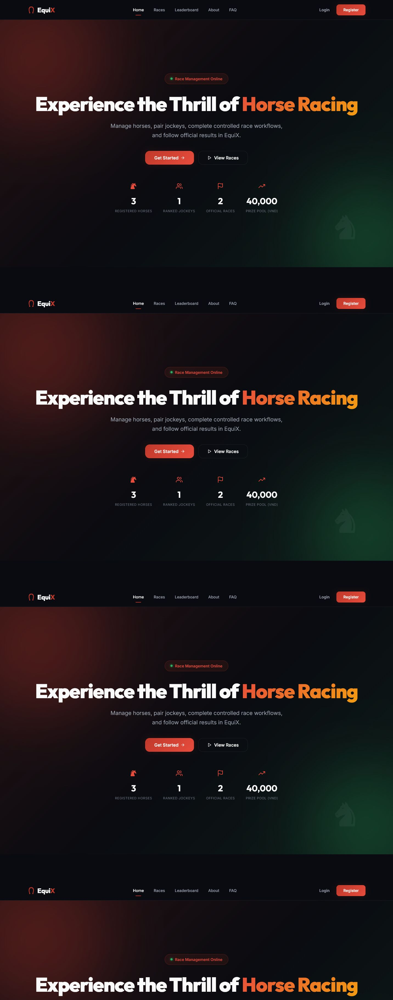
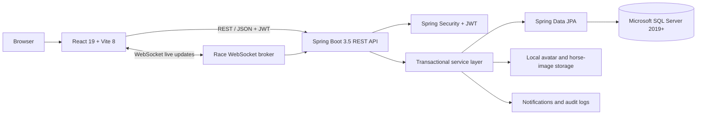
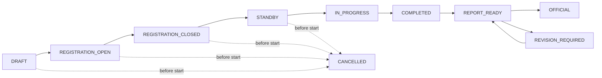
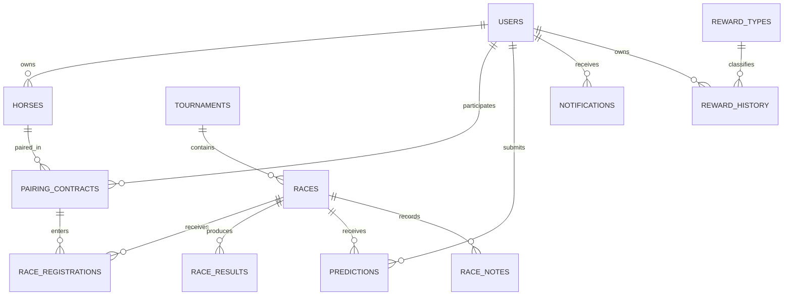
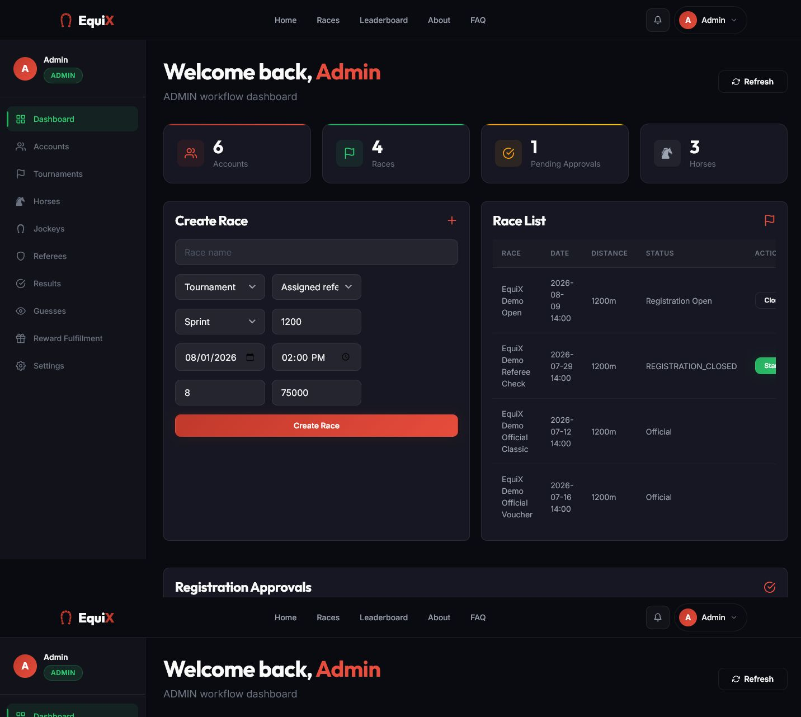
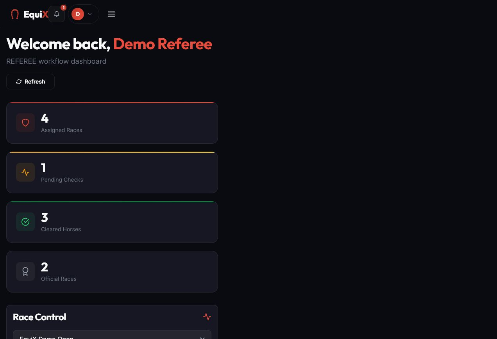
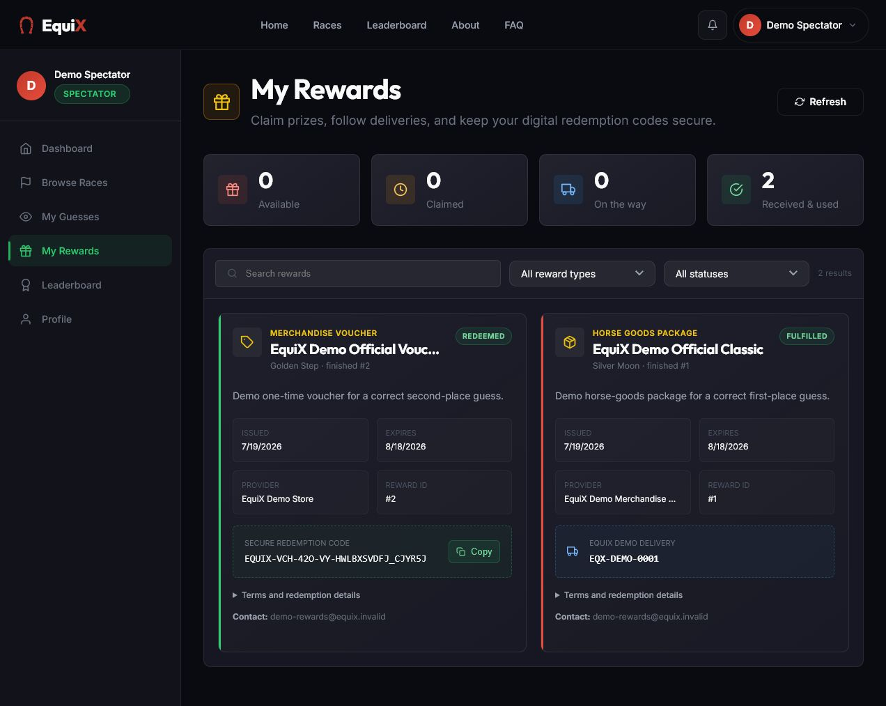

<div align="center">

# EquiX

### Horse Racing Tournament Management System

An end-to-end SWP391 project for managing horse-racing tournaments, role-based operations, live race workflows, spectator predictions, points, and rewards.


**SE1916 · Group 06 · Final Project 2026**

</div>



## Table of contents

- [Overview](#overview)
- [Core features](#core-features)
- [Roles and permissions](#roles-and-permissions)
- [System architecture](#system-architecture)
- [Race lifecycle](#race-lifecycle)
- [Database design](#database-design)
- [Technology stack](#technology-stack)
- [Project structure](#project-structure)
- [Getting started](#getting-started)
- [Quick Login](#quick-login)
- [Testing](#testing)
- [Demo workflow](#demo-workflow)
- [Documentation](#documentation)
- [Security notes](#security-notes)

## Overview

EquiX replaces disconnected race-management activities with one traceable workflow. The system coordinates accounts, horses, jockey invitations, pairings, tournaments, registrations, referee checks, race simulation, signed reports, official results, spectator predictions, points, rewards, notifications, and audit history.

The application provides five role-specific workspaces:

- **Administrator** — governs accounts, tournaments, races, referee assignments, approvals, results, and rewards.
- **Horse Owner** — creates horses, invites jockeys, manages pairings, and registers eligible pairs.
- **Jockey** — responds to invitations and follows accepted assignments and race schedules.
- **Referee** — performs pre-race checks, controls races, records incidents, and signs reports.
- **Spectator** — browses races, submits predictions, earns points, exchanges rewards, and redeems gift codes.

The current business behavior follows [`EquiX_Business_Logic_Definitive_v4.md`](EquiX_Business_Logic_Definitive_v4.md).

## Core features

- JWT authentication and server-side role-based access control.
- Database-backed Quick Login for local demonstrations.
- Account approval, role management, profile, avatar, password, and email-change flows.
- Horse CRUD, health status, portrait upload, and deletion safeguards.
- Jockey invitation and accepted horse–jockey pairing contracts.
- Tournament and race creation, scheduling, referee assignment, cancellation, rescheduling, and deletion controls.
- Registration approval, owner confirmation, withdrawal, referee clearance, bulk approval, and DNF handling.
- Live race simulation with WebSocket updates.
- Incident log, provisional results, signed referee report, revision loop, and Admin officialization.
- Horse and jockey leaderboards.
- One prediction per spectator per race with point settlement.
- 500 starting points for newly created accounts.
- Point-based reward exchange, one-time gift codes, fulfillment tracking, and notifications.
- Toast notifications, persistent notification center, and audit trail.
- Responsive Vietnamese user interface for desktop and mobile.
- Swagger/OpenAPI documentation and automated backend/frontend tests.

## Roles and permissions

| Role | Main responsibilities |
|---|---|
| `ADMIN` | Manage users, tournaments, races, referees, registrations, official results, analytics, and reward fulfillment |
| `HORSE_OWNER` | Manage owned horses, invite jockeys, create pairings, register or withdraw eligible race entries |
| `JOCKEY` | Accept or decline invitations and review active pairings and race assignments |
| `REFEREE` | Clear registrations, start and complete assigned races, record incidents, submit signed reports |
| `SPECTATOR` | Browse races, predict one registered pair per race, earn points, exchange and redeem rewards |

Frontend route protection improves the user experience, while every sensitive operation is authorized again by Spring Security and the service layer.

## System architecture



The production runtime uses **Microsoft SQL Server only**. H2 is scoped to automated tests and does not replace the EquiX runtime database.

## Race lifecycle



Important workflow rules:

1. A race belongs to a tournament and must have a responsible referee.
2. A horse owner registers an accepted horse–jockey pairing, not a horse alone.
3. Registration and schedule rules are validated on the server.
4. A referee can start a race only after at least **six** registrations are `CLEARED_TO_RACE`.
5. Completing a race creates provisional results; it does not make them official.
6. The referee submits a signed report. The Admin either requests revision or declares the result `OFFICIAL`.
7. Officialization settles predictions, points, rewards, notifications, rankings, and audit records transactionally.
8. `OFFICIAL` is a locked terminal state. Cancellation is allowed only before the race starts.

## Database design

The `races` table stores race configuration and current workflow state. It does **not** store every output produced by a race. Child tables keep changing business data normalized and traceable.



| Data area | Main tables | Purpose |
|---|---|---|
| Identity | `users`, `password_reset_tokens`, `email_change_tokens` | Authentication, account state, profile, password recovery, and email change verification |
| Horse and pairing | `horses`, `jockey_invitations`, `pairing_contracts` | Ownership, invitation decisions, and accepted pair contracts |
| Race operations | `tournaments`, `races`, `race_registrations`, `race_notes` | Configuration, scheduling, workflow, entries, checks, incidents, and reports |
| Results and engagement | `race_results`, `predictions`, `reward_types`, `reward_history` | Rankings, guesses, point settlement, reward codes, and fulfillment |
| Cross-cutting | `notifications`, `audit_logs` | User communication and traceability |

Primary keys, foreign keys, unique constraints, check constraints, transactional services, and optimistic conflict checks protect multi-table business operations.

## Technology stack

| Layer | Technology |
|---|---|
| Frontend | React 19, React Router 7, Vite 8, Bootstrap 5, React Bootstrap, React Icons |
| Backend | Java 17, Spring Boot 3.5, Spring Web, Spring Security, Spring Data JPA, Bean Validation |
| Authentication | JWT with JJWT 0.12, BCrypt password hashing, role-based authorization |
| Realtime | Spring WebSocket and frontend live-race client |
| Database | Microsoft SQL Server 2019 or newer |
| API documentation | Springdoc OpenAPI and Swagger UI |
| Testing | JUnit, Spring Boot Test, Spring Security Test, Node test runner |

## Project structure

```text
horse-racing-system/
├── src/
│   ├── main/java/com/equix/horseracingsystem/
│   │   ├── config/          # Security, JWT, WebSocket, demo initialization
│   │   ├── controller/      # REST API endpoints
│   │   ├── dto/             # Validated request and response contracts
│   │   ├── entity/          # JPA domain model
│   │   ├── realtime/        # Live race event publication
│   │   ├── repository/      # Spring Data repositories
│   │   └── service/         # Business rules and transactions
│   ├── main/resources/      # Single runtime application.properties
│   └── test/                # Integration and business-workflow tests
├── equix-frontend/
│   ├── src/components/      # Reusable UI components
│   ├── src/contexts/        # Authentication state
│   ├── src/layouts/         # Public and role dashboards
│   ├── src/pages/           # Feature pages
│   ├── src/routes/          # Route and role guards
│   ├── src/services/        # REST and realtime clients
│   └── src/utils/           # Validation, roles, localization, race mapping
├── docs/
│   ├── database/            # SQL login, migrations, seeds, transfer guide
│   └── demo-screenshots/    # Desktop and mobile evidence
├── EquiX_Business_Logic_Definitive_v4.md
├── HUONG_DAN_CHAY_VA_DEMO_EQUIX.md
├── EQUIX_CAM_NANG_HOC_PROJECT_VA_VAN_DAP.md
├── pom.xml
└── README.md
```

The Spring Boot backend is located at the repository root. There is no separate `equix-backend` directory.

## Getting started

### Prerequisites

- JDK 17
- Node.js 20 or newer and npm
- Microsoft SQL Server 2019 or newer
- SQL Server Management Studio or `sqlcmd`
- Git

Confirm the local tools:

```powershell
java -version
node --version
npm --version
```

### 1. Clone the repository

```bash
git clone https://github.com/FuocFatz/SWP391---SU26---Backend.git
cd SWP391---SU26---Backend
```

### 2. Prepare SQL Server

The backend uses `spring.jpa.hibernate.ddl-auto=validate`, so it validates an existing schema instead of building a complete empty database automatically.

1. Restore a valid `EquiX` database backup in SQL Server, or import the complete project schema and data.
2. Enable **SQL Server and Windows Authentication mode**.
3. Enable TCP/IP on port `1433` when required.
4. Run [`docs/database/create-equix-login.sql`](docs/database/create-equix-login.sql) with an administrative SQL Server account.
5. Apply the scripts in [`docs/database/migrations`](docs/database/migrations) in filename order when upgrading an older EquiX database.

The local demonstration defaults are:

| Setting | Value |
|---|---|
| Server | `localhost:1433` |
| Database | `EquiX` |
| SQL login | `equix_user` |
| SQL password | `123456` |

These credentials are intended for local academic demonstration only. Replace them outside a trusted local environment.

### 3. Configure and run the backend

The backend reads a single runtime configuration file: [`src/main/resources/application.properties`](src/main/resources/application.properties). Environment variables override its local defaults.

PowerShell example:

```powershell
$env:EQUIX_DB_URL='jdbc:sqlserver://localhost:1433;databaseName=EquiX;encrypt=true;trustServerCertificate=true'
$env:EQUIX_DB_USERNAME='equix_user'
$env:EQUIX_DB_PASSWORD='123456'
$env:EQUIX_JWT_SECRET='replace-with-at-least-32-random-bytes'
$env:EQUIX_FRONTEND_BASE_URL='http://localhost:5173'
$env:EQUIX_QUICK_LOGIN_ENABLED='true'

.\mvnw.cmd spring-boot:run
```

macOS/Linux example:

```bash
export EQUIX_DB_URL='jdbc:sqlserver://localhost:1433;databaseName=EquiX;encrypt=true;trustServerCertificate=true'
export EQUIX_DB_USERNAME='equix_user'
export EQUIX_DB_PASSWORD='123456'
export EQUIX_JWT_SECRET='replace-with-at-least-32-random-bytes'
export EQUIX_FRONTEND_BASE_URL='http://localhost:5173'
export EQUIX_QUICK_LOGIN_ENABLED='true'

./mvnw spring-boot:run
```

Backend endpoints:

| Service | URL |
|---|---|
| REST API | `http://localhost:9090/api` |
| Swagger UI | `http://localhost:9090/swagger-ui.html` |
| OpenAPI JSON | `http://localhost:9090/v3/api-docs` |

### 4. Configure and run the frontend

Open another terminal:

```powershell
cd equix-frontend
Copy-Item .env.example .env.local
npm install
```

Set these values in `equix-frontend/.env.local`:

```dotenv
VITE_API_BASE_URL=http://localhost:9090/api
VITE_ENABLE_QUICK_LOGIN=true
```

Then start Vite:

```bash
npm run dev
```

Open `http://localhost:5173`.

## Quick Login

Quick Login is designed for local demonstration. It loads active accounts directly from SQL Server, lets the presenter choose an account under one of the five roles, and asks the backend to issue a real JWT session.

Seed the five standard local accounts by running:

```text
docs/database/seed-quick-login.sql
```

All seeded accounts use `12345` for normal email/password login. Quick Login itself selects a database account and does not expose its password to the frontend.

Both flags must be enabled:

```properties
# Backend
EQUIX_QUICK_LOGIN_ENABLED=true
```

```dotenv
# Frontend
VITE_ENABLE_QUICK_LOGIN=true
```

> Disable Quick Login in production. Hiding only the frontend buttons is insufficient; the backend endpoint must also be disabled.

For a larger presentation-ready data set, review [`docs/database/seed-presentation-ready.sql`](docs/database/seed-presentation-ready.sql) before running it.

## Testing

### Backend

```powershell
.\mvnw.cmd test
```

The test profile uses the temporary H2 database configured in `src/test/resources/application-test.properties`. It does not modify the runtime SQL Server database.

### Frontend

```bash
cd equix-frontend
npm test
npm run lint
npm run build
```

The automated suites cover authentication, authorization, notifications, race workflows, rewards, avatar validation, role mapping, race-track mapping, and Vietnamese localization.

## Demo workflow

A complete presentation can follow this order:

1. **Administrator** creates a tournament and race, assigns a referee, and opens registration.
2. **Horse Owner** creates a horse and invites a jockey.
3. **Jockey** accepts the invitation, producing an active pairing contract.
4. **Horse Owner** registers the accepted pair in the open race.
5. **Administrator** approves the registration and closes registration.
6. **Referee** clears at least six entries and moves the race to standby.
7. **Spectator** submits one prediction before the race starts.
8. **Referee** starts, simulates, completes the race, records incidents, and submits a signed report.
9. **Administrator** reviews the report and declares the result official.
10. **Spectator** checks settled points, notifications, reward exchange, and the one-time gift code.

The full Vietnamese runbook is available in [`HUONG_DAN_CHAY_VA_DEMO_EQUIX.md`](HUONG_DAN_CHAY_VA_DEMO_EQUIX.md).

## Screenshots

| Quick Login | Administrator workspace |
|---|---|
|  |  |

| Referee workflow | Spectator rewards |
|---|---|
|  |  |

## Documentation

- [Business logic v4](EquiX_Business_Logic_Definitive_v4.md)
- [Detailed run and demo guide](HUONG_DAN_CHAY_VA_DEMO_EQUIX.md)
- [Project study and defense handbook](EQUIX_CAM_NANG_HOC_PROJECT_VA_VAN_DAP.md)
- [SQL Server transfer guide](docs/database/SQL_SERVER_TRANSFER_GUIDE.md)
- [Database scripts](docs/database)
- [Demo screenshots](docs/demo-screenshots)

## Security notes

- Never commit real database passwords, JWT secrets, personal data, `.env.local`, database backups, or uploaded user files.
- Change all demonstration credentials before deploying outside localhost.
- Keep `EQUIX_QUICK_LOGIN_ENABLED=false` and `VITE_ENABLE_QUICK_LOGIN=false` in production.
- Use a strong random JWT secret and HTTPS in deployed environments.
- Restrict SQL Server to the required network and grant the application account only the permissions it needs.
- Validate uploaded files and store production uploads outside the source repository.

## Academic context

EquiX was developed as an SWP391 software project at FPT University. The repository demonstrates requirements traceability, layered full-stack architecture, normalized SQL Server data design, role-based security, transactional business rules, automated verification, and a repeatable multi-role presentation workflow.
